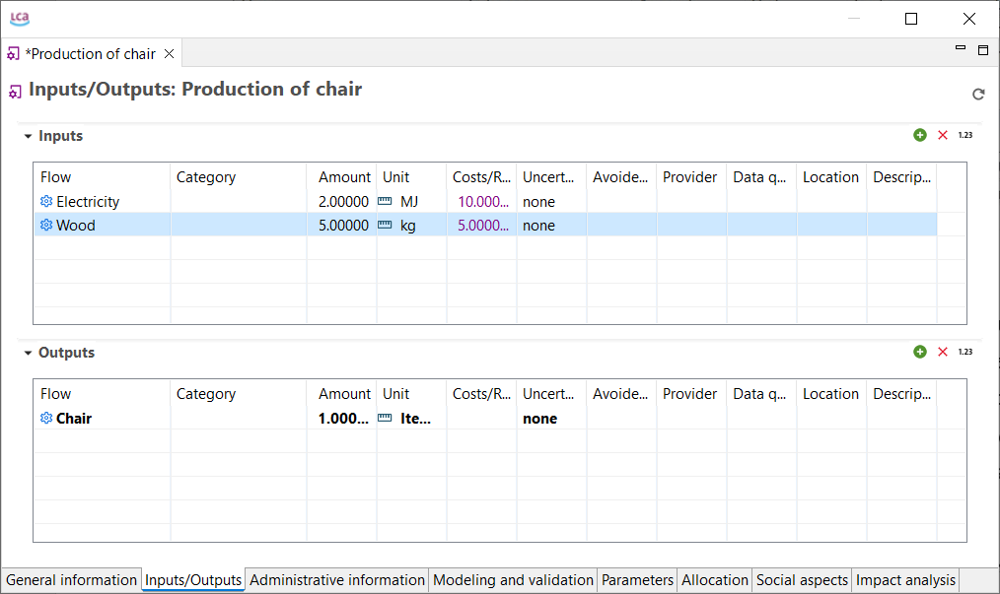
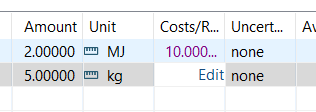
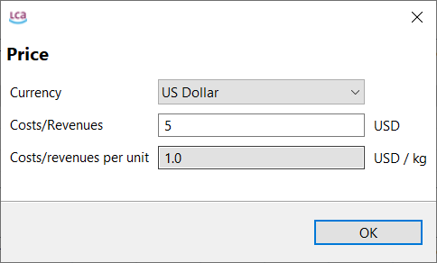
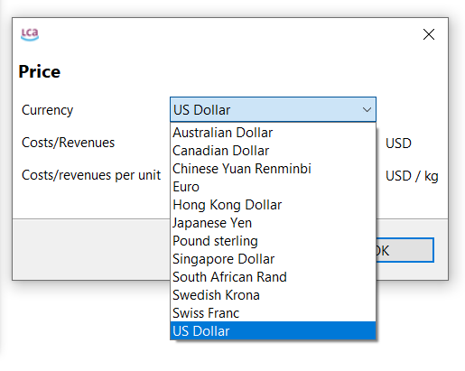
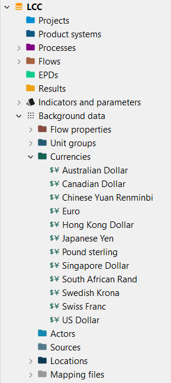
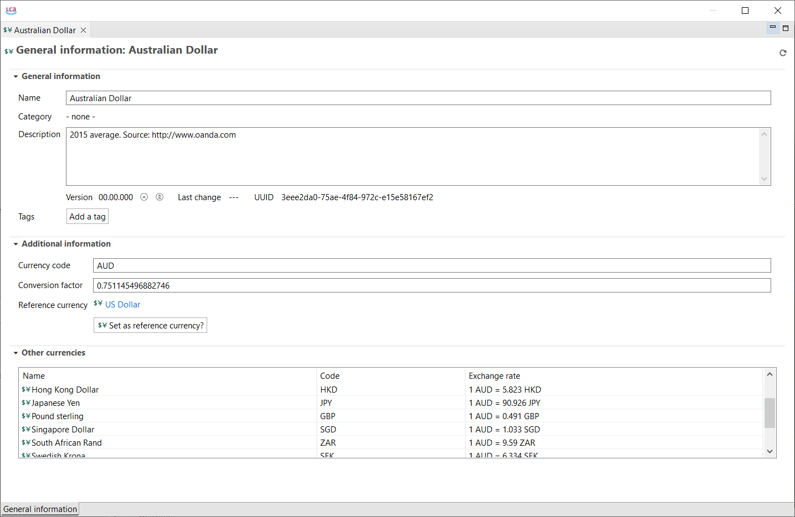
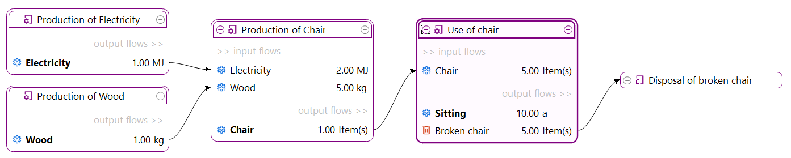
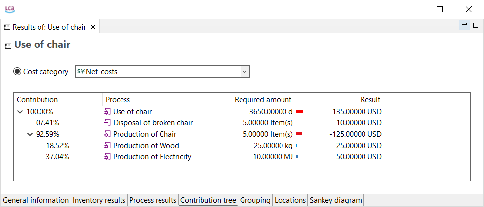

# Life Cycle Costing

 
Life Cycle Costing (LCC) aims to assess the costs of a product over its entire life cycle. 

### LCC and Value Added in openLCA 

Costs are modelled in the software as associated with products, waste or
elementary flows, which are inputs and outputs of processes. They can be
positive or negative while a negative cost is regarded as an added value. In general, there is no need
for the creation of a method for the LCC calculation. [Have also a look at our LCC documentation](https://www.openlca.org/wp-content/uploads/2025/03/Life-Cycle-Costing-in-openLCA.pdf).

The implementation in openLCA follows the proposal of the SETAC working group, for costs, with some modifications, as follows:
	
- costs are modelled as properties of exchanges, i.e. of inputs and outputs of processes; 
- costs can be positive or negative; negative costs are added value 
- costs are displayed in the process editor, in a new column for the exchanges;  
- when a product system is calculated, both costs and added value are available, in parallel to inventory and impact assessment results 

Value added builds on this concept, taking value added as "negative costs", i.e. reversing the sign.

###	A closer look at how costs are specified in the process editor  

Starting point for the cost model and LCC calculation in openLCA are the costs for process data sets. In the process editor, costs can be entered for each exchange, i.e. for each input and output, of a process. Both costs and revenues can be considered:  
  
 
_Costs and revenues for flows in a process_ 
  
Costs on the input side are costs. On the output side, for products, amounts in this column are revenues (the product is sold), while the release of elementary or waste flows might cause a cost, e.g. release of CO2 or emission of waste water with heavy metals. Therefore, any positive amount entered for a product on the output side refers to revenue, while every positive amount entered for an elementary flow reflects costs. To help distinguish both, costs are shown in purple, while revenues are shown in green. 
To edit the costs, or to enter new costs, click in the cost column, and click on edit.

     
_Entering or editing costs in the process editor_
  
A new window will appear for specifying the currency and the amount costs. The amount is meant to be entered as absolute value, i.e. as costs for the amount of the exchange as it is entered for the exchange; for the example in the second figure, it is the costs for 0.12 kg. The costs per specified unit, e.g. per kg, are calculated automatically; they are shown in the small window for entering costs which opens when clicking on edit in the cost/revenue column.  
  

_Entering or editing costs, detail window, with absolute costs (costs for the amount specified for the exchange) and costs per unit which are calculated_ 
  
### Currencies 

As shown in the figures above, costs are expressed in currencies. It is possible to switch for a cost entry between different currencies in the detailed cost window. All currencies available in a database can be found under background data, in the currencies folder. For an entire database, one currency is selected as reference, for the other currencies, an exchange rate is stored to allow recalculation of costs in another currency. The exchange rates are used for calculating the conversion factors which are applied when different currencies in the process are selected.  
  
 

_Changing the currency of a flow_
  
  
 
 
_Under background data you can find the available currency or add your own_ 
  
The reference currency can be changed within one currency (click on "set as reference currency?"). 
  

_General information on a currency_
  
When changing the reference currency, all open currency editors will be closed for updating the conversion factors, and the editor of the new reference currency will be opened again. 

### Multi-output processes (Allocation of costs)

In the case of multi-output processes, consideration of the costs of by-products
depends on the choice of allocation options when setting the calculation
properties (see "[Allocation](../allocation.md)"). If no option is selected the price of the
by-products is considered as revenue, while if a type of allocation is chosen
the allocation factors are applied to the exchanges and the by-product cost is
not considered. The third possibility is to select the option "as defined in
processes": As before, if a type of allocation is chosen the allocation factors
are applied to the exchanges and the by-product cost is not considered; on the
contrary, if no allocation is selected all costs are calculated excluding those
from the by-products.

In case of multi-output processes in the database, it is important to know what happens to the costs of by-products during the calculation of a product system. You have different options for setting the allocation method in the calculation properties.

_Choosing the allocation method in openLCA during the calculation setup. The box for "Include cost calculation" is checked!_

_**Note:**_ Furthermore, LCC can be performed stand-alone by selecting no method when the impact assessment is run.

Depending on this choice (and depending on what is defined in the processes itself) the following rules will be applied: 
- _**None:**_ All costs are considered (the price of the by-product as revenue)
- _**Physical, causal or economic:**_ The allocation factors are applied to the exchanges and the price of the byproduct is not considered 
- _**As defined in processes:**_ 	The physical, causal or economic allocation is chosen  as defined in the processes itself. Again, the allocation factors are applied to the exchanges and the price of the by-product is not considered 
	and no allocation ("none") is selected in the processes, all costs except the one from the by-product are considered 

If you want to apply system expansion, i.e. one of the output products is marked as "avoided product", the calculation is as follows: 

When no allocation is selected in the calculation properties, the following formula is applied: 

		- Added value = Price Reference_Product – Price elementary flows/inputs – Price ByProduct – Added value of avoided supply chain 

When allocation is selected (e.g. "As defined in processes"), the following formula is used:
 
		- Added value = Price Reference_Product +Allocation_factor*(– Price elementary flows/inputs – Price ByProduct – Added value of avoided supply chain) 

As you can define an economic flow property and hold a cost/revenue entry in the process, it is assumed that the process-specific information is more precise and the following rule is applied:
 
When economic allocation is selected and all output products have an economic value (revenue) defined in the process editor, those values will be taken. However, in the case that not all output products have a revenue defined, then the economic flow properties will be used for the calculation (if there are any). 

Another important issue is the consideration of market variability through
uncertainty models. OpenLCA presents a column to assign an uncertainty to the input
and output flows of a process, but not to the price directly. This can be solved
by making the price a [Parameter](../parameters/parameters.md) and assigning uncertainty
directly to it.

### Available Data

Ecoinvent database v. 3.3 in openLCA format provides prices for all products except for waste materials and their disposal. Otherwise, prices can be inserted manually in the input/output section for each process.

Several currencies are available in the database and for an entire database, one
currency can be selected as a reference for all the others.

The software allows to model different prices for the same material referred to
different processes or countries, as the price per reference unit associated with
the material is open and can be changed in the processes of the product system.
In this way, there is no need for the creation of the same material with a
different name and price associated.

### A small case study example 

As an example, a small case study will be presented in the following. The case study is taken from Moreau and Weidema (2015), who in turn refers to a publication by Heijungs and colleagues (Heijungs et al. 2013), and was rebuilt in openLCA.  

The case study is a about the life cycle of a wooden chair, **the functional unit defined as sitting on the chair for ten years**. Overall, the chair is assumed to have a life time of 2 years, which is quite short. The simplified life cycle consists of few processes only: 
-	Production of wood 
-	Production of electricity 
-	Production of the chair 
-	Usage of the chair 
-	Disposal of the broken chair 

Costs and material exchanges between these processes are shown in Table 1. Since the functional unit is 10 years of sitting, 5 chairs are required. 

_Chair case study: Processes, physical exchanges, costs and value added (Moreau and Weidema 2015, modified)_

<table>
  <tr>
    <th>Phase</th>
    <th>Product</th>
    <th>Amount</th>
    <th>Costs per unit*</th>
    <th>Costs**</th>
    <th>Value added</th>
  </tr>
  <tr>
    <td>Production of electricity</td>
    <td>electricity</td>
    <td>1 MJ</td>
    <td>5 €/MJ</td>
    <td>5 €</td>
    <td>5 €</td>
  </tr>
  <tr>
    <td>Production of wood</td>
    <td>wood</td>
    <td>1 kg</td>
    <td>1 €/kg</td>
    <td>1 €</td>
    <td>1 €</td>
  </tr>
  <tr>
    <td rowspan=3>Production of chair</td>
    <td>electricity</td>
    <td>2 MJ</td>
    <td>5 €/MJ</td>
    <td>-10 €</td>
    <td rowspan=3>10 €</td>
  </tr>
  <tr>
    <td>wood</td>
    <td>-5 kg</td>
    <td>1 €/kg</td>
    <td>-5 €</td>
    
  </tr>
  <tr>
    <td>chair</td>
    <td>1 piece</td>
    <td>25 €/piece</td>
    <td>25 €</td>
    
  </tr>
  <tr>
    <td rowspan=3>Use of chair</td>
    <td>chair</td>
    <td>5 pieces</td>
    <td>25 €/piece</td>
    <td>-125 €</td>
    <td rowspan=3>-135 €*</td>
  </tr>
  <tr>
        <td>broken chair</td>
    <td>5 pieces</td>
    <td>2 €/piece</td>
    <td>-10 €</td>
    
  </tr>
  <tr>
    <td>sitting</td>
    <td>10 years</td>
    <td>0 €/year*</td>
    <td>0 €*</td>
    </tr>
  <tr>
    <td>Disposal of broken chair</td>
    <td>broken chair</td>
    <td>1 piece</td>
    <td>-2 €/piece</td>
    <td>2 €</td>
    <td>2 €</td>
  </tr>
</table>

\*in Moreau and Weidema 2015: "price";  \*\*in Moreau and Weidema 2015: "monetary amount"  

In openLCA, the processes have been created, and a product system has been built where these processes exchange their products. Note that the disposal (end of life) of the chair is modelled as provided service to the use of the chair, following the typical ecoinvent (and SimaPro e.g.) modelling of end of life treatment. 
  
  
_The created product system in the model graph in openLCA_

  
One example for a process with costs is already shown in first figure of this page: The production of the chair.  
When the product system is calculated, several summaries of results for costs and added value are available. For example, in the process contributions tab, a new section "costs/added values" is available, which shows the contribution of different processes to the final cost and added value result. It is possible to switch between costs and value added; costs are value added multiplied by -1, i.e. costs for input products "purchased" for one process, minus price of the generated products.  
 
  

_Value added and net-costs in the process contributions tab_

For the production of the chair, for example, net costs are (5 + 10) € - 25 € = -10€; for 5 chairs required in the product system, the amount is -50 €. 
In the contribution tree, value added and life cycle costs are available as new section, in addition to LCIA categories and elementary flows.

**_openLCA offers a detailed document on how to conduct LCC studies in openLCA free [here](<https://www.openlca.org/wp-content/uploads/2025/03/Life-Cycle-Costing-in-openLCA.pdf>). The database with the case study is available for download [here](https://www.openlca.org/case-studies/)_**

