# API clients

openLCA can connect directly to external servers and data platforms via their APIs (Application Programming Interfaces). With these API clients, you can search, import, and in some cases upload data without leaving openLCA. All API clients can be found under "Tools" → "API Clients"; most of them require an account and an API key or login for the respective platform.

 _API clients in the "Tools" menu_

<b>CS Servers</b>

The LCA Collaboration Server is a server application that complements openLCA and allows you to work on LCA models together in teams. Similar to version control in software development, users commit their changes from their local openLCA database to a shared repository on the server and fetch the changes of others. This also makes it easy to distribute reference data and to have models reviewed. Under "CS Servers", you can manage your connections to Collaboration Servers; a database is connected to a repository by right-clicking on it and choosing "Repository" → "Connect...".

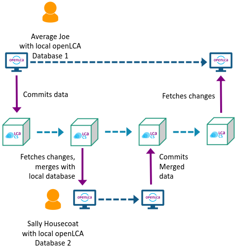
 _Example of two users working together via the LCA Collaboration Server_

For more information, see [Collaboration in Teams](../collaboserver.md) and the [LCA Collaboration Server manual](<https://manuals.openlca.org/lca-collaboration-server/>).

<b>soda4LCA</b>

Since openLCA 2.2, you can access a wide range of ILCD data nodes through the soda4LCA client. This includes various EPD-focused nodes, e.g. EPD International and ÖKOBAUDAT. The client can be found under "Tools" → "API Clients" → "soda4LCA". A window appears in which you can select the desired data node (host); then click "OK".

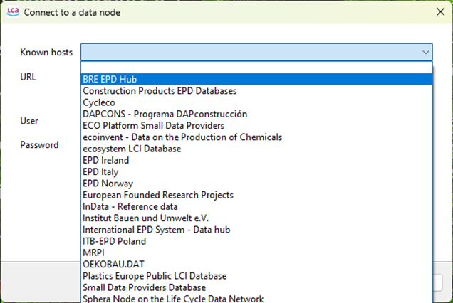
 _Selecting a soda4LCA data node_

You can search the node for EPDs, impact categories, and more.

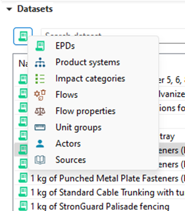
 _Searching a soda4LCA data node_

With an active database, you can import a search result by right-clicking on it and selecting "Import selected". Imported EPDs appear in the "EPDs" folder of your database, impact categories in the "Impact categories" folder, and so on.

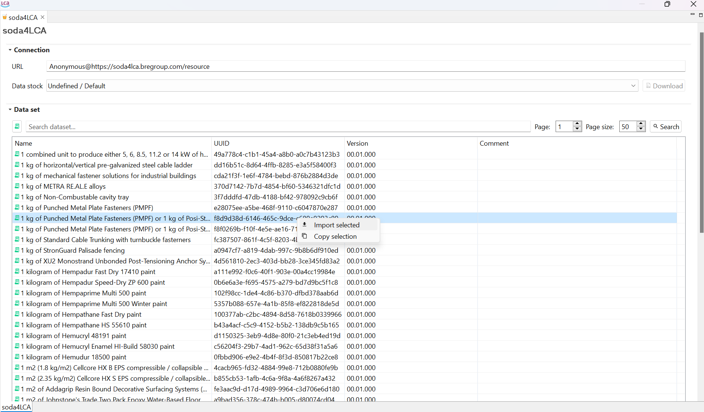
 _Importing a data set from a soda4LCA node_

To ensure a smooth integration of EPDs, use an EN15804-compatible database like the [EN15804 version of ecoinvent](https://nexus.openlca.org/database/EN15804%20add-on) or the EN15804-compatible method package, which is available for free on the same page. If your active database does not contain the required impact methods, openLCA might download them from the respective soda4LCA node. This takes time and can lead to corrupted EPDs, as not all soda4LCA nodes contain the referenced indicators and flows. Also make sure to calculate impacts with the same impact method that was used to create the EPD; otherwise the impacts of the EPD will not be taken into account.

>**_Tip:_** To use an imported EPD result in a product system, make sure a product flow is set as the quantitative reference under "Inventory result" → "Outputs". If there is none, create a new product flow, add it to the outputs, and set it as the quantitative reference. See also [Using results of EPDs in life cycle models](../epds/life_cycle_models.md).

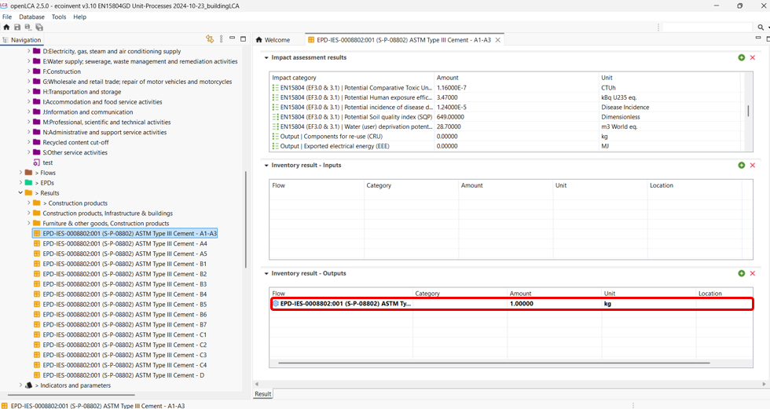
 _Setting a product flow as quantitative reference of an EPD result_

<b>Get EPDs from EC3</b>

With this client, you can download EPDs from and upload EPDs to EC3 (Embodied Carbon in Construction Calculator) by [Building Transparency](<https://www.buildingtransparency.org/>). This requires an account, which you can create on the [Building Transparency website](<https://buildingtransparency.org/auth/login>). Go to "Tools" → "API Clients" → "Get EPDs from EC3", insert your user name, click "Login" and enter your EC3 password.

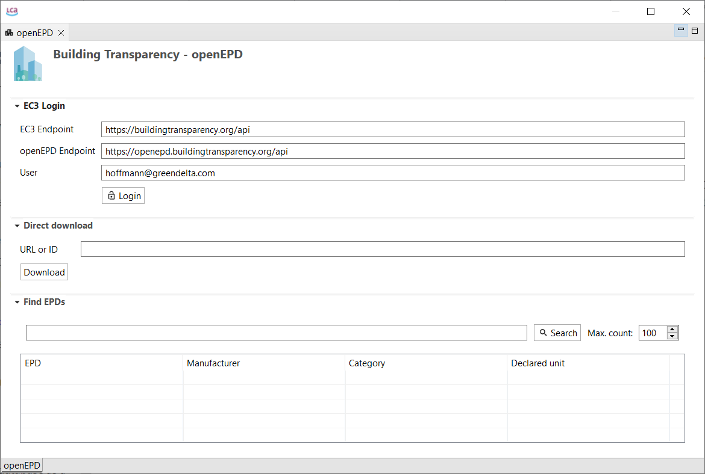
 _Logging in to EC3_

Once you are connected, you can download EPDs via URL or ID, or search and import them directly in openLCA.

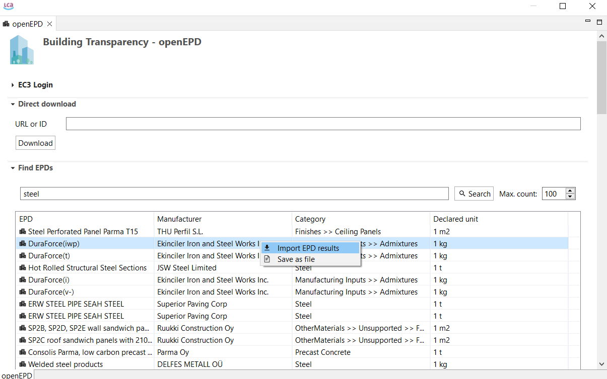
 _Searching EPDs on EC3_

openLCA tries to match the openEPD LCIA methods with the indicators in the active database automatically, but you can also adjust this matching yourself.

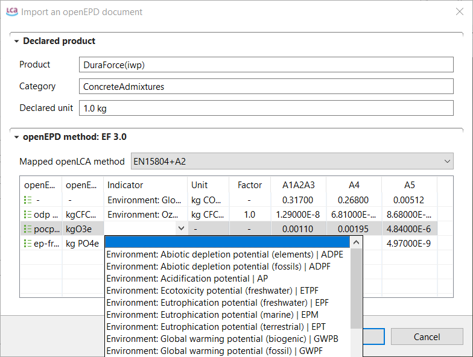
 _Matching the indicators during the import_

The imported EPDs are displayed in the navigation window under "EPDs". An EPD can contain multiple result modules; these results are stand-alone models with a quantitative reference and can be used in product systems.

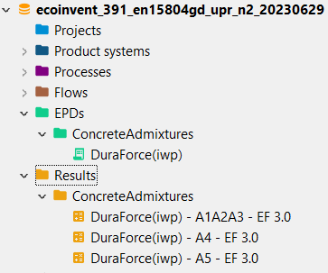
 _Imported EPDs in the navigation window_

You can also upload your EPD drafts to EC3. Open an EPD and select "Upload (Update) EPD on results on EC3". Make sure to fill in all required information, in particular the declared product and the URN.

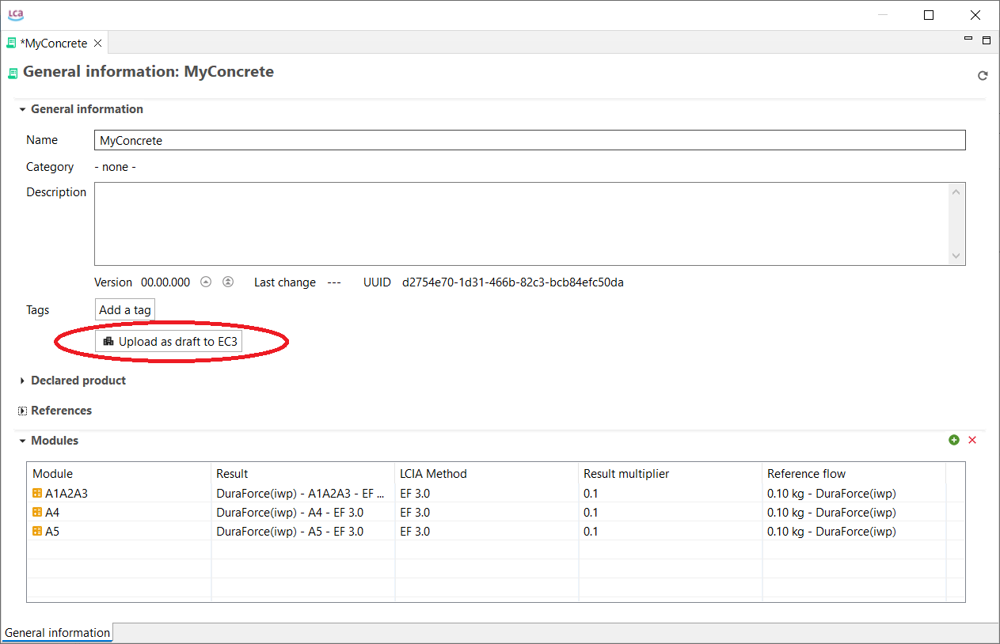
 _Uploading an EPD to EC3_

In the window that appears, click "Upload (Update)". You can then check your uploaded version under https://buildingtransparency.org/ec3/epds/URN, replacing "URN" with your specific URN.

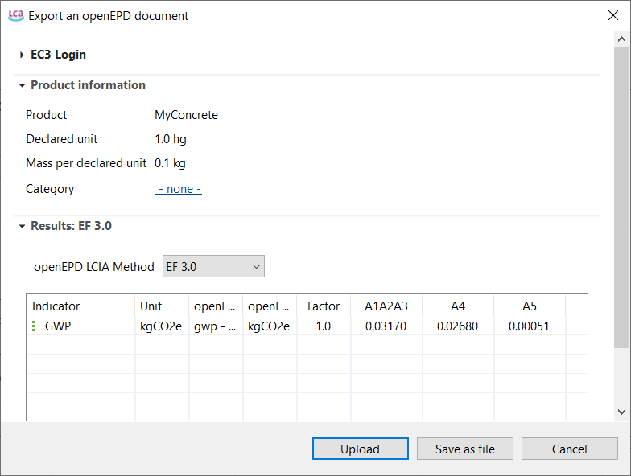
 _Confirming the upload_

<b>SmartEPD</b>

Since openLCA 2.5.0, you can upload EPD results to [SmartEPD](<https://smartepd.com/>). The client can be found under "Tools" → "API Clients" → "SmartEPD (experimental)". To use it, you first need to [request access](<https://www.smartepd.com/request-access>) to SmartEPD; you then find your API key in your profile.

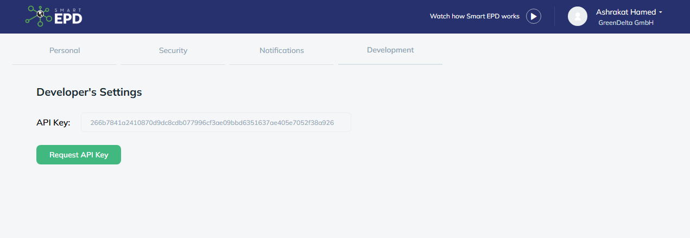
 _API key in the SmartEPD profile_

In openLCA, open the SmartEPD client and enter the URL https://smartepd.com/api/ and your API key.

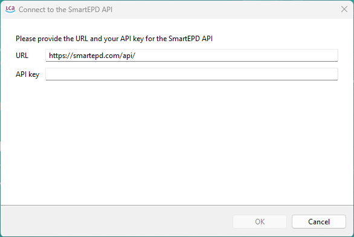
 _Entering the URL and API key in openLCA_

A window appears showing the projects you created on the SmartEPD website, along with the EPDs in each project.

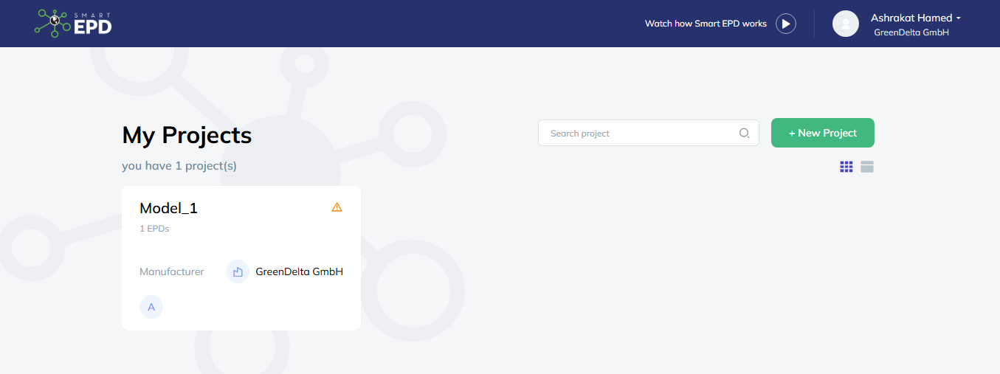
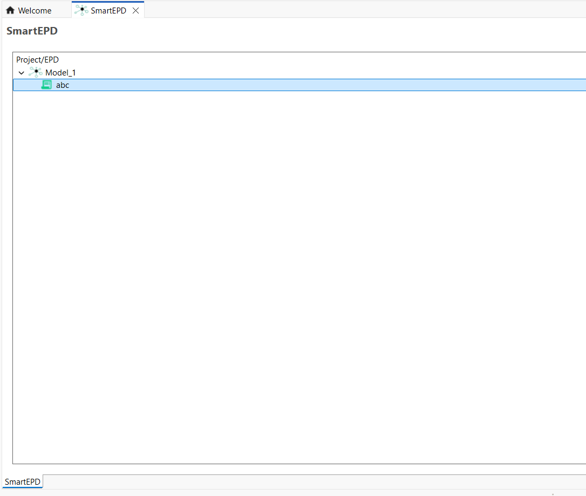
 _Projects and EPDs from SmartEPD in openLCA_

To upload EPD results from your database, right-click on the EPD icon in the SmartEPD window. In the pop-up window, select the EPD and the results you want to upload. You can then review the uploaded results in your project on the SmartEPD website under "Results".

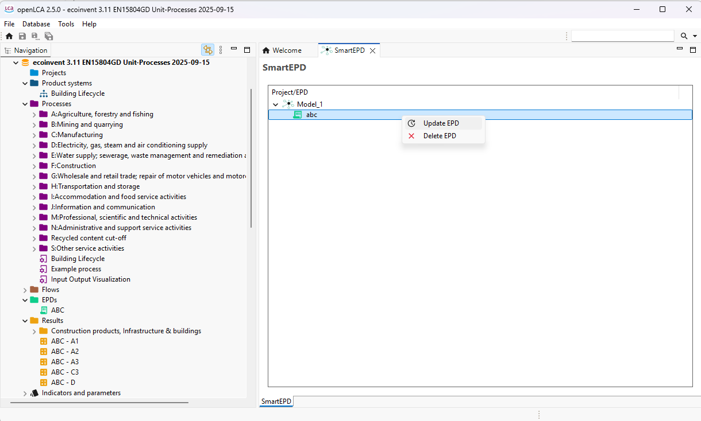
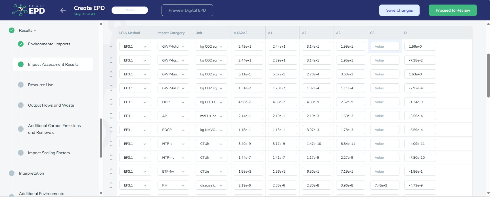
 _Uploading EPD results to SmartEPD_

>**_Note:_** Currently, you can only upload results to SmartEPD; importing EPDs from SmartEPD is not possible.

<b>HESTIA</b>

[HESTIA](<https://www.hestia.earth/>) is an online platform providing agri-food data, such as data on crop and livestock production. Since openLCA 2.6.0, you can search the HESTIA datasets directly in openLCA and import them as process datasets into your active database. The HESTIA API client can be found under "Tools" → "API Clients" → "Hestia (experimental)". As indicated in the menu, it is still an experimental feature.

**Connecting to HESTIA**

When you open the API client for the first time, you need to enter your API key. You can find it in your user account on the [HESTIA platform](<https://www.hestia.earth/>), under "Settings" → "API Access".

 _API key in the user account on the HESTIA platform_

Enter the API key in openLCA. If you select "Save API key", the key is stored in the openLCA workspace, so you do not have to enter it again.

 _Entering the API key in openLCA_

**Searching and importing datasets**

You can now search for datasets on the HESTIA platform directly in openLCA. Enter a search term and click "Search". With the checkbox "Search aggregated data sets", you can decide whether aggregated datasets are included in the search, and with "Number of results" you can limit how many results are shown.

 _Searching for HESTIA datasets in openLCA_

Right-click on a search result to open the following options:

- **Show cycle:** opens the original HESTIA dataset in a preview window, so you can check it before importing.
- **Import selected:** imports the dataset as a process into the currently active database.

 _Options for a search result_

 _Preview of a HESTIA dataset_

**Using a mapping file**

For the import, it is recommended to use a mapping file that maps the HESTIA flows to the openLCA reference flows. We provide a mapping file derived from the [Python HESTIA to openLCA converter](<https://gitlab.com/hestia-earth/hestia-convert-to-openlca>). It is a simple CSV file in the [openLCA flow mapping format](<https://github.com/GreenDelta/data/blob/master/docs/format_csv_flow_mapping.md>) and can be imported into your database via the normal file import: right-click on the database and choose "Import" → "File".

 _Importing the mapping file into the database_

After the import, the mapping file is listed in the navigation window under "Background data" → "Mapping files".

 _The imported mapping file in the navigation window_

You can then select the mapping file under "Mapping file" in the HESTIA API client; it is applied to all datasets you import.

 _Selecting the mapping file in the HESTIA API client_

>**_Note:_** You may have to re-open the API client after importing the mapping file before it can be selected. Also, only the mapping files of the currently active database are shown, which is the database the datasets are imported into.

**Extending the mapping file**

The mapping file can easily be extended by editing the CSV file. Make sure to keep the format, with semicolons as column separators. Besides flows, you can also define providers for product inputs. As the flow ID, use the original ID of the respective HESTIA term. You can find it as the end of the URL in the description field of an imported flow:

 _The HESTIA term ID at the end of the URL in the flow description_

**Example of an imported process**

The following figure shows an example of a HESTIA dataset imported as a process in openLCA:

 _Inputs and outputs of an imported HESTIA dataset_

**Import errors**

If errors occur during the import, the "Import finished" dialog shows how many datasets were affected. Click "Details..." to see what went wrong.

 _Summary of the import with the option to show error details_

**Known limitations**

- Aggregated datasets often contain the same emission several times as separate outputs.
- Practices from HESTIA are currently not mapped to exchanges in openLCA.
- Additional flow information available via the HESTIA API is not yet used in the import. For example, HESTIA flows already include a mapping to ecoinvent flows (see e.g. [this flow](<https://www.hestia.earth/term/beefCattleSolidManureDryKgN>)).

