# API clients

openLCA can connect directly to external servers and data platforms via their APIs (Application Programming Interfaces). With these API clients, you can search, import, and in some cases upload data without leaving openLCA. All API clients can be found under "Tools" → "API Clients"; most of them require an account and an API key or login for the respective platform. Some API clients are described in other chapters of this manual: [CS Servers](../collaboserver.md), [soda4LCA](../epds/soda4lca.md).

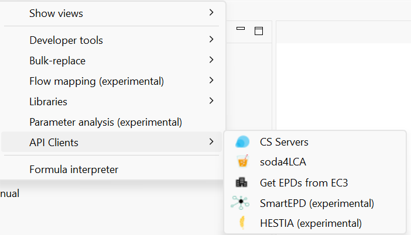
 _API clients in the "Tools" menu_

<b>HESTIA</b>

[HESTIA](<https://www.hestia.earth/>) is an online platform providing agri-food data, such as data on crop and livestock production. Since openLCA 2.6.0, you can search the HESTIA datasets directly in openLCA and import them as process datasets into your active database. The HESTIA API client can be found under "Tools" → "API Clients" → "Hestia (experimental)". As indicated in the menu, it is still an experimental feature.

**Connecting to HESTIA**

When you open the API client for the first time, you need to enter your API key. You can find it in your user account on the [HESTIA platform](<https://www.hestia.earth/>), under "Settings" → "API Access".

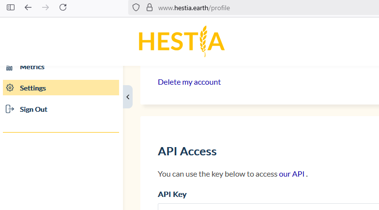
 _API key in the user account on the HESTIA platform_

Enter the API key in openLCA. If you select "Save API key", the key is stored in the openLCA workspace, so you do not have to enter it again.

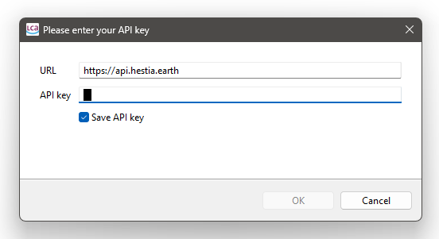
 _Entering the API key in openLCA_

**Searching and importing datasets**

You can now search for datasets on the HESTIA platform directly in openLCA. Enter a search term and click "Search". With the checkbox "Search aggregated data sets", you can decide whether aggregated datasets are included in the search, and with "Number of results" you can limit how many results are shown.

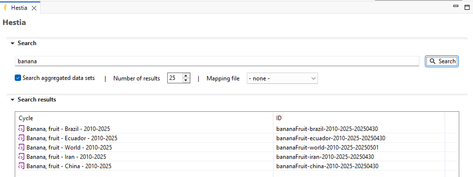
 _Searching for HESTIA datasets in openLCA_

Right-click on a search result to open the following options:

- **Show cycle:** opens the original HESTIA dataset in a preview window, so you can check it before importing.
- **Import selected:** imports the dataset as a process into the currently active database.

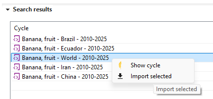
 _Options for a search result_

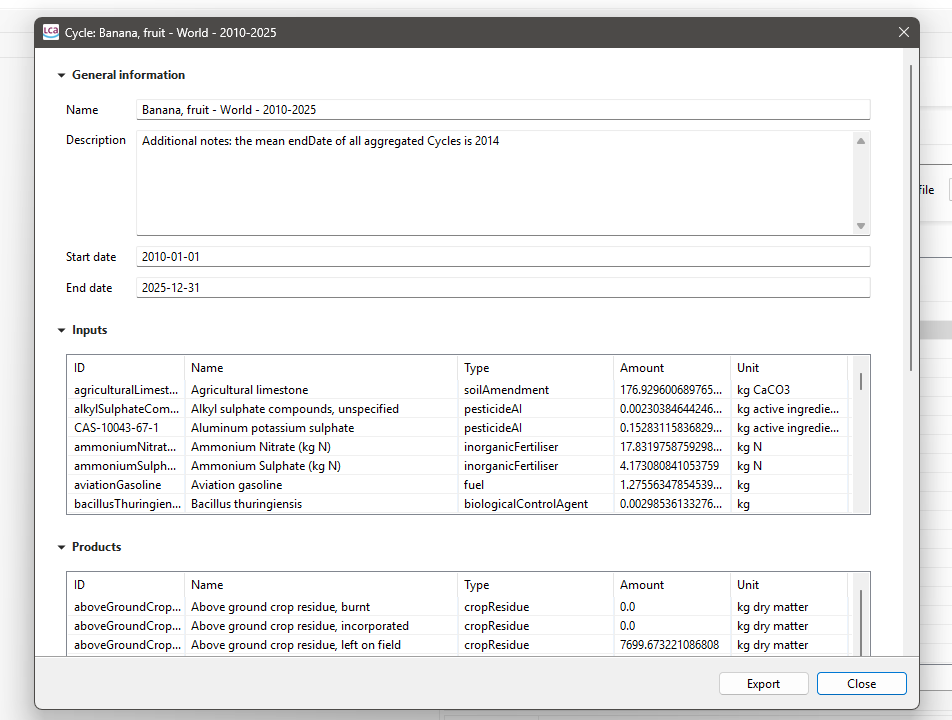
 _Preview of a HESTIA dataset_

**Using a mapping file**

For the import, it is recommended to use a mapping file that maps the HESTIA flows to the openLCA reference flows. We provide a mapping file derived from the [Python HESTIA to openLCA converter](<https://gitlab.com/hestia-earth/hestia-convert-to-openlca>). It is a simple CSV file in the [openLCA flow mapping format](<https://github.com/GreenDelta/data/blob/master/docs/format_csv_flow_mapping.md>) and can be imported into your database via the normal file import: right-click on the database and choose "Import" → "File".

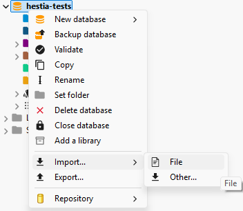
 _Importing the mapping file into the database_

After the import, the mapping file is listed in the navigation window under "Background data" → "Mapping files".

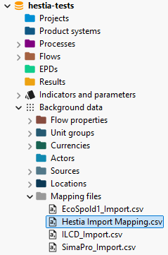
 _The imported mapping file in the navigation window_

You can then select the mapping file under "Mapping file" in the HESTIA API client; it is applied to all datasets you import.

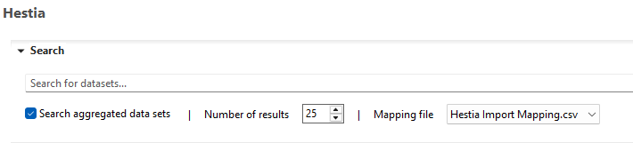
 _Selecting the mapping file in the HESTIA API client_

>**_Note:_** You may have to re-open the API client after importing the mapping file before it can be selected. Also, only the mapping files of the currently active database are shown, which is the database the datasets are imported into.

**Extending the mapping file**

The mapping file can easily be extended by editing the CSV file. Make sure to keep the format, with semicolons as column separators. Besides flows, you can also define providers for product inputs. As the flow ID, use the original ID of the respective HESTIA term. You can find it as the end of the URL in the description field of an imported flow:

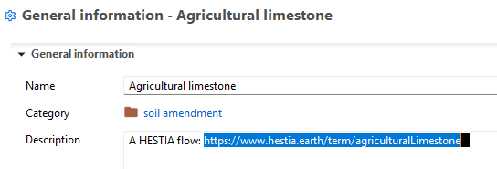
 _The HESTIA term ID at the end of the URL in the flow description_

**Example of an imported process**

The following figure shows an example of a HESTIA dataset imported as a process in openLCA:

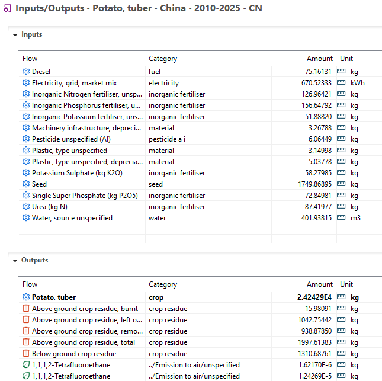
 _Inputs and outputs of an imported HESTIA dataset_

**Import errors**

If errors occur during the import, the "Import finished" dialog shows how many datasets were affected. Click "Details..." to see what went wrong.

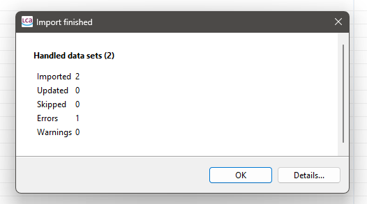
 _Summary of the import with the option to show error details_

**Known limitations**

- Aggregated datasets often contain the same emission several times as separate outputs.
- Practices from HESTIA are currently not mapped to exchanges in openLCA.
- Additional flow information available via the HESTIA API is not yet used in the import. For example, HESTIA flows already include a mapping to ecoinvent flows (see e.g. [this flow](<https://www.hestia.earth/term/beefCattleSolidManureDryKgN>)).

