# Data Quality

Data quality is a critical aspect of life cycle assessment (LCA) studies, and it is addressed in ISO 14040 and ISO 14044 standards. openLCA offers broad support for entering, managing, and calculating data quality in LCA models. Before we start, let’s remind us that in ISO 14040, data quality is defined as fitness for purpose.

Below, we describe how to work with data quality in openLCA.

### Choosing a data quality system

First you need do define a data quality flow schema. If you generate a database with complete reference data, we provide you with two data quality systems. You can choose one of them in the "General information" tab, see "[Process tab content](../processes/process_tab_content.md)":

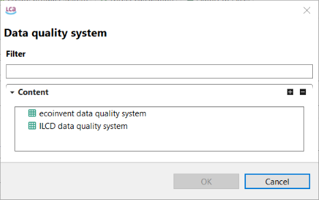  
_Available data quality systems in a database with complete reference data in openLCA_

You can also create your own data quality system or modify existing quality systems according to your own criteria. In openLCA, it is assumed that all data quality systems follow a pedigree matrix "style", i.e. there are data quality indicators that are evaluated in classes, from good to bad. These pedigree matrices can be defined from scratch, but openLCA contains some predefined data quality systems already. 

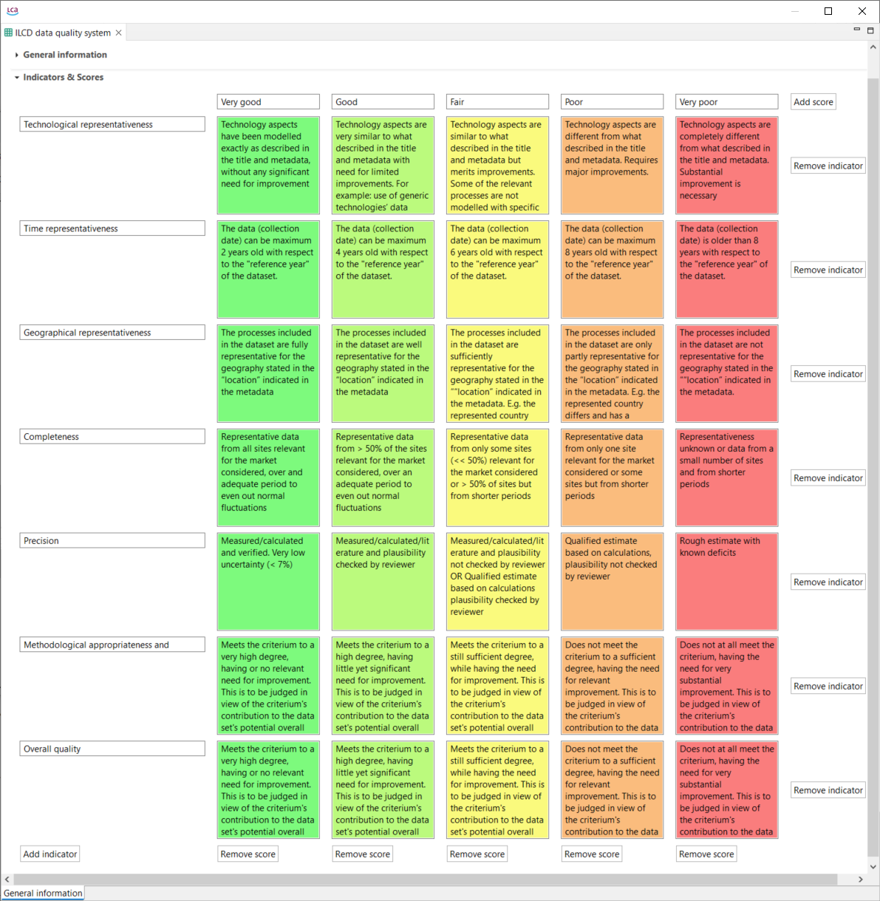  
_Data quality system according to the ILCD data quality system requirements_

To create a new data quality system, right-click on the "Data Quality Systems" directory and select "New data quality system". Then you can add indicators, scores and uncertainties.

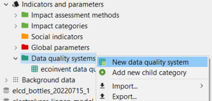  
_Step 1: Creating a new data quality system_

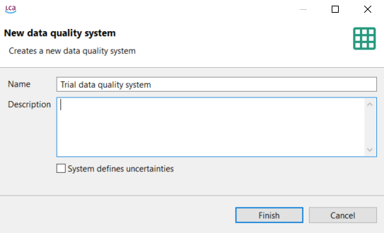  
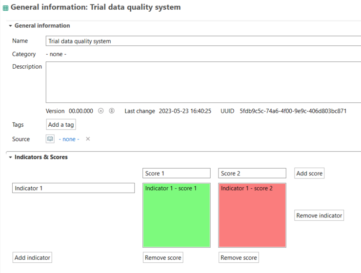  
_Step 2: Setup a new data quality system_

### Working with data quality

Now you can select a data quality system for the process, flows and social aspects.

1. Data quality information for processes must be defined in the "Data quality" section in the "General information" tab of a process window.

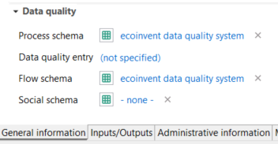  
_Process window tab - general information, data quality_

2. On the other hand, data quality information for flows and social assessments need to be selected under data quality columns in "Input/Output" tab or in "Social aspects" tab, see "[Process tab content](../processes/process_tab_content.md)".

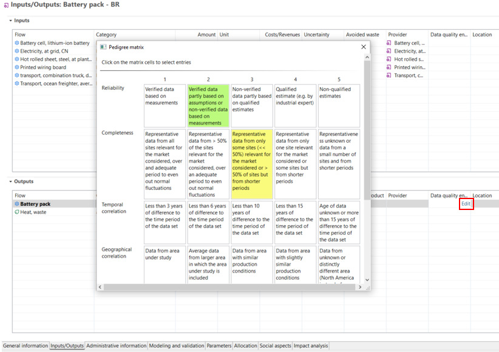  
_Process window tab - Inputs/Outputs, Data quality for flows_

Data quality system can be selected among the systems available in the "Data
quality systems" directory in the "Indicators and parameters" section of the
active database.

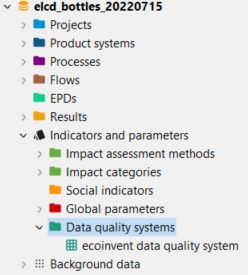  
_Data quality systems directory in an active database_

You can access the existing data quality system in the folder "Data quality system" in the navigation panel. You can use for example, the ecoinvent data quality system improved by Dr. Andreas Ciroth (click [here](https://www.greendelta.com/wp-content/uploads/2017/03/Pedigree_report_final_May2012.pdf) to read the complete report). When you open a data quality system in the Editor, you’ll see a "General information" tab. This tab displays scores for various indicators and provides options to assign uncertainty values to these indicators, as illustrated below. 

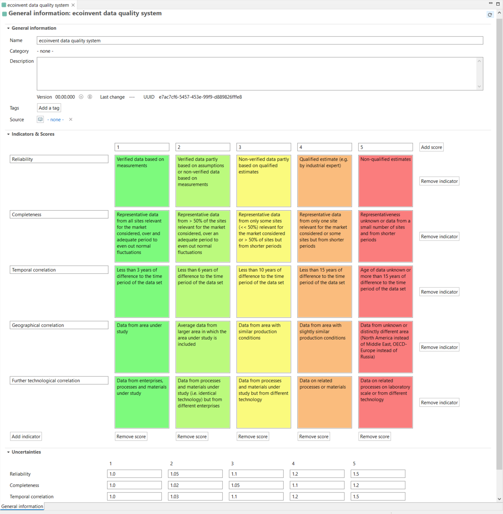  
_Data quality systems, indicators and scores_

As visualized above, adding uncertainty values allows for performing "[Monte Carlo Simulations](../advanced_top/monte_carlo.md)" in openLCA.

### Setup

To access the data quality during a calculation, check the box "Assess data quality" when setting the calculation properties.

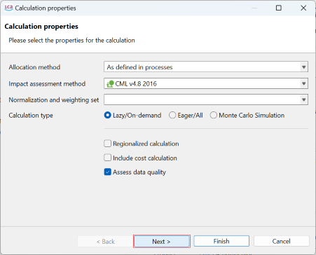  
_Checking the box for including a data quality assessment_

Then, click "Next" and the "Data quality properties" window will open, allowing you to access the details on the data quality assessment.

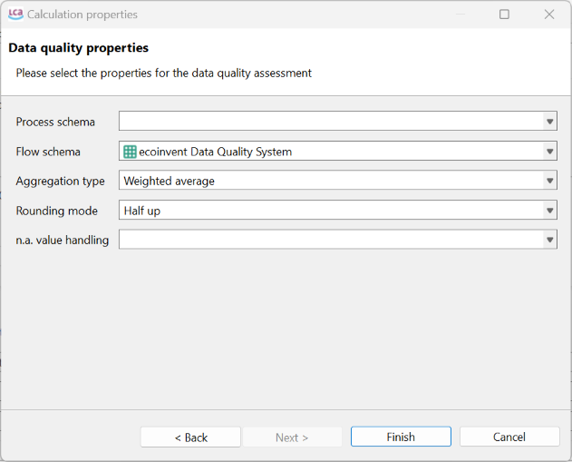  
_Setup for the data quality assessment_

You can choose the aggregation type, a rounding method, and how to handle exchanges that lack data quality values. Then, click on the "Finish" button to start the calculation, including the data quality assessment.

### Results

When the calculations are done, the results window will open in the Editor. You will notice that the data quality of the inventory analysis is now shown in the inventory analysis tab with color-coded numbers.

  
_Inventory analysis - data quality information_

The abbreviations for the columns are **R**eliability, **C**ompleteness, **T**emporal correlation, **G**eographical correlation, **F**urther technical correlation as defined in your data quality scheme, see "[Processes](../processes/general_information.md)". 

In a similar fashion, the data quality for the impact analysis tab is displayed after the calculation is performed.

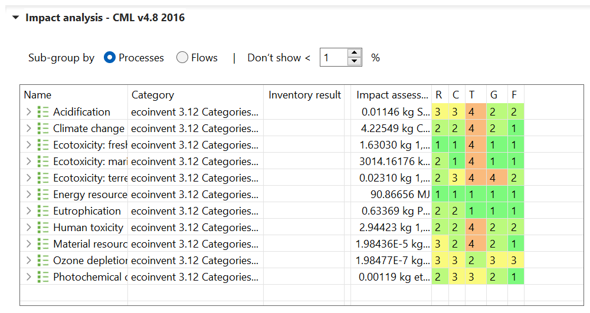  
_Impact Analysis - data quality_

 >**_Note:_** If the data quality is captured on the flow level (e.g. ecoinvent), the   assessment and aggregation of data quality up to the impact categories in the results   is **based solely on the data quality entries for elementary flows**. However, you     can get the aggregated data quality of product flows throughout the supply chain by     deleting all links to this product flow in the [Model Graph](../prod_system/model_graph.md). This will give you results like this:

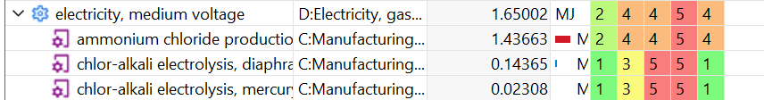  

