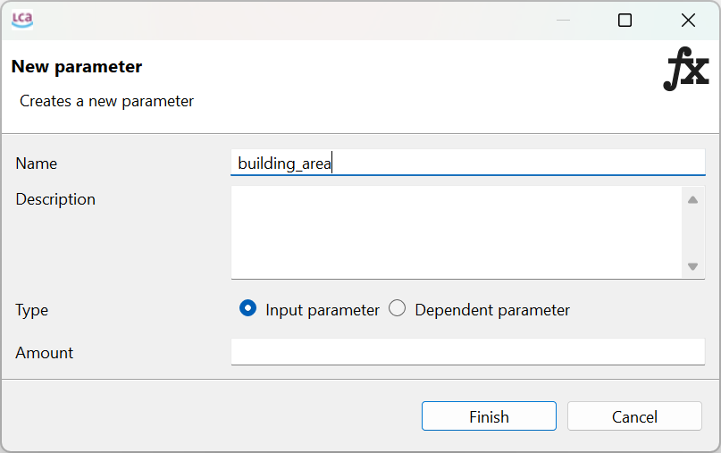
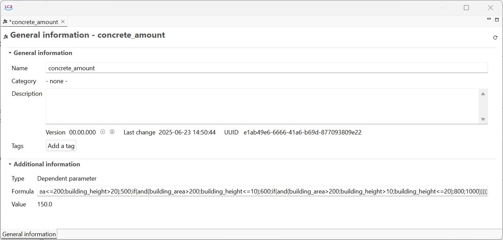

# Dependent Parameter in openLCA

<div style='text-align: justify;'>

Dependent parameters in openLCA are useful for dynamically adjusting LCI data based on specific scenarios. They allow users to create complex models where results update automatically as input parameters change. 
Users can use the [constants, operators and functions ](../cheat/formulas_in_openlca.md) listed below to create formulas for dependent parameters. This is particularly useful when users wish to connect openLCA to external tools where input parameters may be initialised by or dependent upon user inputs. 

| **Function/Operator/Constant** | **Description**                       | **Examples with values**                | **Usage in a Dependent Formula** |
|---------------------------------|---------------------------------------|-----------------------------------------|---------------------------------|
| pi                              | Ratio of circumference to diameter    | `pi = 3.141592653589793`                | `circle_area = pi - radius^2`   |
| e                               | Base of natural logarithm            | `e = 2.718281828459045`                 | `exponential_growth = e^growth_rate` |
| +                               | Addition                             | `1 + 2 = 3`                             | `total_cost = material_cost + labor_cost` |
| -                               | Subtraction                          | `5 - 3 = 2`                             | `net_income = revenue - expenses` |
| -                               | Multiplication                       | `2 - 3 = 6`                             | `total_energy = energy_per_unit - units_produced` |
| /                               | Division                             | `6 / 2 = 3`                             | `average_cost = total_cost / quantity` |
| ^                               | Exponentiation                       | `2^3 = 8`                               | `compound_interest = principal - (1 + rate)^time` |
| div                             | Integer division                     | `7 div 2 = 3`                           | `batches = total_units div batch_size` |
| mod                             | Modulus (remainder)                  | `7 mod 2 = 1`                           | `remaining_units = total_units mod batch_size` |
| =                               | Equal to                             | `1 = 1 = true`                          | `is_equal = value1 = value2` |
| <> or !=                        | Not equal to                         | `1 <> 2 = true` or `1 != 2 = true`      | `is_not_equal = value1 <> value2` |
| <                               | Less than                            | `2 < 3 = true`                          | `is_less = temperature < setpoint` |
| <=                              | Less than or equal to                | `2 <= 2 = true`                         | `is_in_range = value <= limit` |
| >                               | Greater than                         | `3 > 2 = true`                          | `is_greater = pressure > threshold` |
| >=                              | Greater than or equal to             | `3 >= 3 = true`                         | `is_above_min = score >= passing_score` |
| and or &&                       | Logical AND                          | `true() && false() = false`             | `in_range = temperature >= low && temperature <= high` |
| or or ||                        | Logical OR                           | `true() || false() = true`              | `requires_attention = temperature < low || temperature > high` |
| abs(x)                          | Absolute value of x                  | `abs(-1) = 1`                           | `magnitude = abs(change)` |
| sqrt(x)                         | Square root of x                     | `sqrt(4) = 2`                           | `side_length = sqrt(area)` |
| ln(x)                           | Natural logarithm of x               | `ln(7.389) = 2`                         | `decay_rate = ln(remaining_amount)` |
| sin(x)                          | Sine of x (in radians)               | `sin(pi/2) = 1`                         | `wave_height = amplitude - sin(angle)` |
| cos(x)                          | Cosine of x (in radians)             | `cos(0) = 1`                            | `horizontal_force = total_force - cos(angle)` |
| tan(x)                          | Tangent of x (in radians)            | `tan(pi/4) = 1`                         | `slope = rise / tan(angle)` |
| round(x)                        | Rounds x to the nearest integer      | `round(2.5) = 3`                        | `rounded_value = round(exact_value)` |
| floor(x)                        | Largest integer not greater than x   | `floor(2.7) = 2`                        | `full_batches = floor(total_units / batch_size)` |
| ceil(x)                         | Smallest integer not less than x     | `ceil(2.2) = 3`                         | `full_containers = ceil(total_volume / container_volume)` |
| if(b;x;y)                       | Returns x if b is true               | `if(1 > 2; 1; 2) = 2`                   | `result = if(condition; value_if_true; value_if_false)` |
| min(x1;x2;...;xN)               | Returns the minimum of x1            | `min(1;2;3) = 1`                        | `minimum_value = min(value1; value2; value3)` |
| max(x1;x2;...;xN)               | Returns the maximum of x1            | `max(1;2;3) = 3`                        | `maximum_value = max(value1; value2; value3)` |
| exp(x)                          | Euler's number e raised to power x   | `exp(2) = 7.389`                        | `growth_factor = exp(rate - time)` |

### Extending the formula field character allowance


**_Note_**: Often the length of the formula field allowed by the software (150 characters) is insufficient for the formulas users wish to enter. The length of the formulas can be extended using the SQL command below in the SQL query browser of openLCA, which can be found under (select the green icon), users may save this formula under Tools>developer tools>SQL. You may save the script under the ‘scripts’ database elements folder as this script has to be allowed to each new database in openLCA.

```
ALTER TABLE tbl_exchanges
ALTER COLUMN resulting_amount_formula
SET DATA TYPE VARCHAR(15000);
ALTER TABLE tbl_parameters
ALTER COLUMN formula
SET DATA TYPE VARCHAR(15000);

```

  

Below are some examples using global parameters that users can try out. In each of these examples, the input parameters are created first as described in the [parameter](../parameters/parameters.md) section, so that they can be used in the dependent parameters where the formulas are added. Dependent parameter formulas can also use other dependent parameters. 

## Example 1: The amount of concrete required depends on both the area and the height of the building.

### Input Parameters:

- building\_area (m²)  
- building\_height (m)  


  

### Dependent Parameter:

- concrete\_amount (m³)

### Formula on openLCA 

concrete\_amount= if(and(building\_area\<=100;building\_height\<=10);150;if(and(building\_area\<=100;building\_height\>10;building\_height\<=20);200;if(and(building\_area\<=100;building\_height\>20);250;if(and(building\_area\>100;building\_area\<=200;building\_height\<=10);300;if(and(building\_area\>100;building\_area\<=200;building\_height\>10;building\_height\<=20);400;if(and(building\_area\>100;building\_area\<=200;building\_height\>20);500;if(and(building\_area\>200;building\_height\<=10);600;if(and(building\_area\>200;building\_height\>10;building\_height\<=20);800;1000))))))))

  

**_Note_**: openLCA requires precise syntax. If there is any mistake in the syntax—such as incorrect usage of operators, missing parentheses, or improper logical conditions—the software will return an error and the calculation will not proceed. In the example below the bracket was removed before the first ‘if(and’ from the concrete amount formula.*

  

## Example 2: Determining the flow regime in a pipe (laminar, transitional, or turbulent) based on the Reynolds number to decide on a pipe for an experiment

### Input Parameters:

- density \= 1000 (kg/m³) \- Fluid density  
- velocity \= 2 (m/s) \- Flow velocity  
- diameter \= 0.05 (m) \- Pipe diameter  
- viscosity \= 0.001 (Pa·s) \- Fluid viscosity

### Dependent Parameters:

- reynolds\_number (dimensionless)  
- flow\_regime (numeric code)

### Formula:

reynolds\_number \= (density\*velocity\*diameter)/viscosity

flow\_regime \= if(reynolds\_number\<2000;1;if(reynolds\_number\<=4000;2;3)) 

*Please note the opening and closing brackets in the if-else statements.*

where,

- flow\_regime \= 1 indicates laminar flow and uses pipe material design 1   
- flow\_regime \= 2 indicates transitional flow uses pipe material design 2  
- flow\_regime \= 3 indicates turbulent flow pipe material design 3

## Example 3: Calculation of total cost considering production volume and wastage of a material. (using and() and if())

### Input Parameters:

production\_cost\_per\_unit \= 10 ($/unit)

production\_volume \= 1000 (units)

wastage \= 50 (units)

### Dependent Parameters:

total\_cost ($)

### Formula:

total\_cost \= if(and(production\_volume\>500;wastage\>30); (production\_cost\_per\_unit\- (production\_volume+wastage));production\_cost\_per\_unit\*production\_volume)


</div>
