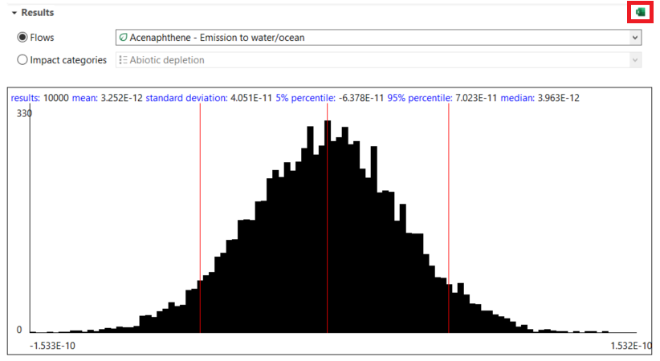

# Monte Carlo Simulation

The Monte Carlo simulation randomly varies your model’s input data using uncertainty distributions. This calculation method considers the uncertainty in the input data, resulting in multiple calculation results, each with a specific uncertainty distribution. Typically, several thousand iterations are carried out to obtain robust results.

### Adding uncertainty information

The first step in openLCA is to add uncertainty data to all input and output flows in the processes. To add uncertainty data to flows, open a process, click in the uncertainty field and select "Edit". A pop-up wizard opens where you can choose between:

- Logarithmic normal distribution (Geometric mean, Geometric standard deviation)
- Normal distribution (Mean, Standard deviation)
- Triangle distribution (Minimum, Mode, Maximum)
- Uniform distribution (Minimum, Maximum)

  
    
_Adding uncertainty to flows_

Likewise, it is also possible to define uncertainty data for parameters as well as for LCIA characterisation factors.

### Starting the Monte Carlo Simulation

Clicking on "Calculate" in a product system opens the pop-up wizard "Calculation properties". In this wizard you can select the calculation type Monte Carlo simulation and define the number of iterations.

  
_Calculation properties: Monte Carlo simulation_

Afterwards, the simulation editor will open. Select "Start" to begin the calculations. The calculation time required depends on the database and product system complexity, and the selected number of simulations. The results for each flow and impact category will be displayed while the simulation runs.

  
_Starting a Monte Carlo Simulation_

### Monte Carlo Results

The results of the simulation can be exported as an Excel document. Simply click on the Excel icon on the right-hand side of the editor.

  
_Monte Carlo Simulation results_

The results of all processes and sub-product systems that are part of a product system can be displayed separately in the Monte Carlo Simulation tab. For easy navigation, individual processes can be pinned.

  
_Pin/Unpin processes or subsystems_

### Comparing two processes in the Monte Carlo simulation

It is also possible to compare two processes with a Monte Carlo simulation if you create a process and the corresponding product system, where one process is subtracted from the other to avoid double counting of uncertainties.

  
_Creation of a process subtracting one process to the other for future comparison in Monte Carlo simulation_

