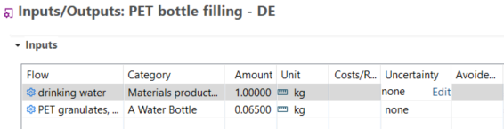
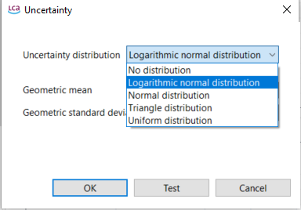
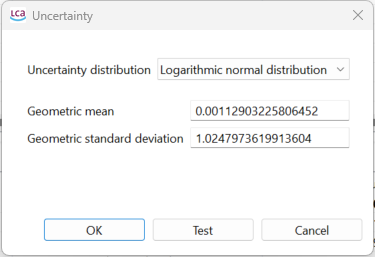
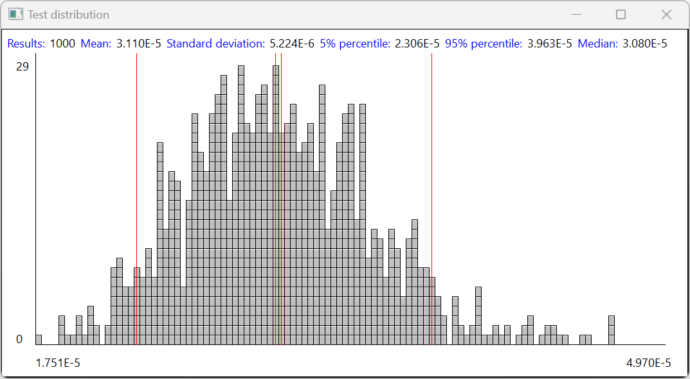
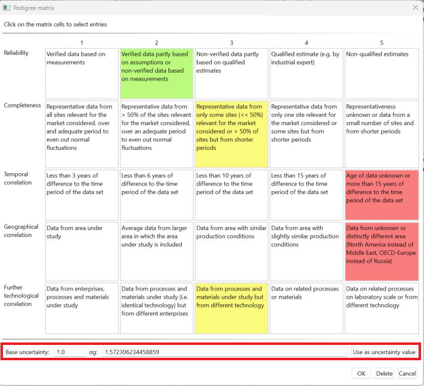
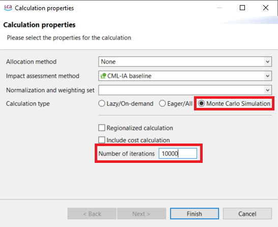
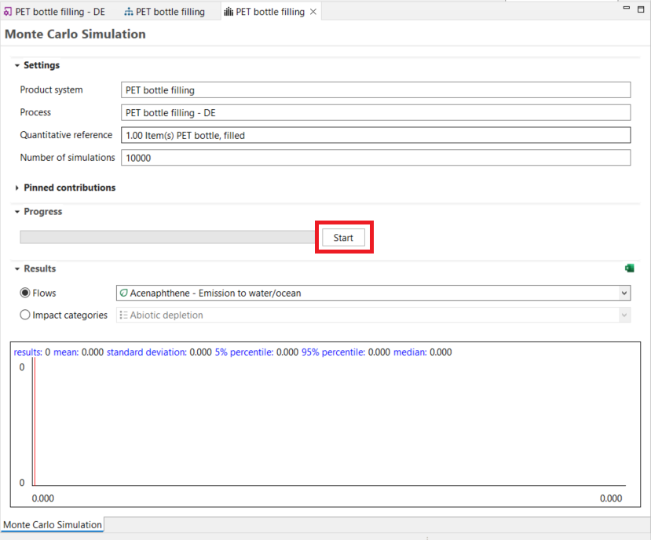
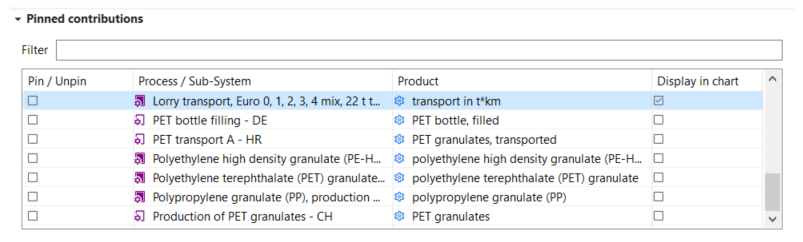
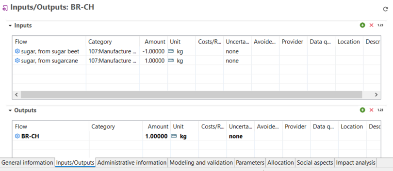

# Monte Carlo Simulation

As life cycle assessment models typically rely on many assumptions, methods to determine the associated uncertainty in life cycle inventory and life cycle impact assessment can be helpful to communicate the effect of those assumptions on the communicated results. Hence, openLCA supports to perform Monte Carlo Simulation (MCS) within a product system using per-exchange uncertainty information. The produced MCS result will display values such as the mean result from the number of calculations performed along a standard deviation, 5th percentile and 95th percentile boundaries as well as the median value of the simulated results. Particularly the standard deviation can be useful for expressing the overall uncertainty in product system results. For further investigation and interpretation, exporting the results of the MCS to Excel may be useful.	

### Principle

The Monte Carlo simulation randomly varies your model’s input data using uncertainty distributions. This calculation method considers the uncertainty in the input data, resulting in multiple calculation results, each with a specific uncertainty distribution. Typically, several thousand iterations are carried out to obtain robust results.

### Adding uncertainty information

The first step in openLCA is to add uncertainty data to all input and output flows in the processes. To add uncertainty data to flows, open a process, click in the uncertainty field and select "Edit". A pop-up wizard opens where you can choose between:

<b>Logarithmic normal distribution (Geometric mean, Geometric standard deviation)</b>

An asymmetrical probability distribution skewed towards the right, which is described through the geometric mean and geometric standard deviation. Unlike in normal distributions, the geometric mean is the maximum of the logarithmically transformed data set, just like the geometric standard deviation is the standard deviation of the logarithmically transformed data set.

<b>Normal distribution (Mean, Standard deviation)</b>

A type of distribution in which the values are concentrated symmetrically around the most common value, the peak and mean of a standard distribution. How much the values are spread around this mean is determined by the standard deviation.

<b>Triangle distribution (Minimum, Mode, Maximum)</b>

A distribution type in which all values are distributed between a minimum and a maximum. The mode defines the peak of the triangular distribution and this determines to which of the other parameters the concentration of values is skewed.

<b>Uniform distribution (Minimum, Maximum)</b>

A distribution type in which all values are evenly distributed between a minimum and a maximum value. Therefore, the minimum and maximum are the only required input parameters.

  
    
_Adding uncertainty to flows_

Likewise, it is also possible to define uncertainty data for parameters as well as for LCIA characterisation factors or to derive the uncertainty values from the respective data quality.

Luckily, some databases, e.g. ecoinvent, already provide uncertainty values for flows as visualized below (editing uncertainty as described above in the "Input/Output" tab of a "Process"):

  
   
_Defined logarithmic normal distributed uncertainty of a flow as found in the input/output tab of a process_

These are mostly based on a certain base uncertainty which is merged by with an additional uncertainty derived from the data quality and can be used directly for the Monte Carlo Simulation. However, if you use the ecoinvent database, we highly recommend the respective chapter about uncertainty [Uncertainties - ecoinvent Support](https://support.ecoinvent.org/uncertainties)

When you click on the "test" button, openLCA will simulate the uncertainty for this exchange with 1000 runs:

  

### Deriving uncertainty from Data Quality Pedigree Matrices

An alternative approach to setting exchange uncertainties is to make us of the data quality pedigree matrices that come with the openLCA reference data. The predefined data quality pedigree matrices can be used to set the uncertainty of processes according to the confidence in collected data. To use this feature, the flow data quality has to be defined see "[Data Quality](../advanced_top/data_quality)". Following that the button "use as uncertainty value" makes it possible to use the documented data quality uncertainty as defined in the data quality system (ecoinvent or Weida/Müller/Ciroth/Lesage).

This uncertainty value will be set in logarithmic normal distribution and use the values defined in the pedigree matrix window. 

  
   
_Example exchange data quality, highlighting the function of using the data quality matrix for the determination of uncertainty values_

### Starting the Monte Carlo Simulation

Clicking on "Calculate" in a product system opens the pop-up wizard "Calculation properties". In this wizard you can select the calculation type Monte Carlo simulation and define the number of iterations.

  
_Calculation properties: Monte Carlo simulation_

Afterwards, the simulation editor will open. Select "Start" to begin the calculations. The calculation time required depends on the database and product system complexity, and the selected number of simulations. The results for each flow and impact category will be displayed while the simulation runs, though only one will be displayed at the same time.

  
_Starting a Monte Carlo Simulation_

### Monte Carlo Results

The results will be displayed live and provide you with information about:

  

- **Results**: Number of iterations
- **Mean**: The arithmetic mean of the results obtained in the total number of iterations performed so far, signified by one of the central red lines in the graph.
- **Standard deviation**: The standard deviation associated with the mean of the data set of results produced so far. This describes how dispersed the produced results are around the mean value.
- **5% percentile**:  The lower boundary value, which demarks the area of results produced by only 5% of iterations. It is marked with the leftmost line in the graph.
- **95% percentile**: The upper boundary value, which demarks the area of results produced by only 5% of iterations. It is marked with the rightmost line in the graph.
- **Median**: The center value of the distribution of iterations. For different types of distributions, this can differ considerably from the mean. This value is marked by the second one of the central lines in the graph.

**The accuracy of the results is strongly depending on the number of iterations performed!**

However, all results can be exported directly as an Excel document to further assessment. Simply click on the Excel icon on the right-hand side of the editor (see above).

_**Note:**_ Depending on the type of uncertainty distribution most prevalent in the product system, the resulting mean may not match the value calculated in LCIA through regular product system result calculation. This results from a cumulative effect of skewed product system uncertainty distribution types propagating to the reference flow.

### Pinning of Monte Carlo Simulation results

The results of all processes and sub-product systems that are part of a product system can be displayed separately in the Monte Carlo Simulation tab. For easy navigation, individual processes can be pinned.

  
_Pin/Unpin processes or subsystems_

### Comparing two processes in the Monte Carlo simulation

It is also possible to compare two processes with a Monte Carlo simulation if you create a process and the corresponding product system, where one process is subtracted from the other to avoid double counting of uncertainties.

  
_Creation of a process subtracting one process to the other for future comparison in Monte Carlo simulation_

