# Regionalized LCA

With openLCA you can perform regionalized impact assessment, accounting for specific conditions and characteristics of the location where the processes occur. With parameters, you can define regional characteristics affecting the impacts. Regional characteristics and information about geographic locations are contained in GeoJSON files that can be imported into openLCA.

The new regionalized calculation employs a  **location-based** approach. Here, locations are independent entities within the database, interacting with impact factors, processes, and exchanges to generate region-specific impact assessments. This approach differs with the traditional flow-based regionalization, which relies on region-specific flows to incorporate regional Characterization Factors (CFs).

This location-based approach is more flexible, as it enables the addition of new regionalized CFs at any scale (e.g., basin-level, sub-country level...) without needing to introduce new flows. The pictures below illustrates the key differences between location-based and flow-based regionalization approaches.

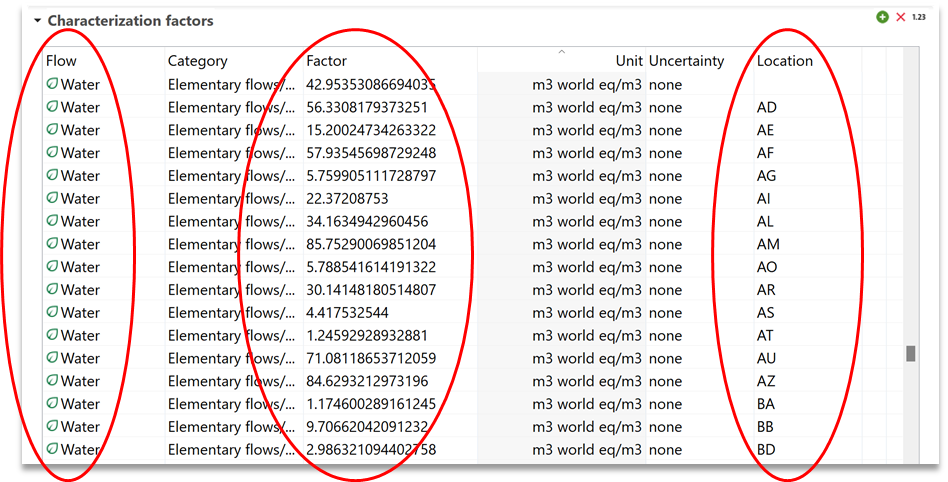
_Location-based regionalization_

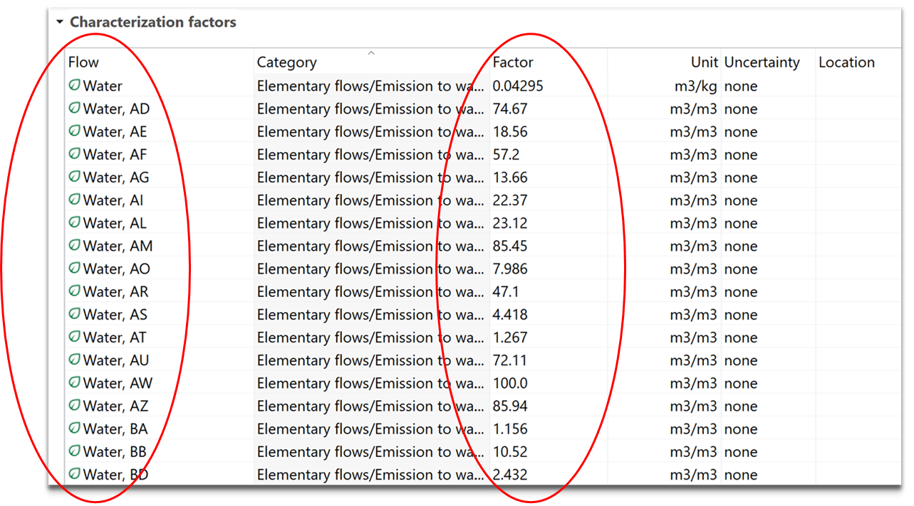
_Flow-based regionalization_

# How to perform regionalized LCA-step by step 

_**Note:**_ regionalized calculation is an advanced form of impact calculation. It is more resource consuming that a normal impact calculation and it is needed to be handled carefully. We advise to allocate enough memory for the calculations (check "File" section of chapter ["Running openLCA for the first time"](../running_olca_for_first_time.md)), to perform it using a location-based regionalized method, and to check that the locations of processes are the intended ones along the whole supply chain (check section "Assign locations to processes and exchanges" below for more details). 

At the moment, these are the methods we offer that are location-based regionalized: 
- **EF 3.1 (adapted)**: available in openLCA method package from v2.4.0 upward. Regionalized in "hybrid" format (meaning that can be used with the new regionalization tool, but it's still compatible with traditional flow-based regionalized databases).
- **TRACI 2.2 (freshwater and marine eutrophication impact categories)**: available in openLCA method package from v2.5.0 upward. Regionalized in "hybrid" format.
- **AWARE 1.2**: available in openLCA method package from v2.6.0 upward. Regionalized in "hybrid" format.
- **LC-Impact**: available in Nexus as standalone (compatible with the same databases as our method pack). Location-based regionalized only. For LC-Impact we provide also regionalization setups in json format, where the **flow-binding has already been set**. 

Nonetheless, in this chapter you will learn how to bind flows yourself and to calculate characterization factors for specific locations, which works both for methods already regionalized and method that are not yet updated, but which provide geographic information for their impact factors.

## Check locations in openLCA

A regionalized LCA needs to understand locations. In openLCA 2, available locations in a database are shown in the navigation tab under Database  &#8594; Background data &#8594; Locations.

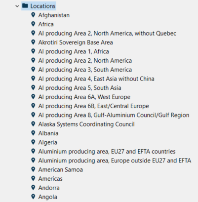  
_Available locations in a database_

Opening one, you will see geographic data, including latitude, longitude and country code (e.g. ES for Spain), and the covered area defined by GeoJSON. It is also possible to modify the coordinates by using the text editor that can be opened by clicking on the pencil icon in the "Geographic data" section.

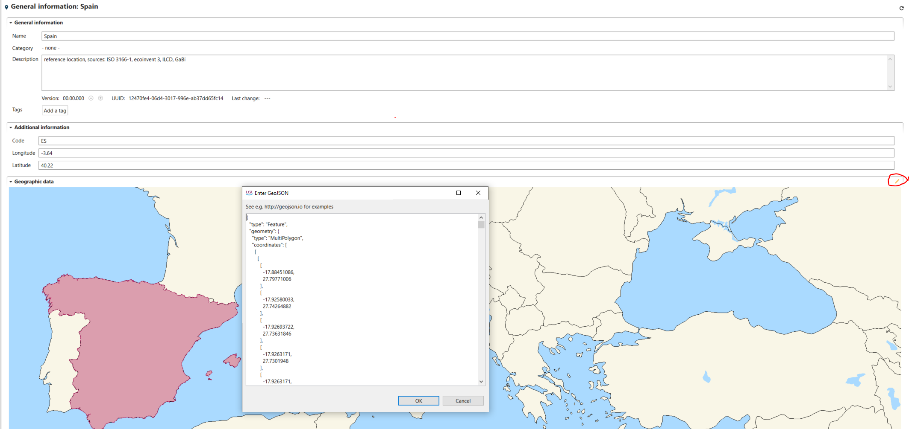  
_General geographic data - Example: Spain_

Locations can be also imported in the active database, for instance from a GIS software, as GeoJSON files File &#8594; Import &#8594; other &#8594; geometries from GeoJSON.

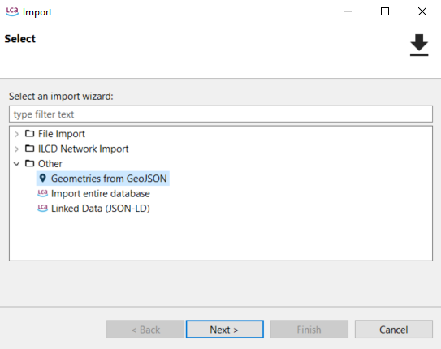  
_Import of locations into active database_

Alternatively, locations can be also drawn by users in [geojson.io](https://geojson.io/#map=2/20.0/0.0)  as polygons, lines or points. 

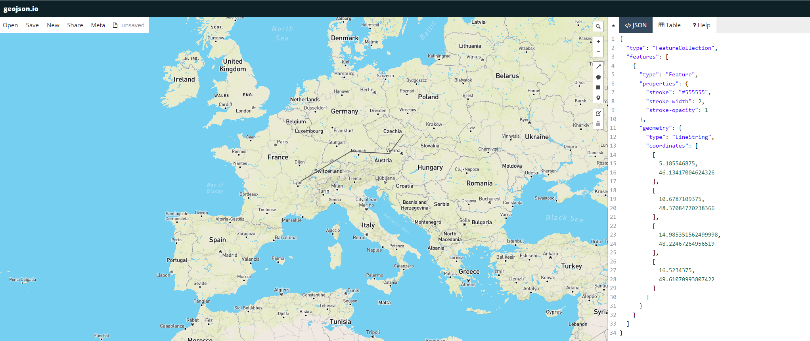  
_geojson.io example_

The coordinates text can then be just pasted in the text editor in openLCA, after the creation of a new location (right click on location folder &#8594; new location &#8594; add name and country code &#8594; open the text editor in the geographic data 
("pencil" icon) &#8594; paste coordinate text from geojson.io).

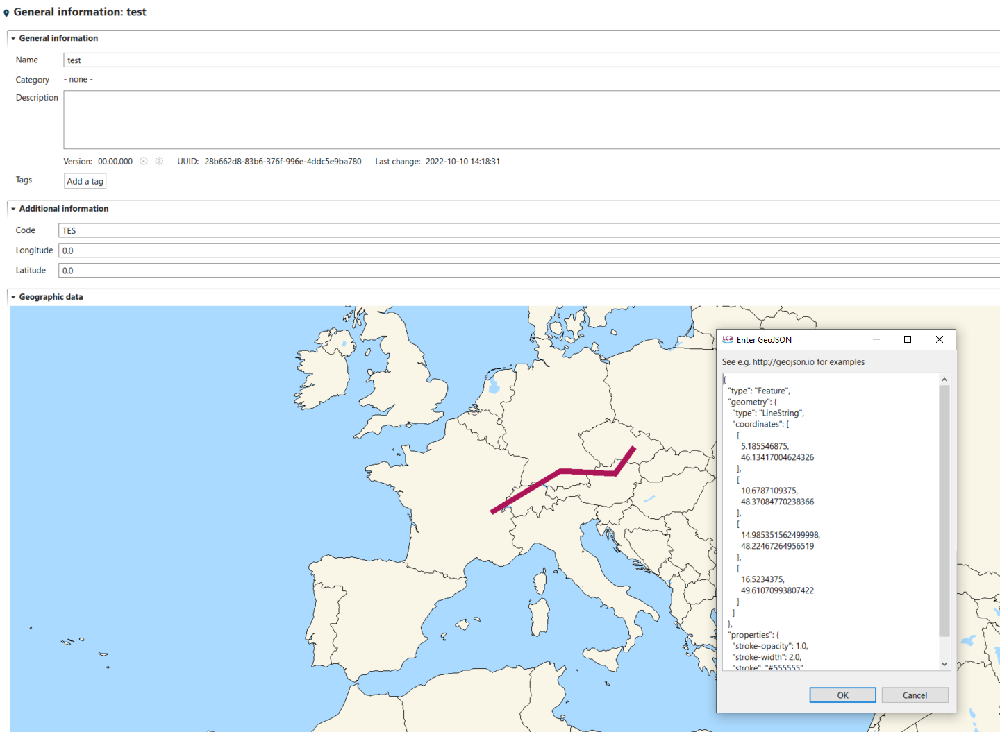  
_Use of coordinates text from geojson.io example in the openLCA text editor_

## Importing regional characteristics as GeoJSON file

Data for regional characteristics are contained in GeoJSON files, which can be imported in openLCA. To regionalize an impact category, first go to "impact categories" folder and open an existing category (or create a new one). Then go to the tab "regionalized calculation" for the opened category. Here you need to import regional characteristics (e.g. population density, watershed area, characterization factors…) by clicking on "open" and selecting GeoJSON files available in your laptop (e.g. previously exported from a GIS software). Parameters are extracted during the GeoJSON file import and are available under the section "GeoJSON Parameters".

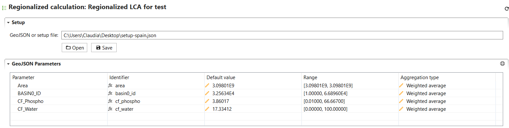  
_Regionalized calculation_

Each imported parameter can be visualized in a map by selecting the parameter and clicking on the "world" icon in the GeoJSON Parameters section.

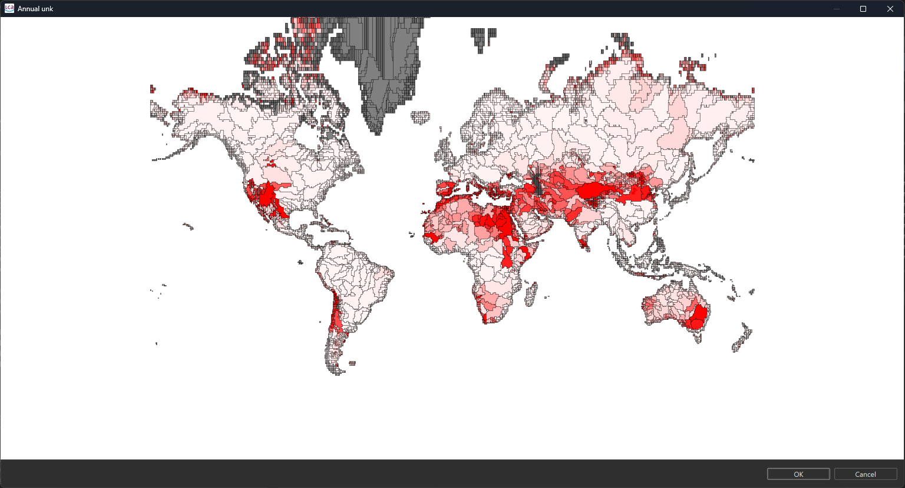  
_Visualization of parameters_

## Binding regional characteristics (GeoJSON files) to flows

Flows for which you want to calculate geo-spatial based CFs need to bound to the regional characteristics contained in GeoJSON files, so that the CFs can vary based on the selected location for exchanges and processes. In the "flow bindings" section under "regionalized calculation" in the open impact category, add the flows that you want to regionalize (use the "+" icon") and parametrize the "formula" field using the parameters extracted during the regional characteristics import and available under "GeoJSON parameters". In regionalized assessment, the parameter value derived from the GeoJSON file is used for the formula evaluation. Instead, if you apply non-regionalized LCIA or no location is available for exchanges and processes, the default CF value will be used in the calculations.

In "Formula" field, you can chose the parameter of your geoJSON that you want to use for the calculation of the CF of the flow you chose. You can treat that field as any other formula in openLCA. For instance, if you have a water flow expressed in Kg and the parameter of your geoJSON is in m3, you can se

In the "Range" field, you can view the minimum and maximum values for each parameter. The "Aggregation Type" field allows you to choose the aggregation type for the calculation of your CFs: "Weighted Average" (N.B.: area-weighted average), "Average," "Minimum," or "Maximum." The "Default Value" displays the value derived from the selected aggregation type performed for each parameter on your entire map.

  
_Example of flow binding and parameterization_

Currently, openLCA cannot store the GeoJSON parameters and flow bindings, but you can save and export your setup by clicking on "save". You can import this configuration again at any time by clicking on "open" and selecting the exported setup.
The calculated CFs instead (see below) can be saved and therefore permanently stored in the impact category of choice-

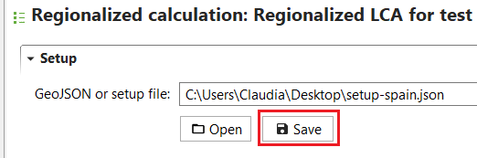  
_Saving geojson parameters and flow bindings_

## Calculate CFs for selected locations

The last step to set-up the regionalized LCIA method, is to link process locations and LCIA methods spatial units. Therefore, the intersection between GeoJSON file features and process geometries (stored in "Locations") is calculated by the software, thus resulting in dedicated CFs for locations selected by the user. By clicking on the "calculate" icon in the "flow bindings" section, the user defines the locations for which CFs are to be calculated for the flows added in the "flow bindings" section. 

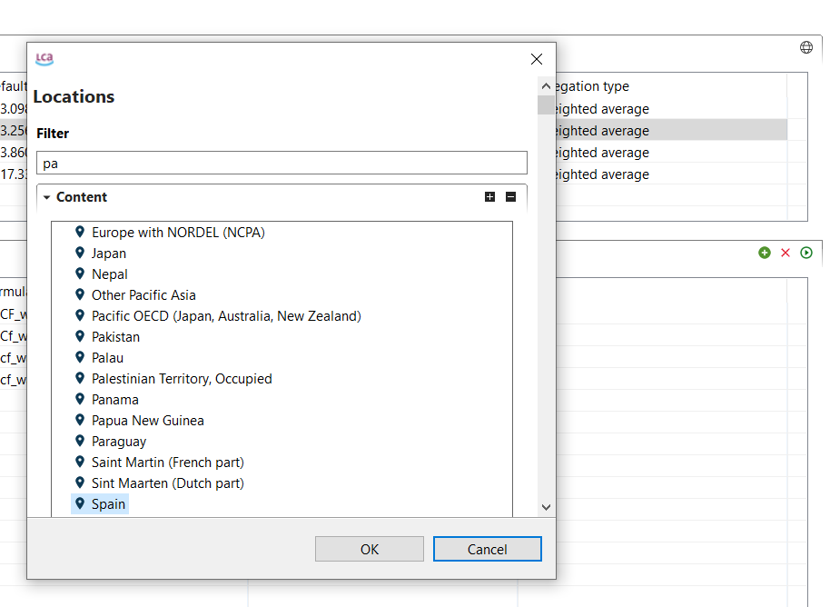
 _Defining the location for which the characterization factors are calculated_

A window will open with the resulting characterization factors. The system will calculate, using the aggregation type you choose (see the above section) two values: 1) **a value based on the geometry of the specific location you select**; 2) **a default value representing a global factor** (what was called "default value" in the GeoJSON Parameters table) without a specific location, useful for instance when the location of a process is unknown. 

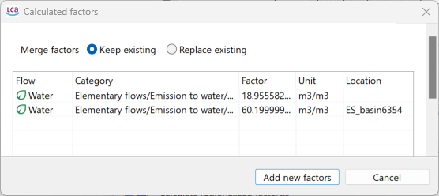  
_Example results of newly calculated Characterization Factors_

You can choose between two saving options: 

- **Keep existing**: This option preserves any existing CFs. For example, if the method you're using already includes a global default value, selecting this option ensures it remains unchanged.
- **Replace existing**: This option overwrites all values. It will add or replace both the specific CF for the selected location and the default global value.

Eventually click on "Add new factors". The resulting CFs for the selected locations and flows are available in the tab "characterization factors" for the open impact category. A flow for each selected location and the same flow without a specific location are created and assigned with a CF depending on the location, or with the default CF value for the case of the flow without a specific location.

## Add the regionalized impact category to an impact assessment method

When running LCIA, you need to select an impact assessment method. Therefore, the regionalized impact category/ies need to be added to the method that will be used to calculate the product system impact. To create a new regionalized method, right-click on the folder "impact assessment methods" and select "new LCIA method". Then you can add the previously created impact category in the section "impact categories" in the first tab "general information".

  
_Adding an impact category to the tab "General information"_

## Assign locations to processes and exchanges

To perform a regionalized LCIA, ensure that the correct locations are assigned to your processes and/or exchanges. 

For process locations, go to the 'Geography' section in the 'General Information' tab of a process and select the desired location. 

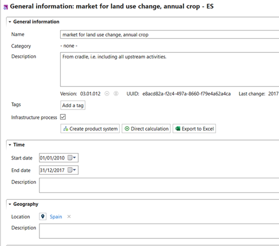  
_Process with Spain as assigned location_

For exchange locations, add them to the 'Location' field in the 'Input/Output' tab of a process.

  
_Exchange with Norway as assigned location_

Mind that **the locations of exchanges will have priority over the location of the process, if they differ**. For instance, if a process has "Italy" assigned as its location, but some of its exchanges are designated with more specific regions (e.g., Sicily or a particular water basin), the impact will be calculated based on the exchange locations. If no specific location is given for an exchange, the impact will then be calculated using the process location (therefore, it's not mandatory to specify locations for every exchange).

_**Note:**_ Instead, locations specified in flows (if any) are **not considered** in the regionalized impact calculation! These locations mainly apply to product or waste flows and are not relevant to regionalized impact calculations, which only account for process or exchange locations. See below:

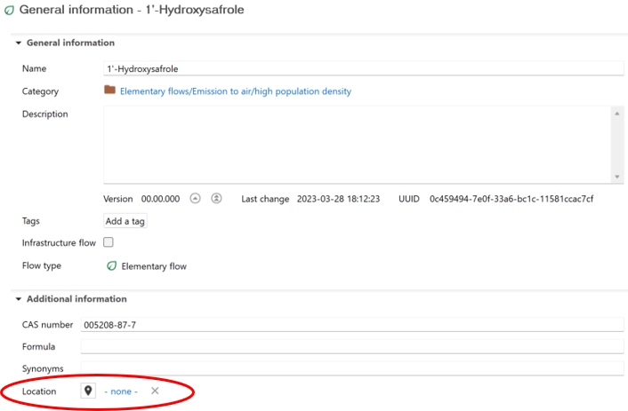
 _If a location is specified at this level, it won't be taken into account during the regionalized impact calculation_

## Run regionalized LCIA of a product system

To run regionalized LCIA for a product system, select a regionalized impact assessment method and check the box "regionalized calculation". Click on "Finish" to start the calculations.

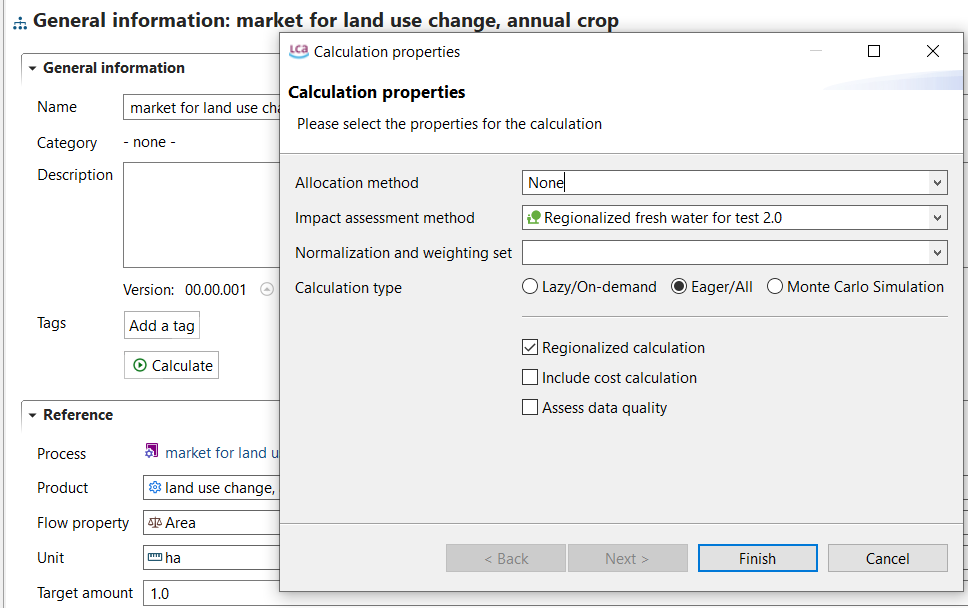  
_Calcualtion of a regionalized LCIA_

Regionalized results can be analysed using different tabs, such as "impact analysis" and "locations".

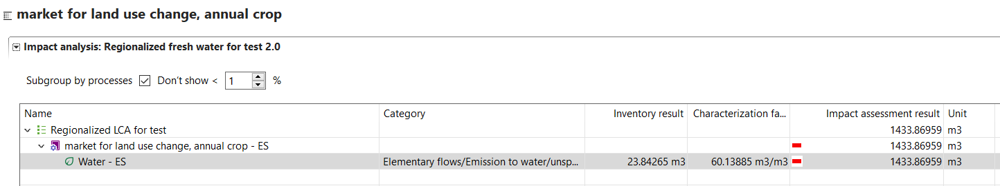  
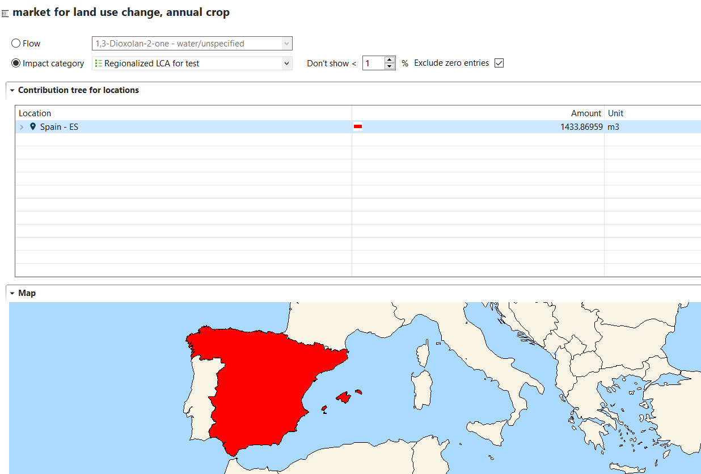  
_Example results of a regionalized LCIA_

