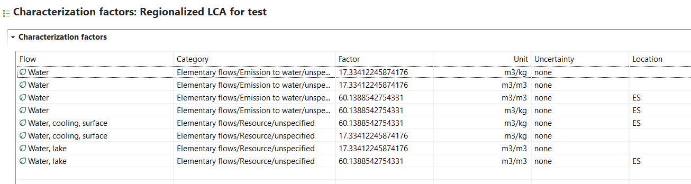

# Regionalized LCA

With openLCA you can perform regionalized impact assessment, accounting for specific conditions and characteristics of the location where the processes occur. With parameters, you can define regional characteristics affecting the imcts. Regional characteristics and information about geographic locations are contained in GeoJSON files that can be imported into openLCA

## How to perform regionalized LCA-step by step 

_**Note:**_ regionalized calculation is an advanced form of impact calculation. It is more resource consuming that a normal impact calculation and it is needed to be handled carefully. We advise to allocate enough memory for the calculations, to perform it using a regionalized method (that uses locations as entities), and to check that the locations of processes are the intended ones along the whole supply chain.

At the moment, we offer two methods that are regionalized using locations as entities: **EF 3.1 (adapted)** available in openLCA method package 2.4.0 and **LC-Impact** available in Nexus as standalone (compatible with the same databases as our method pack). For LC-Impact we provide also regionalization setups in json format, where the flow-binding has already been set. However, in this chapter you can learn how to calculate yourself characterization factors for specific locations, which works both for  methods already regionalized and method that are not yet updated, but which provide geographic information for their impact factors.

### Check locations in openLCA

A regionalised LCA needs to understand locations. In openLCA 2, available locations in a database are shown in the navigation tab under Database  &#8594; Background data &#8594; Locations.

  
_Available locations in a database_

Opening one, you will see geographic data, including latitude, longitude and country code (e.g. ES for Spain), and the covered area defined by GeoJSON. It is also possible to modify the coordinates by using the text editor that can be opened by clicking on the pencil icon in the "Geographic data" section.

  
_General geographic data - Example: Spain_

Locations can be also imported in the active database, for instance from a GIS software, as GeoJSON files File &#8594; Import &#8594; other &#8594; geometries from GeoJSON.

  
_Import of locations into active database_

Alternatively, locations can be also drawn by users in [geojson.io](https://geojson.io/#map=2/20.0/0.0)  as polygons, lines or points. 

  
_geojson.io example_

The coordinates text can then be just pasted in the text editor in openLCA, after the creation of a new location (right click on location folder &#8594; new location &#8594; add name and country code &#8594; open the text editor in the geographic data 
("pencil" icon) &#8594; paste coordinate text from geojson.io).

  
_Use of coordinates text from geojson.io example in the openLCA text editor_

### Importing regional characteristics as GeoJSON file

Data for regional characteristics are contained in GeoJSON files, which can be imported in openLCA. To regionalize an impact category, first go to "impact categories" folder and open an existing category (or create a new one). Then go to the tab "regionalized calculation" for the opened category. Here you need to import regional characteristics (e.g. population density, watershed area, characterization factors…) by clicking on "open" and selecting GeoJSON files available in your laptop (e.g. previously exported from a GIS software). Parameters are extracted during the GeoJSON file import and are available under the section "GeoJSON Parameters".

  
_Regionalized calculation_

Each imported parameter can be visualized in a map by selecting the parameter and clicking on the "world" icon in the GeoJSON Parameters section.

  
_Visualization of parameters_

### Binding regional characteristics (GeoJSON files) to flows

Flows for which you want to calculate geo-spatial based CFs need to bound to the regional characteristics contained in GeoJSON files, so that the CFs can vary based on the selected location for exchanges and processes. In the "flow bindings" section under "regionalized calculation" in the open impact category, add the flows that you want to regionalize (use the "+" icon") and parametrize the "formula" field using the parameters extracted during the regional characteristics import and available under "GeoJSON parameters". In regionalized assessment, the parameter value derived from the GeoJSON file is used for the formula evaluation. Instead, if you apply non-regionalized LCIA or no location is available for exchanges and processes, the default CF value will be used in the calculations.

  
_Example of flow binding and parameterization_

Currently, openLCA cannot store the GeoJSON parameters and flow bindings, but you can save and export your setup by clicking on "save". You can import this configuration again at any time by clicking on "open" and selecting the exported setup.

  
_Saving geojson parameters and flow bindings_

### Calculate CFs for selected locations

The last step to set-up the regionalized LCIA method, is to link process locations and LCIA methods spatial units. Therefore, the intersection between GeoJSON file features and process geometries (stored in "Locations") is calculated by the software, thus resulting in dedicated CFs for locations selected by the user. By clicking on the "calculate" icon in the "flow bindings" section, the user defines the locations for which CFs are to be calculated for the flows added in the "flow bindings" section. 

_Defining the location for which the characterization factors are calculated_

The resulting CFs for the selected locations and flows are available in the tab "characterization factors" for the open impact category. A flow for each selected location and the same flow without a specific location are created and assigned with a CF depending on the location, or with the default CF value for the case of the flow without a specific location.

  
_Example results of the tab "Characterization factors"_

### Add the regionalized impact category to an impact assessment method

When running LCIA, you need to select an impact assessment method. Therefore, the regionalized impact category/ies need to be added to the method that will be used to calculate the product system impact. To create a new regionalized method, right-click on the folder "impact assessment methods" and select "new LCIA method". Then you can add the previously created impact category in the section "impact categories" in the first tab "general information".

  
_Adding an impact category to the tab "General information"_

### Assign locations to processes and exchanges

To perform regionalized LCIA, make sure to assign a location to your processes and/or exchanges. You can do this by going to the "geography" section in the "general information" tab of a process and selecting your desired location. 

  
_Assigning locations to processes_

Location can be assigned to exchanges in processes by adding them to the "location" field for each flow in inputs and outputs. 

  
_Assining locations to exchanges_

### Run regionalized LCIA of a product system

To run regionalized LCIA for a product system, select a regionalized impact assessment method and check the box "regionalized calculation". Click on "Finish" to start the calculations.

  
_Calcualtion of a regionalized LCIA_

Regionalized results can be analysed using different tabs, such as "impact analysis" and "locations".

  
  
_Example results of a regionalized LCIA_

