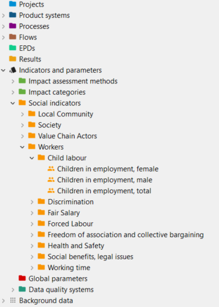
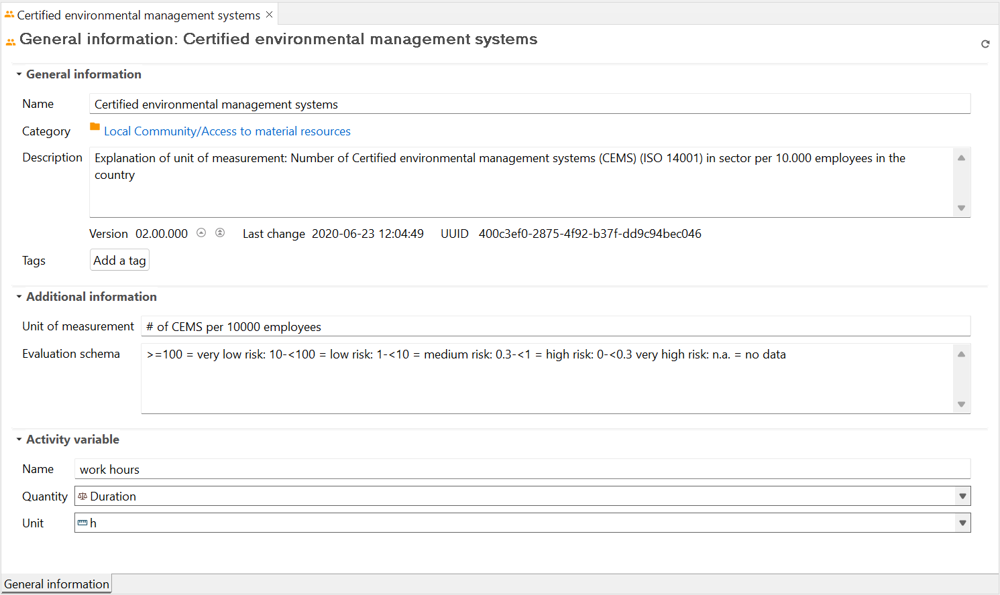
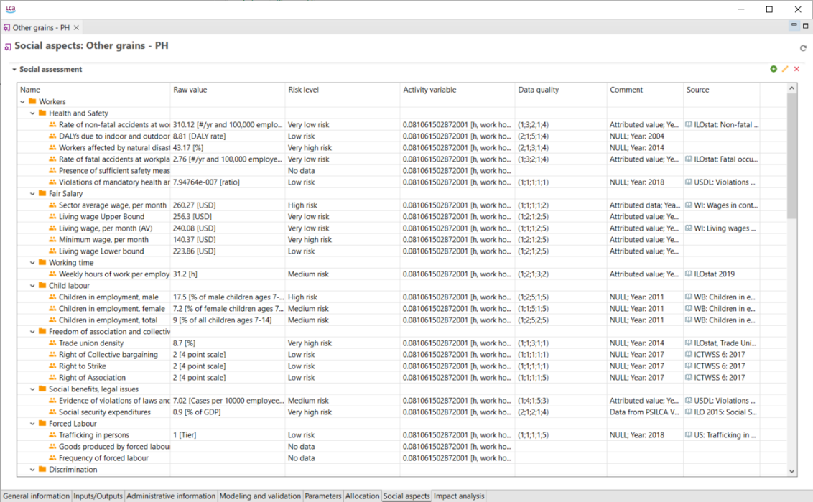

# Social aspects

openLCA can also be used to conduct social lifecycle assessments (SLCA) for any product or project. SLCA is a part of a sustainability assessment that focuses on the social impacts throughout a product's lifecycle. Guidelines for carrying out SLCA were developed (and were last updated in 2020) by the United Nations Environment Programme (UNEP) and can be freely accessed on their website.

Similar to conventional environmental LCA, there are background databases used for SLCA. In openLCA, PSILCA and SHDB are examples of social databases that can be used. You can also integrate SOCA, which is an add-on for ecoinvent LCI databases to carry out SLCA. Social LCA databases are available on openLCA Nexus, under the Database section.' This section will display content only if processes have social-related information. 

In an active social database, you can find the "Social Indicators" in the "Indicators and parameters" directory. 

  
_Social indicators in "Indicators and parameters" directory_

To learn more about any social indicator, you can double-click on it. In the General information tab, additional information about the unit of measurement, evaluation schema and activity variable are displayed. 

  
_General Information of a Social Indicator_

Information regarding the social indicator according to each process can be viewed in the "Social Aspects" tab.Information on the raw values, risk level (evaluated according to the amount of the "raw value"), activity variable, data quality, comment and source can all be displayed. The risk-assessed indicators are characterised by the activity variable. For instance, for the time being, all indicators use working hours as an activity variable. To learn more about this and about each social indicator, it is recommended to visit the PSILICA manual which is available on the nexus website.

  
_Process, social aspect tab_

