

# First test version of integrating system dynamics into openLCA

System dynamics allows one to model non-linear behavior of complex systems over time using stocks, flows, and feedback loops. It makes it possible to model product systems in broader system surroundings and further define dynamic relationships of system variables. 

In openLCA you can now link your LCA models to system dynamics models, making it possible to calculate dynamic impact results over time. First, you need to enable "Support for system dynamics models" in the preferences (do not forget to press "Apply" or "Apply & Close" in that dialog):

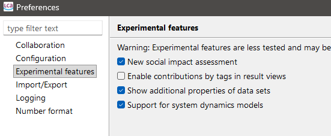

Then, refresh the navigation via F5 or the refresh button:

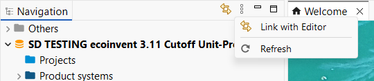

You should see a folder "System dynamics models" in your database folders now:

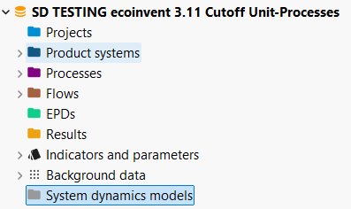

Right click to add a new model:

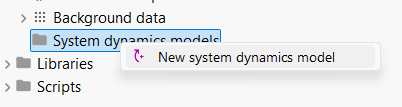

openLCA does not yet include a system dynamics modelling interface, so the models need to be pre-modelled and exported from a system dynamics software first. You need a XMILE file of your model. Some example models can be found here: [https://exchange.iseesystems.com/directory/isee](https://exchange.iseesystems.com/directory/isee) (but not all of these are supported yet.). 

The pop-up window allows you to give your systems dynamics model a name and select the XMILE file of your model. 

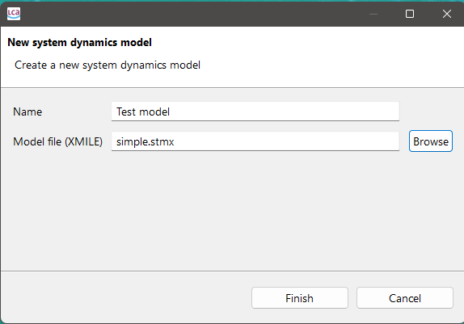

By clicking “Finish”, the model editor will open with the model settings, variables, and generated image of the model.

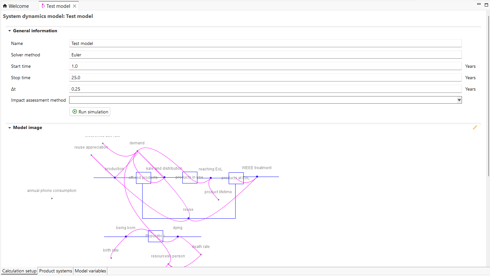

You can directly run a model with the "Run simulation button". It will run the simulation and open the results view (below you see the results of an array variable):

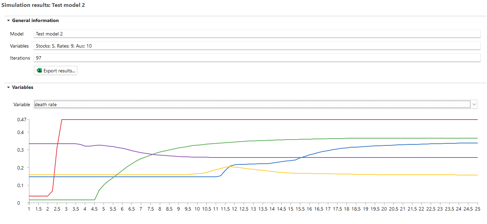

You should always test the model first before trying to link it to an LCA model, as not all features of your system dynamics software may be supported yet. It can also be that the results differ slightly to the results of your system dynamics software. In most cases you should get an error message:  

When your model works, you can link its model variables to parameters of product systems.
In the "Product systems" tab, you can bind a model variable (stock, rate, auxiliary) to parameters of selected product systems. Note that you can only bind variables that evaluate to plain numbers to parameters as openLCA does not support other data types other than numbers for parameters. However, the SD simulation engine of openLCA has support for arrays that can be used in model variables.

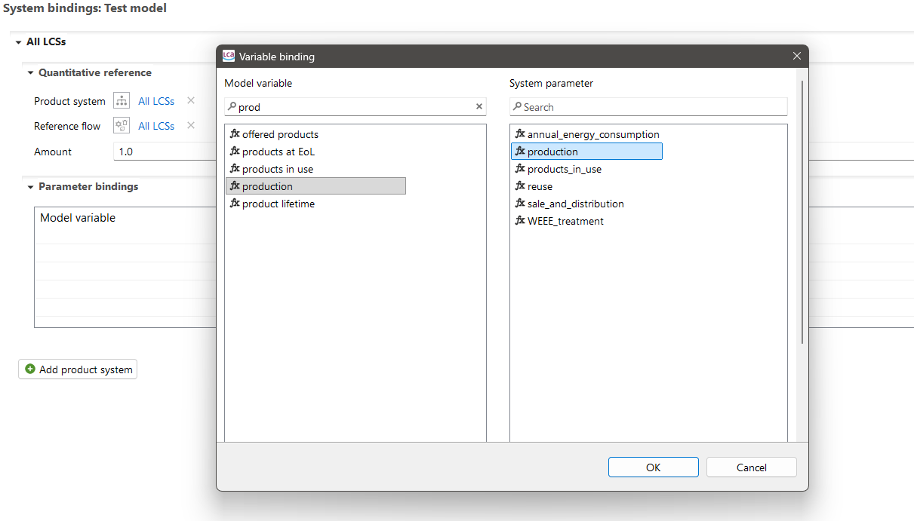

In each simulation step, it will then calculate the linked product system with the respective values from the system dynamics model of that step. 

Once you linked your product system, you need to select an LCIA method in the setup in order to get LCA results:

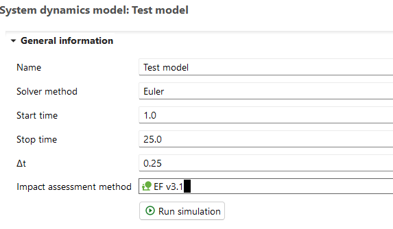

Run the simulation by clicking “Run simulation”.

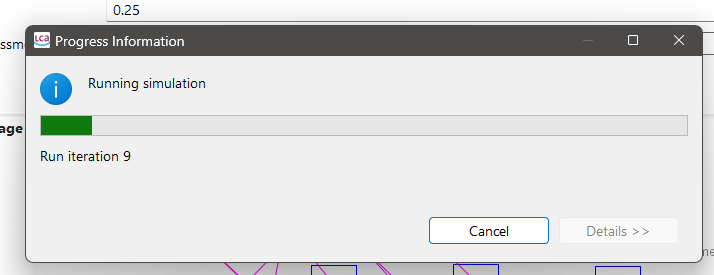

You will then get LCIA results for each simulation step which can be exported to excel with the corresponding model variables.

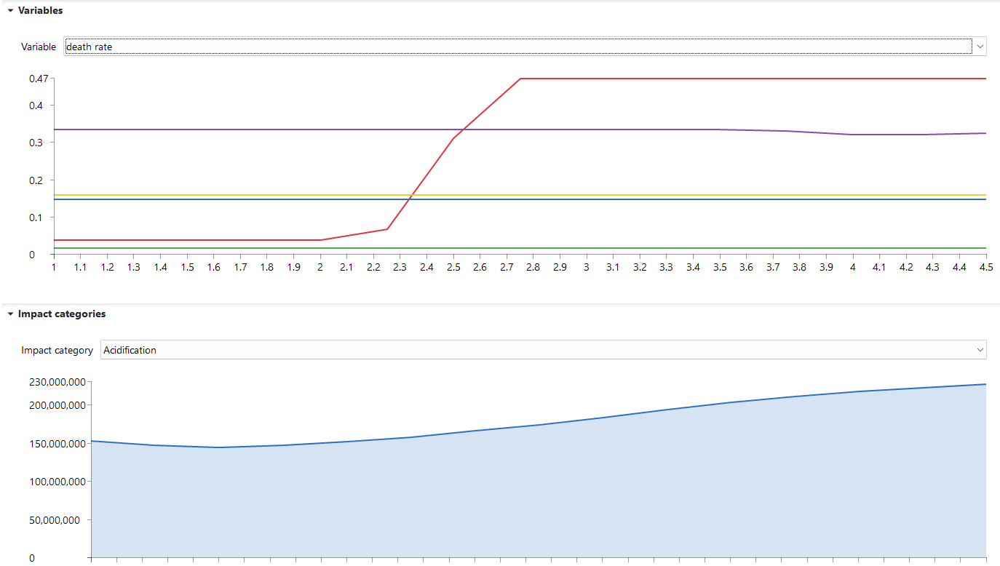

