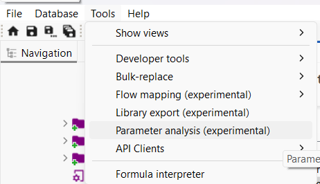
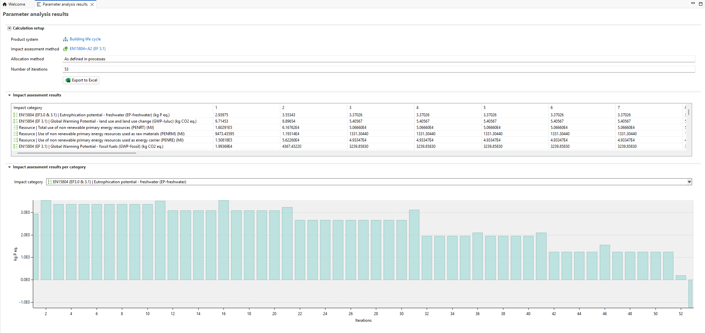
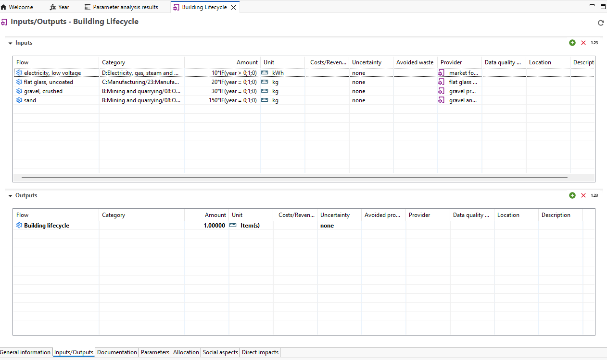
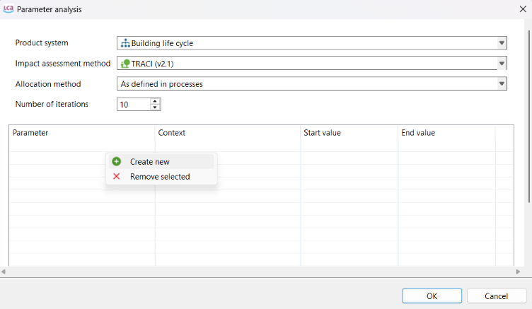
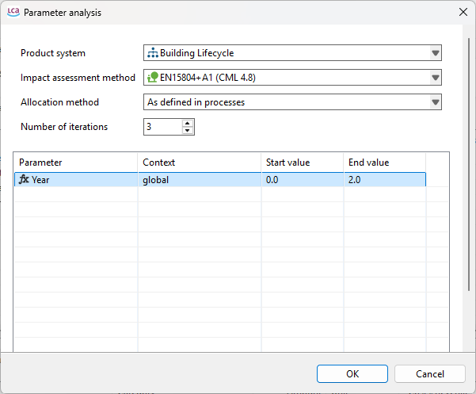
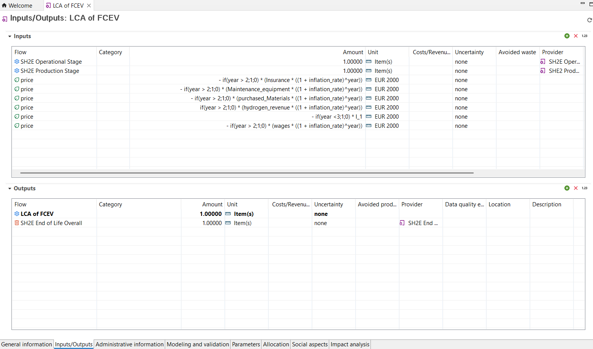
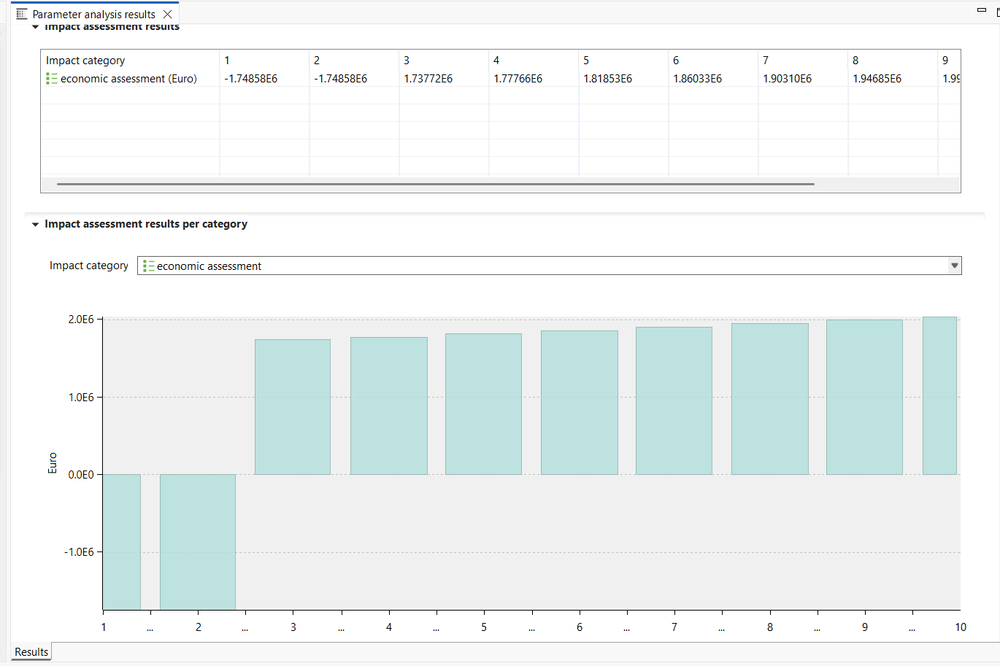

# Impact analysis with a time parameter

Under Tools → Parameter analysis is a feature that allows you to change given parameter variable(s) across different iterations.

A useful application is testing how impacts change over time. For example, in a building life cycle, impacts vary across the different stages of the building’s lifetime, as illustrated in the diagram below:

In the beginning, impacts arise from the construction phase. Later, impacts occur during the use phase, end-of-life, and beyond.
To model this, you must first define a global input parameter that is referenced in your process(es). In this example, the parameter is **Year**.

You must then insert this parameter into the relevant process(es). In the example below, if conditions are applied to indicate when the construction phase ends (assumed to be at year 0) and when the building enters the use phase (starting from year 1 onward).

Next, create a product system based on the process. When you open Parameter Analysis (as shown previously), a pop-up window will appear. Select the product system, impact assessment method, and any other required settings.

Set the number of iterations (runs) you want to perform. In the lower section of the window, right-click and select Create New to add the parameter you want to vary in each iteration.

The parameter will appear in the table below. Set the start and end values; these will be divided equally across the specified number of iterations. Finally, click OK to run the iterations.

In the example below, the range is set from year 0 to year 2. The number of iterations is set to 3, corresponding to Year = 0, Year = 1, and Year = 2.

The results will then appear in a graphical and tabular format for each impact category of the selected impact method. You can export the results by clicking Export to Excel at the top.

The full building life cycle can be found here: https://www.openlca.org/case-studies/ 

You can further apply time-dependent parameters when modeling life cycle costing. In the example below, capital costs and operational costs are defined separately. Operational costs are multiplied by an inflation rate adjusted using the year factor. Additionally, costs are assigned a negative factor, while revenue for the is assigned a positive factor. This ensures that net costs are calculated correctly.

The results then show how the net costs vary along the year, with the first two years indicating investment periods and this appears as negative factors.

You can learn more on this example here: https://www.greendelta.com/project/sh2e/ 
