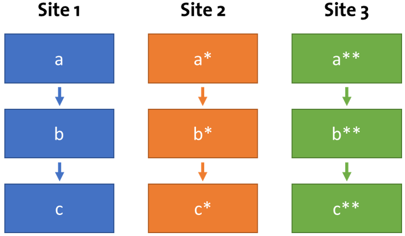
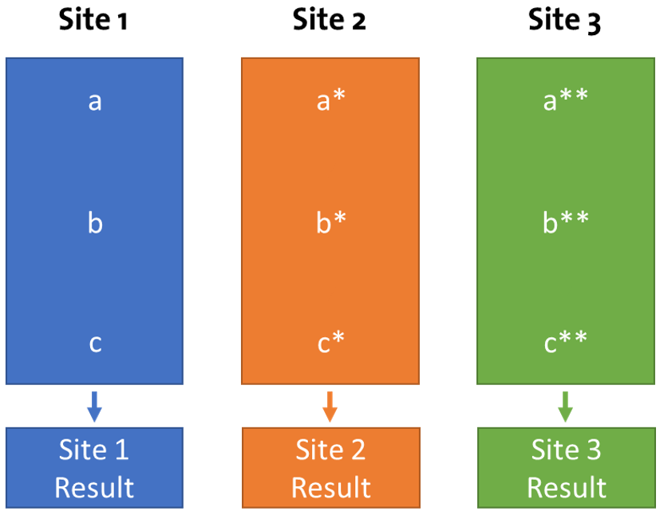
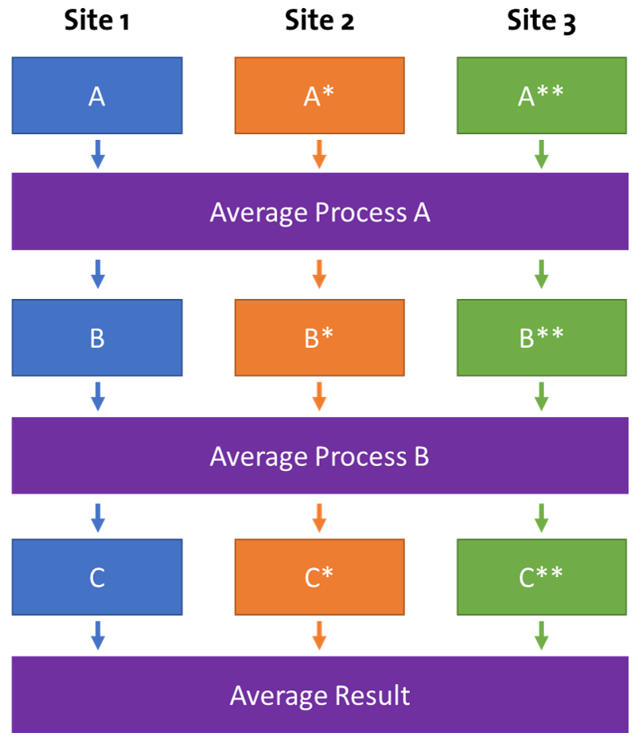
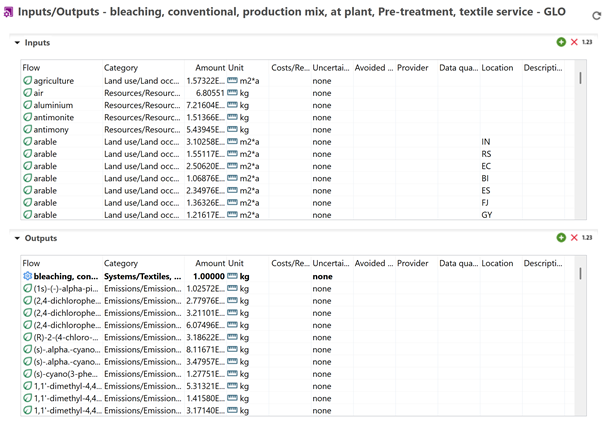
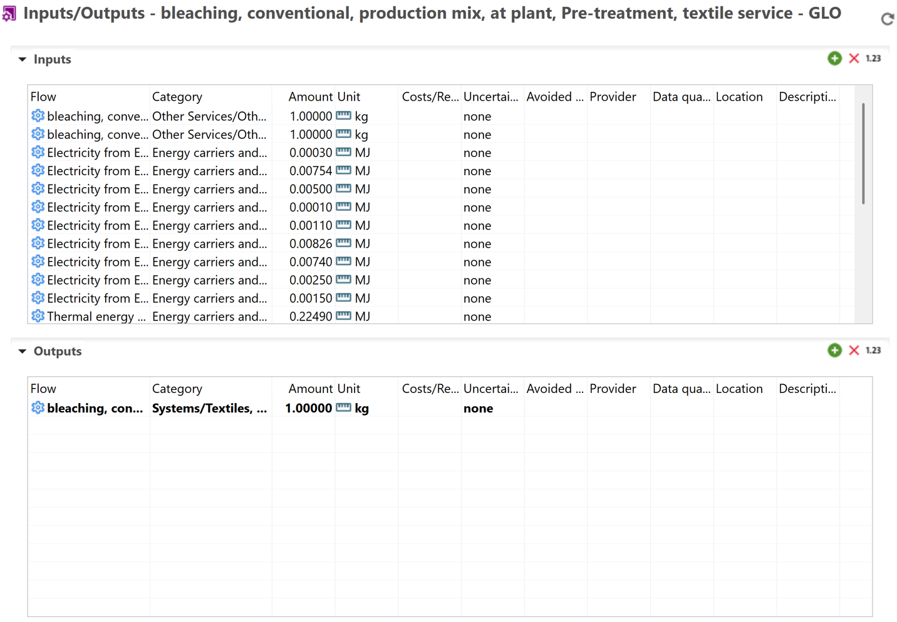
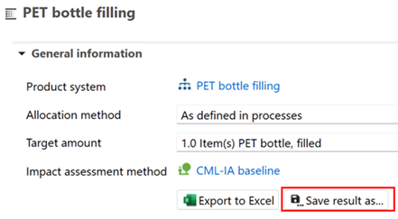
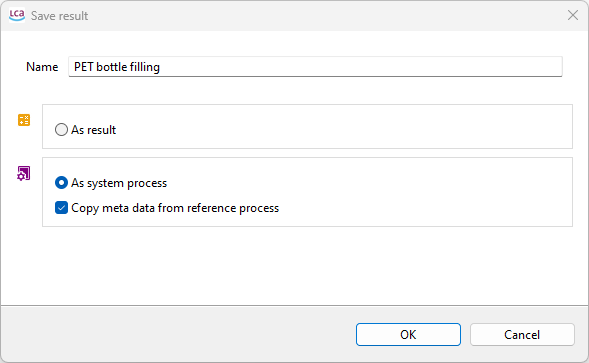

# Creating Data Sets in openLCA - Data Aggregation 

## Background

One of the main challenges in the creation of LCI datasets and databases is the tension between transparency and the need to protect suppliers’ intellectual property. For suppliers, there is very little incentive to share process or product data at the level of granularity required to make a high-quality, transparent LCI dataset. As a result, several strategies for preserving supplier IP in the creation of LCI datasets have been developed, all centred around the concept of aggregation.

The goal of these aggregation strategies is to ensure that datasets are representative of reality without exposing the process data of any one supplier. This anonymisation is a critical step in the creation of high-quality, FAIR, open-access datasets. openLCA supports you with this in several ways.

## Vertical vs Horizontal Averaging 

To create a vertically averaged dataset, first, the individual production chains for a given product must be modelled. These production chains consist of a sequence of unit process inventories (UPIs) or aggregated processes (system processes), [see process chapter](./processes/index.html). Once each production chain has been modelled and calculated, a final weighted average can be calculated based on the production tonnage of each chain. Vertical aggregation provides the datasets with the most realistic representation of production chains while still maintaining supplier confidentiality [1].

  
_Three production chains comprised of three individual UPIs_

  
_Vertical aggregation across three production sites_

This has been done in our research project PRIMUS to generate EcoProfiles of plastic recyclates. Have a look at the respective [methodology ](https://nexus.openlca.org/database/EcoProfiles%20Recycled%20Plastics%20)[(download directly)](https://nexus.openlca.org/ws/files/38305).

To create a horizontally averaged dataset, multiple UPIs or aggregated processes from different production chains that supply the same reference flows are aggregated. Horizontal averaging can be beneficial for addressing data gaps or creating benchmarks, but it is methodologically less robust than vertical averaging due to potential differences in the averaged operations [1]. 

  
_Horizontal averaging across three production sites_

Both types of aggregation can be either company-specific or an average of different suppliers within an industry [2].  A hybrid of vertical and horizontal averaging approaches is often used in the creation of datasets.

## Fully vs Partially Terminated Datasets 

A fully terminated dataset is a dataset that contains the entire product system within its boundaries. Since all intermediate exchanges are generated and consumed within the system boundaries, the inputs/outputs appear as a list of only elementary flows [3]. By removing any intermediate exchanges from the dataset, system processes protect confidential IP while still allowing LCA practitioners to calculate life cycle impacts [2].
However, the lack of transparency provided by fully terminated processes means that users lose oversight over the background system and are unable to adapt processes, limiting the flexibility of the model. Furthermore, comparability between system process datasets can be limited due to differing assumptions made regarding allocation, cut-off etc. 
Historically, system processes have had the added benefit of requiring less computational power in LCA calculations. However, recent technological developments, such as precalculated database libraries developed by GreenDelta, mean that there is often no longer a meaningful difference in calculation speed between unit and system process datasets.

In addition to fully disaggregated and fully terminated processes, datasets can be created in a “partially terminated” format. Partially terminated datasets consist of an almost completely aggregated dataset, except for one or more intermediate exchanges listed that the user can connect to background datasets [4].

_Screenshot from openLCA showing fully terminated process (system process)_

  
_Screenshot from openLCA showing partially terminated process_

In all cases, GreenDelta is happy to provide support for extracting and sharing LCA data using openLCA.

## Data Aggregation in openLCA 

To perform data aggregation in openLCA, there are several ways. However, the fastest is to calculate the results of your product system and save them as a novel system process by clicking the "Save results as..." button in the "General information" tab of the results window [see process chapter](./res_analysis/analysis.md):

Save as result:

  

Then you generate a **system process**, which can be further exported as ILCD or JSON file and shared with other practitioners.

If you want to produce a **partially terminated process** from your results, you need to hold intermediary flows in your calculated flow (the supply chain should not be fully resolved). You can follow the logic presented in the [Validation Chapter](./validation.html#validation-of-data) by disconnecting respective product flows from your reference process in the model graph or by not setting the provider on process level prior to the product system creation and removing the tick from 'auto-link processes. This will give you an inventory solely consisting of intermediary flows and direct emissions from this process you can export again as described above. This can also be done use various scripts, feel free to reach out to us for consultancy on this matter.

Relevant sources:

[1]	PlasticsEurope, ‘Eco-profiles program and methodology’. Accessed: Oct. 07, 2025. [Online]. Available: https://plasticseurope.org/wp-content/uploads/2024/03/PlasticsEurope-Ecoprofiles-program-and-methodology_V3.1.pdf
[2]	United Nations Environment Programme and SETAC, Global Guidance Principles for Life Cycle Assessment Databases. 2011. Accessed: Dec. 11, 2025. [Online]. Available: https://www.lifecycleinitiative.org/wp-content/uploads/2012/12/2011%20-%20Global%20Guidance%20Principles.pdf
[3]	‘Life Cycle Terminology 2 - Life Cycle Initiative’. Accessed: Jan. 16, 2026. [Online]. Available: https://www.lifecycleinitiative.org/activities/life-cycle-terminology-2/
[4]	European Commission. Joint Research Centre., Guide for EF compliant data sets. LU: Publications Office, 2020. Accessed: Sep. 25, 2025. [Online]. Available: https://data.europa.eu/doi/10.2760/537292

