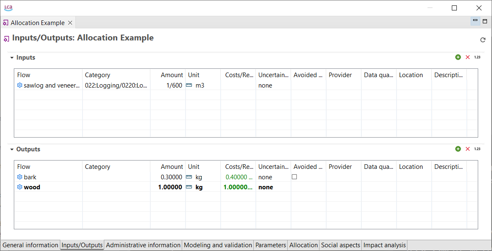
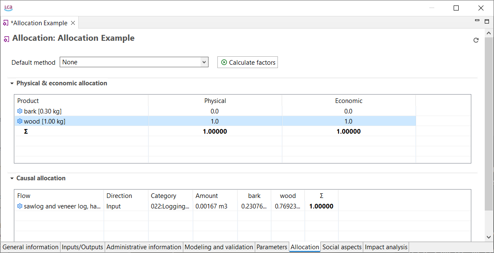
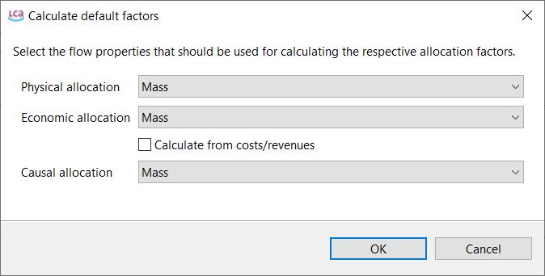
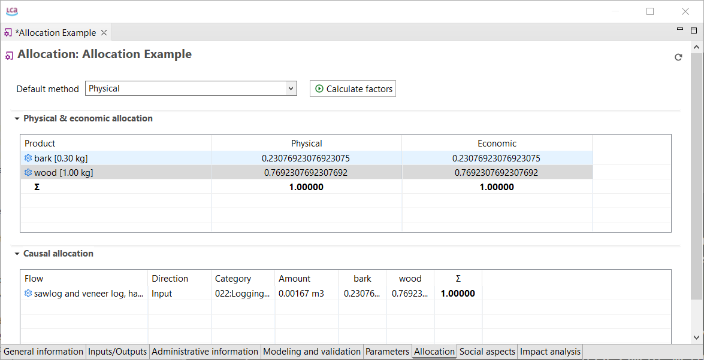
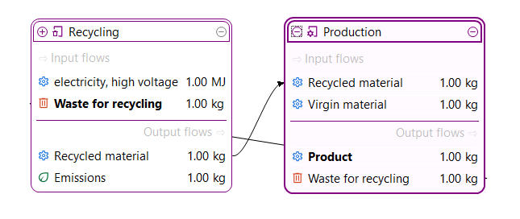
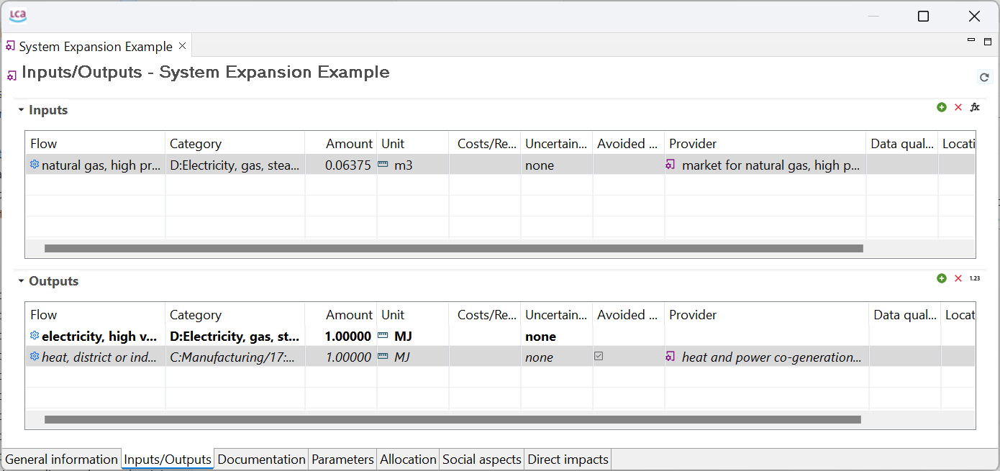
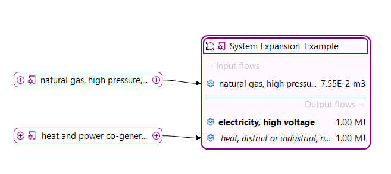

# Allocation

When a process involves several products, you have to assign how much of the impact each product is responsible for. Typical examples of such processes are co-generation of heat and power (multi-output) or a landfill (multi-input). These allocation problems can be dealt with using two different strategies; partitioning or system expansion. 

### Partitioning

There are three allocation by partitioning methods in openLCA:

-   **Physical allocation**: partitioning based on the physical relationships between the products in terms of, for example, mass. 

-   **Causal allocation**: partitioning based on assumptions or former research on the relative impact of different products.

-   **Economic allocation**: partitioning based on the economic (cost or revenue) relationships between products. Consequently, an economic property in terms of cost/revenue has to be added for this to be applicable. 

Moreover, we also provide the following technical solutions:

-   **As defined in processes**: this option will perform allocation according to the method used in each individual process along the supply chain.

- **None**: if none is selected, no allocation will be applied, even for multifunctional processes. Hence, each product of a process gets the entire impacts of this process and its supply chain.

Below is an example illustrating how the three different methods are applied in openLCA. In this example, 1 kg of wood and 0.3 kg of bark are produced from 1 kg of saw log (measured as solid wood under bark).

 _Inputs and Outputs for our example, note that economic properties have been added_

The allocation factors for physical, causal and economic allocation can be viewed/altered in the "Allocation" tab of a process. Select the "Calculate factors" button and the software will automatically calculate the values for the three allocation methods. 

 _The "Allocation" tab with the "Calculate factors" button_

 _Calculate factors_

- The physical allocation factors are calculated based on the ratio between the products (wood and bark) physical unit. Since the output of wood and bark is 1 kg and 0.3 kg respectively, the allocation factors become 0.77 and 0.23.

- For causal allocation an assumed ratio can be inserted. In this example, we assume that the wood is responsible for 60% of the impacts, whereas bark is responsible for 40%. 

- In the case of economic allocation, we assume a revenue of 1$/kg for wood and 0.4$/kg for bark.

_**Important:**_ openLCA does not automatically update the allocation factors prior calculation of a product system. Hence, it always uses the last saved allocation factors. So, if you work with allocation in your study, make sure that the allocation factors are in the most recent state prior to creating a product system.

 _Calculated allocation factors. Causal allocation has to be inserted manually, else it will by default get the physical allocation factors._

_**Note:**_ For allocation to work, the main product and the by-products need to have the same flow property. But openLCA will tell you if this is not the case.

_**Note:**_ When a currency is unavailable, a new currency can be created under "Currencies" under the "Background data" in the Navigation plane. A conversion factor can be added according to whatever reference currency is set.

#### Allocation for Recycling

Be reminded that also recycling processes are multi-output processes as they treat waste and produce recycled material hence they **require allocation**. It is necessary to use allocation to distribute the impacts according to the linked process. A short example on how to model recycling in openLCA is displayed below:

 _The model graph for a recycling scenario_

 _As the recycling process is a multi-output process allocation is needed! Here, physical allocation was applied._

_**Note:**_ Here we allocated 50% of the impacts to the recyclate and the waste. This is only one option. However, if you are not modeling a closed-loop scenario this can be a relevant detail you should consider.

### System Expansion

Applying system expansion means that the process you are modeling is credited with the impact that is avoided by supplying the by-product. For example: if a process produces electricity and has heat as a by-product, it can be credited with the load that would appear if this heat was supplied from elsewhere. In openLCA, this can be performed by checking the box of "Avoided product" for the by-product.

 _Avoided product check box highlighted in the Inputs/Outputs tab_

It is important that a process providing the avoided product flow exists. This provider then occurs in the "[Model graph](./prod_sys/model_graph.md)" when creating the "[Product system](./prod_sys/Creating.md)", but as a supplier of the output side of our example process.

 _The model graph where heat is accounted for as avoided and has a respective provider besides it is an output of the process_

Note that the flow which is avoided is displayed in the process but also in the product system italic. In complex models this can help you to differentiate between common flows and avoided flows.

