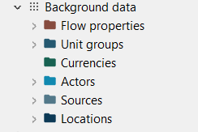
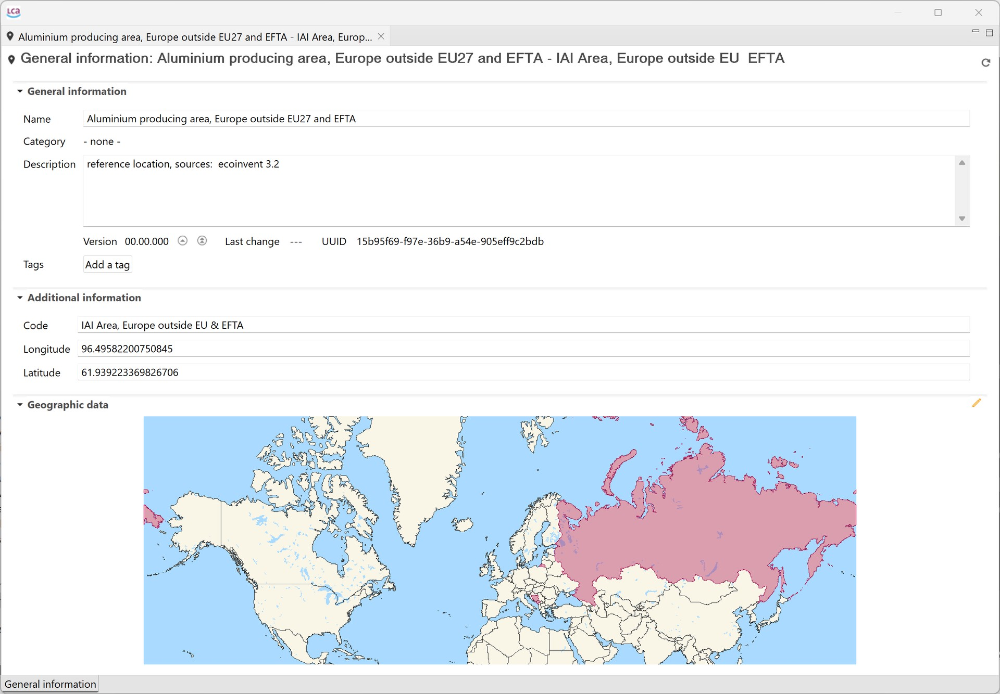

# Background data

in "Background data" you can find all the elements that users typically don't engage with often, like units, sources, locations and so on. You can freely explore this section on your active database.

  
_Background information in a database_

## Locations

Locations can be regions, countries, or any other point on a map. They are important for localizing the supply chain and for calculating regional impacts. 
Here an example of how locations are shown in openLCA when you click on them.

_Example of how locations are shown in openLCA_