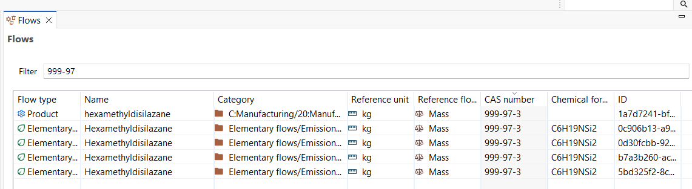

# Searching for CAS numbers in openLCA

Being able to search for flows using CAS numbers is especially useful when working with large databases or when you need to ensure that a specific chemical substance is correctly identified. Many chemicals may share similar names or abbreviations, but each has a unique CAS number. Using this feature helps you quickly locate the exact flow you need, avoid mismatches, and maintain consistency in your LCA modeling, particularly when mapping flows or integrating external datasets.

The database [Contents](../running_olca/toolbar_database.md) function allows you to filter "Flows" of the active database where the selected. As visualized the Flow type, name, category, reference unit, reference flow property, chemical formula, UUID as well as the CAS number are displayed.
By entering the CAS number in the empty cell, you can filter the flows by the CAS number:

The data is extracted from the flow's meta data with is found [here](../flows/flow_tabs_contents.md).

