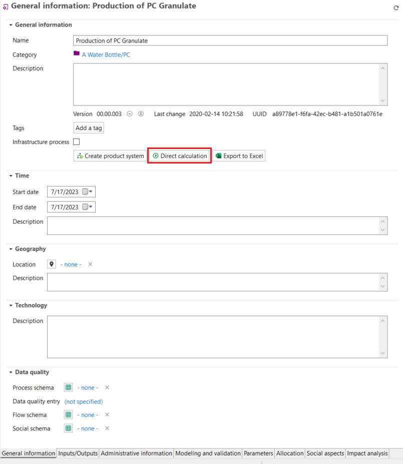

# Direct calculations in processes

openLCA provides the flexibility to calculate the impacts of processes directly, without the need to create product systems. You can either use the "Impact analysis" tab (only direct impacts) or the "Direct calculation" function directly within a process.

## Direct Calculations in the Impact Analysis tab

If you don’t want to generate a product system to calculate the direct impacts of a process, you can directly use the "Impact Analysis" tab in processes! It enables you to select raw materials and services with low environmental impacts directly from a LCI database without the need to create a product system.

In the "Impact Analysis" tab of a process, the process's **direct impact** is calculated. Hence, only elementary flows present in this process will be considered (no upstream impacts). You can choose the impact assessment method directly within the tab and the results will dynamically update accordingly.

  
_Impact analysis of a process representing the direct impacts_
	
However, to perform overall impact calculations, you can explore the sections "[Calculation and Result Analysis](../res_analysis/index.html)" and "[LCIA methods and categories](../lcia_methods/importing_lcia_methods.md)".

## Direct calculation in the general information tab

A fast way to perform overall calculations without generating a product system is by using the "Direct calculation" button in the "General information" tab of a process. This feature generates an in-memory product system comprising all processes in the database. 

  
_Direct calculation option in the "General information" tab of a process_

However, accurate results are only obtained when there are unambiguous connections between these processes.

For example, each product should have a single process responsible for its production, and every product input should have a default provider assigned. To ensures the integrity of the connections (linking) between processes in the database, you can navigate to "Database → Check linking properties" or use the "Check linking" option in the pop-up window after selecting "Direct calculation".

  
_Check linking prior calculation_

The main advantage of "Direct calculation" is its efficiency in terms of memory usage. It eliminates the need to create a product system in advance, offering a practical solution. This is particularly advantageous for large databases such as PSILCA, exiobase, and GaBi. 

