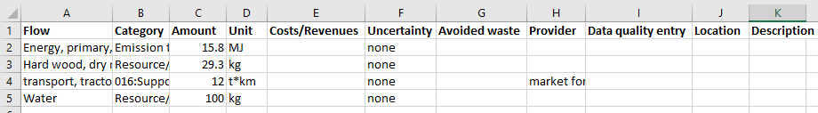
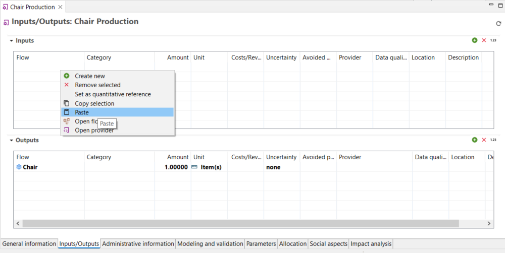
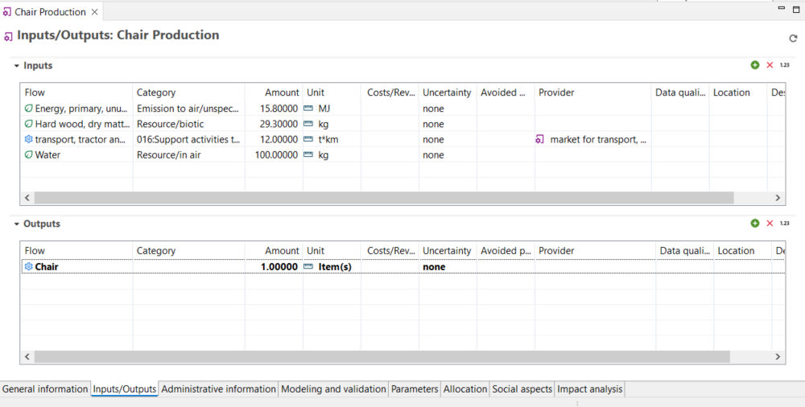
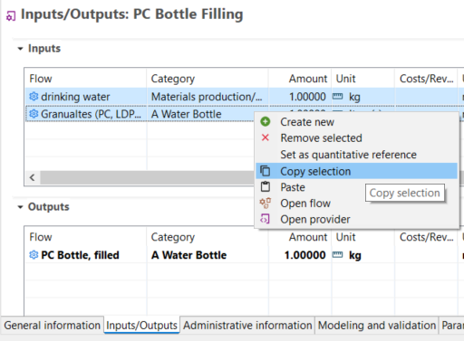

# openLCA and excel

It is possible to simply copy data from Excel into a process in openLCA, as long as the Excel table have the same column structure and column headings of the process inputs/outputs table in openLCA. See below.

  
_Excel template_

  
_Paste Excel data into a process in openLCA_

Copied data:

  
_Copied Excel data in openLCA_

To select specific columns and rows for copying, follow these steps:

1. Click on a cell within the table to begin the selection.
2. Hold the "Shift" button on your keyboard.
3. Click on another cell in the table to mark a range of rows and columns.
All the rows and columns between the initial and final selection will be highlighted.
4. Right-click within the selected area.
5. Choose "Copy selection" from the context menu.

      
    _Copying data from openLCA tables_