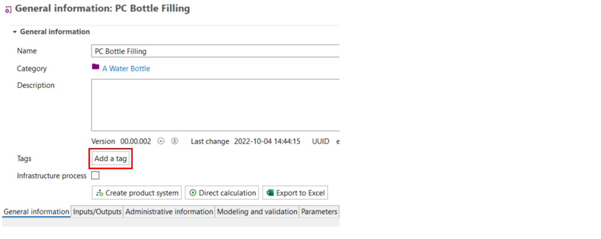
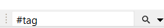
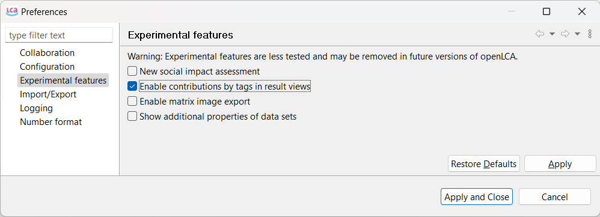
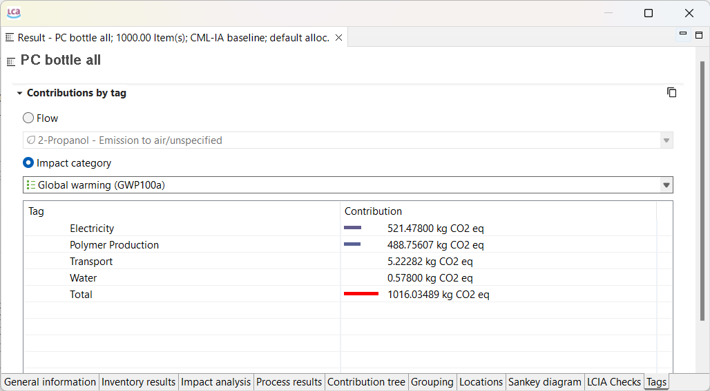
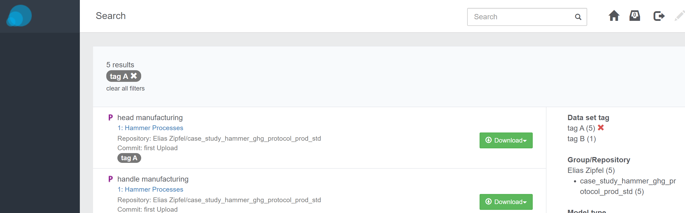

# Tags

In openLCA, tags are a feature used to organize and search data objects within the software. 
They provide a way to assign labels or keywords to elements in your LCA model, such as processes, flows, or impact categories and can be later used to analysze your results or organize your data by tags.

### Adding Tags
Each element within openLCA can have multiple tags associated with it. To add tags, navigate to the "General information" tab of a flow, process, product system, impact category or the "Project setup" tab of a project, 
and click on "Add a tag." A wizard will appear, allowing you to specify the tag's name and provide a description.

  

### Searching using Tags

You can search by tags by prefixing a word with #. This only works with single word tags.

  

### Tags in the Results

In contrast to using the "Grouping" function in openLCA, you can also analyze your results by using tags that have been added to flows/processes/product systems.

To display the "Tags" tab in the results you have to activate the options prior in the Preferences:

  

After restart of openLCA, you will be able to analyze your results by the provided tags:

  

For some databases, e.g. ecoinvent, tags are already provided. Hence, you can analyze your results accordingly. As you can also assign several tags to a flow/process/product system, mutliple mentioning in the "Tags" tab can occur.

### Tags in the Collaboration Server
In addition, users can filter by tags on the Collaboration Server, which is a great way to locate and organise shared data 
if a consistent tagging system is used within the team.

  
_Searching for Tags, Collaboration Server_

