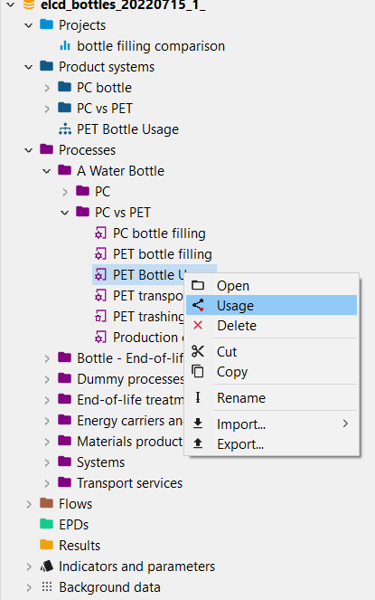
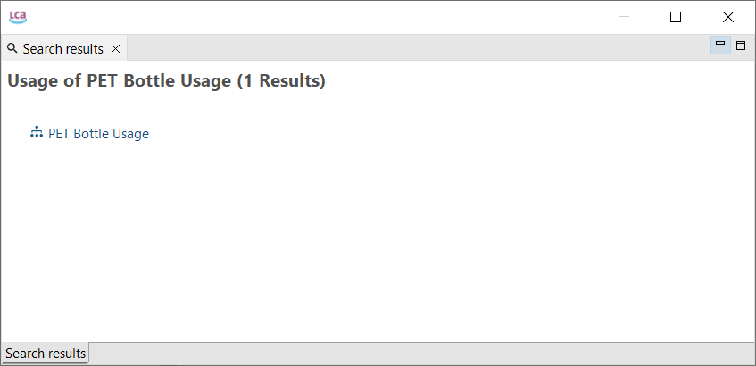

# Usage

The "Usage" function allows you to find where the selected "Flow", "Process" etc. is utilized within the system. For this, right-click on a database element:

After clicking on "Usage", the following window will show where the selected process is used:

This function it’s helpful for example if you want to delete a connected process/flow. 

>**_Note:_** Moreover, the "Used in processes" section in every product or waste flow ([General information tab](../flows/flow_tabs_contents.md)) shows you a more detailed "Usage" information.

