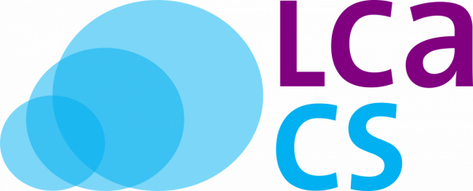

# Collaboration in Teams

With the general advancement of Life Cycle Assessment (LCA) and the spreading of Life Cycle Thinking (LCT), collaborative work on LCA studies becomes increasingly common e.g. within a company or team at the same location, within a company or team at different locations within multilateral projects (e.g. in research) on an international level and under participation of various entities such as companies, universities or consultancies as well as co-development of an LCA among executing contractors and clients. Moreover, it is becoming increasingly commonplace to use reference data for background processes, elementary flows, impact assessment methods, and other elements of existing LCA models. Often sharing of reference data for updating databases and distribution to users who are (also) distributed comes along with technical issues. In addition, quality assurance and review of LCA models through an external reviewer is of interest for anybody who wants to create a consistent LCA database.
The LCA Collaboration Server, now in version 2.0, is a server application that complements openLCA (the LCA desktop application). It is available for free, and support is available on demand.

If you wish to learn more about the collaboration server, please visit [the collaboration server manual](<https://manuals.openlca.org/lca-collaboration-server/>).

