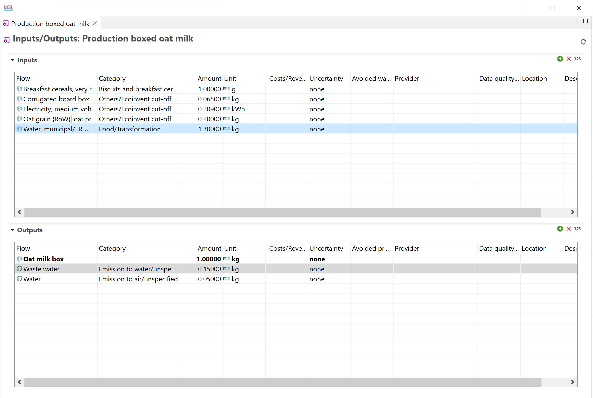
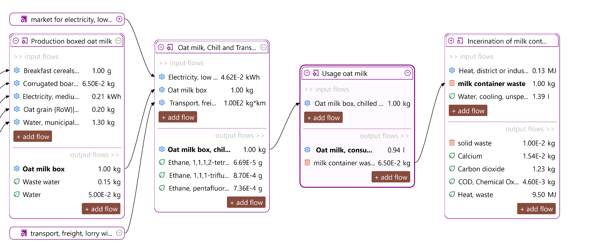
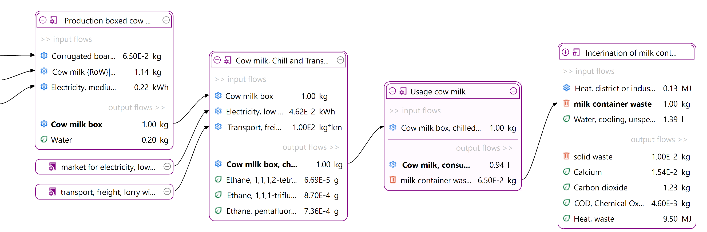
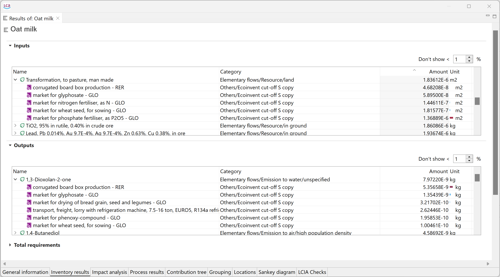
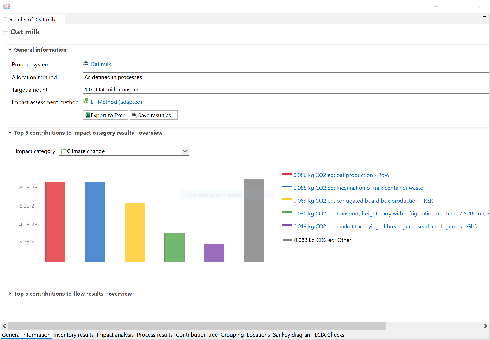
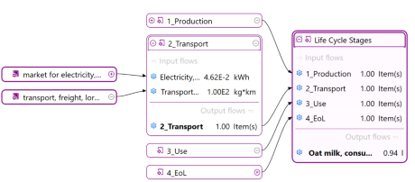
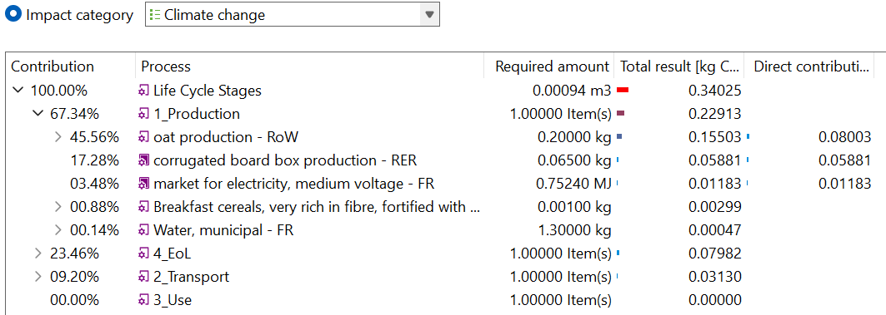
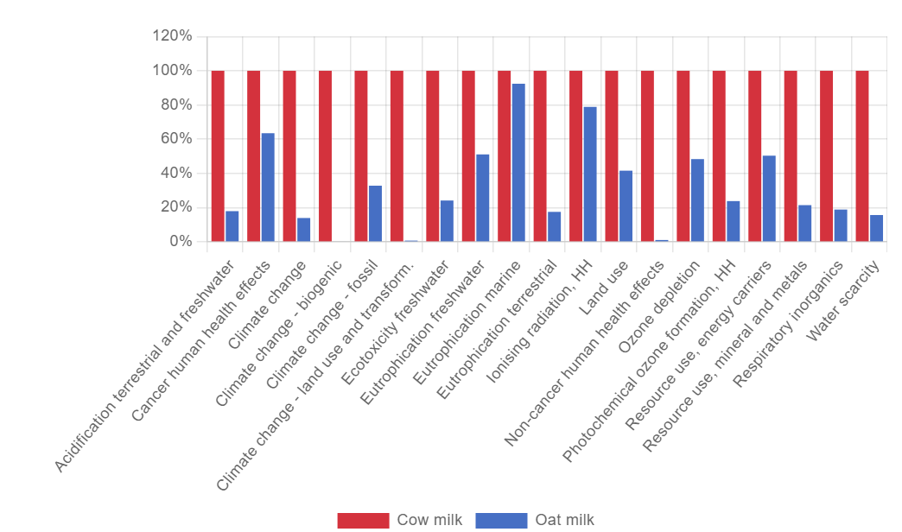

# LCA case study

In this section, we provide an overview of openLCA's key features by demonstrating a typical LCA modeling approach. These key elements include selecting a background database, creating processes and products, connecting them to a life cycle, choosing an impact assessment method, performing life cycle calculations, and reviewing the results. Detailed instructions for using the software will be provided in subsequent sections of this manual.

Let's get started!

## Getting a database

The essential first step in LCA modeling using openLCA is the selection of a background database. In the software context, a "database" serves as a repository for the components required for conducting LCAs, therefore, you need to create or import one to work with openLCA. Moreover, it's uncommon to model the entire life cycle from scratch. Instead, you will get common processes from an existing database (these "common" processes typically include electricity production, transport, construction, waste treatment, and so on). You will typically model yourself core, foreground processes specific to the product or service you want to analyze. 

In this case study, we'll model the life cycle of a pack of oat milk compared to the life cycle of a pack of cow milk, using core processes from the Agribalyse database, freely available on [Nexus](https://nexus.openlca.org/).

 _Agribalyse as active database in openLCA_

Check the ["Databases"](../databases/index.html) section to learn more.

## Creating a process

Now, we can design the life cycle phases, or **processes**, of our product (in this case, packed oat milk). As you will see, a process is a set of activities that transform inputs into outputs. They are characterized by a quantitative reference, which is the product that the process produces, or, for waste treatment processes, the waste it treats. In the context of this case study, we will skip the raw material extraction phase and directly model the processes of the manufacturing phase. 

Below, you can see the process that model the production phase of an oat milk pack, with its input and output flows. 

_Process representing the production of an oat milk pack, with its input and output_

To model the entire life cycle of this product, we'll also create the distribution phase, use phase, and end-of-life processes (you can find details about end-of-life modeling in [this](../waste_modelling.md) section).

Check the ["Flows"](../flows/index.html) and ["Processes"](../processes/index.html) sections to learn more.

## Creating a product system

We will integrate the processes we just created into a life cycle model by creating a **product system**.

_Life cycle model of an oat milk pack, with all its interconnected processes_

Following the same steps, we'll also create the product system of a cow milk pack. This way, we can compare them and draw some considerations about their different environmental impact.

_Life cycle model of a cow milk pack, with all it interconnected processes_

Check the ["Product system"](../prod_sys/index.html) section to learn more.

## Calculating the Life Cycle Inventory (LCI) and Life Cycle Impact Assessment (LCIA) 

With your life cycle model ready, it's time to calculate the inventory of your product. This provides insights into the materials and resources utilized and emitted throughout the life cycle of your product. This is the Life Cycle Inventory (LCI) and in openLCA, it can be obtained by clicking on "Calculate" in your product system window.

The "Inventory Results" tab will open and contain a table with input and output flows of the product system, showing amounts and units for each of them.

To generate the Life Cycle Impact Assessment (LCIA), you need to add an LCIA method to the calculation. After clicking on "Calculate" in the product system window, you need to choose an "Impact assessment method" from the drop-down menu, which will calculate the environmental impact from the life cycle inventory.

_Calculation results window_

Check the ["LCIA methods and categories"](../lcia_methods/index.html) and ["Calculation and Results Analysis"](../res_analysis/index.html) sections to learn more.

<b>If you are interested to display impacts per life cycle stage click here</b>

For a detailed analysis of the impacts of the individual life cycle stages in openLCA, you have to slightly modify the modelling approach which will lead to the following model graph:

This will allow you to assess the impacts per life cycle stage as displayed here:

 

In a similar fashion in the contribution tree:

## Comparing life cycle models using projects

Comparing life cycle model results, i.e. product systems, can provide valuable insights into their relative environmental performance. In openLCA, this is done via **projects**.

When you create a project, you can add the product systems you want to compare and generate insights and graphs for both of them.

_Relative impact results of one pack of oat milk vs one pack of cow milk, obtaind using EF Method_

Check the ["Project"](../projects/index.html) section to learn more.

**Congratulations!** You have successfully gone through the key steps in openLCA. With this knowledge, you can now start making informed decisions to improve the environmental performance of your products and processes. Happy analyzing!

Next, we will go systematically through the features of openLCA.

