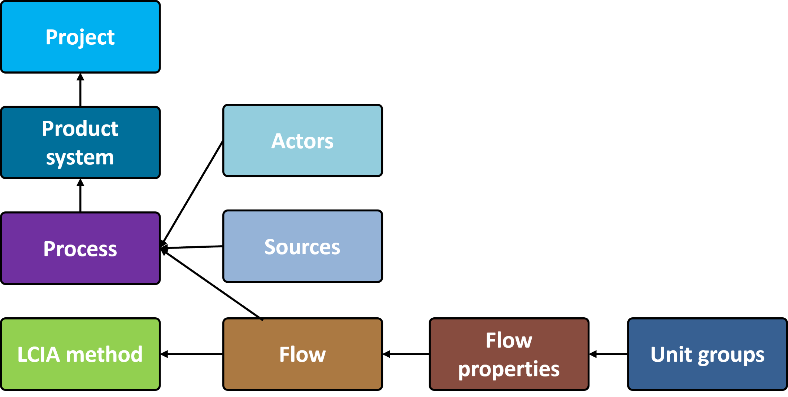
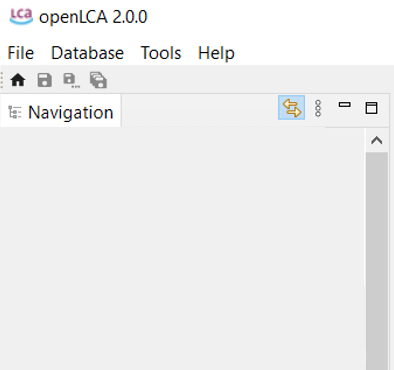
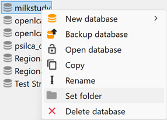

# Databases

In openLCA, a "database" functions as a container that organizes and stores interconnected elements needed by openLCA. It serves as a repository for projects, product systems, processes, flows, results, and other important components required for conducting LCAs. Key elements of an openLCA database are shown below, with their relations.

  
_Database elements. The direction of the arrow represents the direction in which the information flows._

After launching openLCA for the first time, you will notice that the navigation section is empty. To start working with openLCA, you can either [create a database from scratch](./create_database.md) 
or [load one from an existing file](./restore_database.md) (e.g. one you might have downloaded from [openLCA Nexus](<https://nexus.openlca.org/>), in this case follow the instructions for "Accessing databases from openLCA Nexus" on [openLCA Nexus](../resources/nexus.md) section). You can also load a database from a GitHub repository("New database" > "From repository...").

  
_Empty Navigation window following openLCA installation_

openLCA offers the flexibility to have multiple databases imported in the software. Each database functions independently and only one database can be "active" at a time, while the others remain "inactive". This allows you to separate different LCA studies or case studies for better organization and management.

However, with openLCA it is also possible to combine multiple databases, by merging their content. This feature enables comprehensive analysis that incorporates various datasets and LCA models. Check "[importing and combining databases](./importing_and_combining_databases.md)" section for details.

_**Note:**_ It is considered good practice to work with **one database for each case study/LCA project** performed in openLCA. 

_**New!**_ Now in openLCA 2 you are able to sort your databases in folders. Right-click on a database and then click on "Set folder", and create your new folder:

 

After your folder is created you can add also other databases in it just dragging and dropping them.

