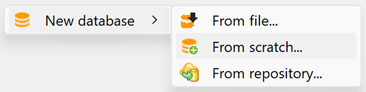

# Creating a new database from scratch

To create a new database in openLCA, follow these steps:

1. Right-click in the navigation window and select "New database" and then "From scratch...".

  
_Step 1: Creating a new database_

2. A wizard for creating a database will appear, asking you to name the new database.

  
_Step 2: Data creation wizard_

In the wizard, you can choose from the following "Database content" options:

- Empty database: Select this option if you want to create a blank database without any data. As you can see in the figure below, all folders are empty.

- Units and flow properties: This option includes flow properties, unit groups, and currencies in the "Background data" folder of the new database.

- Complete reference data: This option provides a more comprehensive setup, including elementary flows, flow properties, unit groups, currencies, locations, and mapping files in the "Background data" folder of the new database.

  
_Difference between the three available new database types_

**_Note:_** Typically, you will create the database with the "complete reference data" setting, unless you are importing data sets from external sources with other flows than the openLCA reference flows. E.g., you can import an entire SimaPro database and just use all flows and LCIA methods from there. Units are causing less issues in different database and LCA software systems (every LCA software has a unit "kg"), and you will need units, of course, thus in an empty database, you will need to create everything yourself. Starting with a database that contains most basic content such as units thus saves time. 

**_New!_** The [ecoinvent geographies](<https://geography.ecoinvent.org/>), along with their respective geometries, are now directly added to the reference data. Hence, if you create a database using the "Complete reference data" template, it will include these geographies.

**Once you've made your selections, simply click on "Finish" to finalize and create the new database!** 

