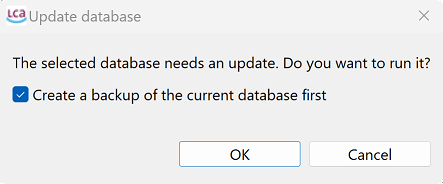

# Database update

openLCA has an internal database that stores all the different elements visible in the navigation tree (or, most of them at least). With a new openLCA version, the structure of the internal database, the database schema in IT terms, may change, e.g. because new elements have been added in a new version. 

When you try to open a database in openLCA with an older database schema, the software will detect the differences and prompt you to update the database. After the update, your database will be compatible with the new version of openLCA.

  
_Backing up a database before updating to a newer openLCA version_

**_Note:_** Once the database has been updated, it will only be compatible with the newer version of openLCA. It cannot be reverted to be compatible with older versions of openLCA! It is recommended to create a backup of the database before updating it.

After completing these steps, the database will open and automatically become your active database (indicated by the yellow icon and bold text). You will see the navigation panel with various folders:

 

