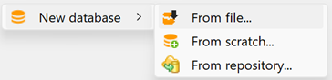

# Creating a new database loading it from file

Loading a database allows you to import an entire openLCA database, with all elements, process datasets, models, etc., into the openLCA system you are currently working with. This is useful e.g. for restoring backups, or for migrating all LCA work from a project or colleague.

For loading a complete database, you need a zolca file from openLCA. For example, most files provided by openLCA Nexus are zolca files (see ["openLCA Nexus"](../resources/nexus.md) section in "Resource" for mode details about downloading databases from our platform). The zolca file format was specifically developed by GreenDelta to compress and package openLCA databases, for backup and sharing purposes.

To restore a complete database, follow these steps:

1. Right-click on the navigation window and choose "New database" and then "From file...".

     

2. Select the zolca-format database file you want to load.

**_Note:_** Keep in mind that you have to update openLCA from time to time as the databases will be created with the most recent openLCA version. This is often the reason for the error message: _'Could not get the version from the database. Is this an openLCA database?'_.

**_Note:_** The program decompresses the files into a different directory (C:\Users\NAME\openLCA-data-1.4). As a result, the original zolca file remains compressed and won't be directly affected by changes made to the database within the software.

