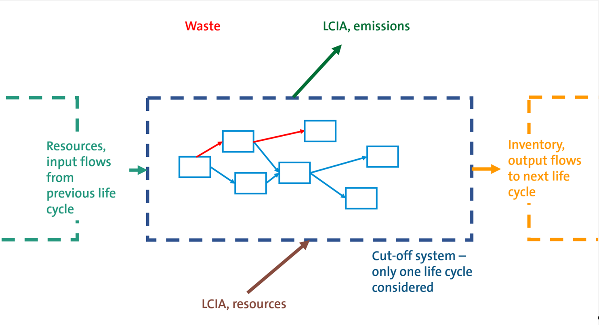

# _New_ Environmental Product Declarations (EPDs)

In openLCA 2 we added EPDs as new elements. EPDs in openLCA contain the LCA information that is part of an EPD 
(not the technical product information) and the text "around" the EPD result that make a complete EPD. 
EPDs in openLCA contain the full impact assessment results, per life cycle stage, for a given reference product unit.

Users are advised to use the EN15804 add-on for ecoinvent, created by GreenDelta GmbH in accordance with the EN15804 norm, when navigating through this section.
 
 

