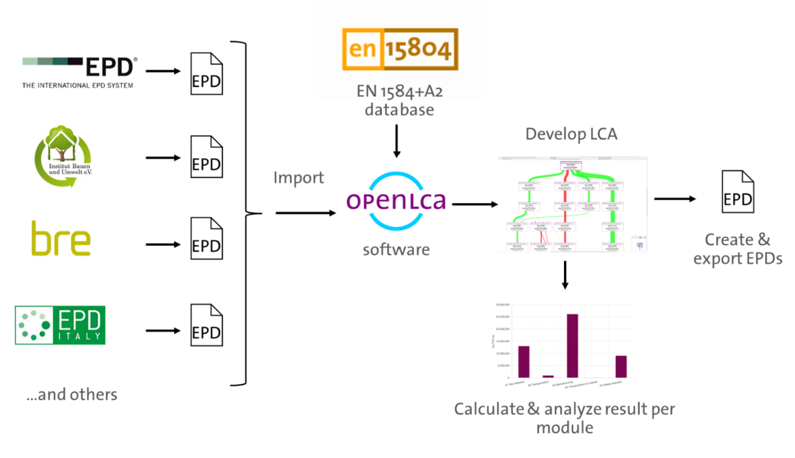

# _New_ Environmental Product Declarations (EPDs)

In openLCA 2 we added EPDs as new elements. EPDs in openLCA contain the LCA information that is part of an EPD 
(not the technical product information) and the text "around" the EPD result that make a complete EPD. 
EPDs in openLCA contain the full impact assessment results, per life cycle stage, for a given reference product unit.

In brief, openLCA allows users to perform versatility of functions that makes it easier and transparent to develop EPDs.

Users are always recommended to download and use the recent version of the [EN15804+A2 add-on](https://nexus.openlca.org/database/EN15804%20add-on), created by GreenDelta GmbH in accordance with the EN15804 norm, and read the release notes, especially to note changes on the impact method calculations.  

