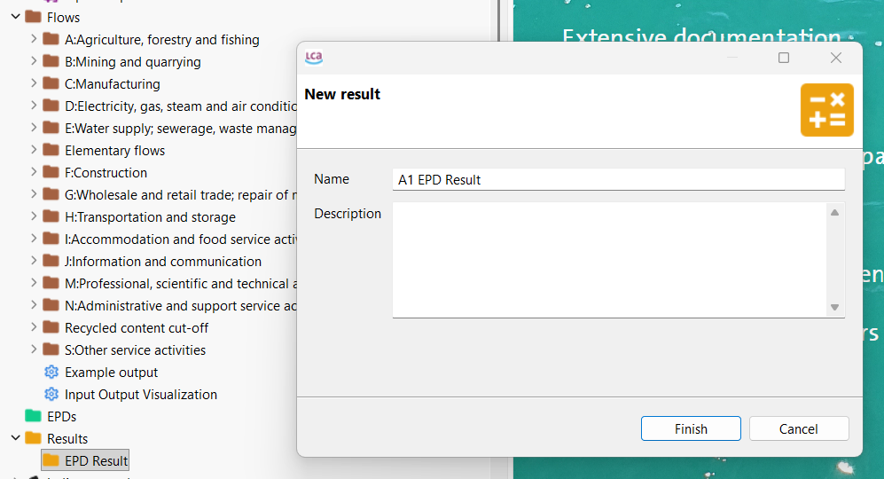
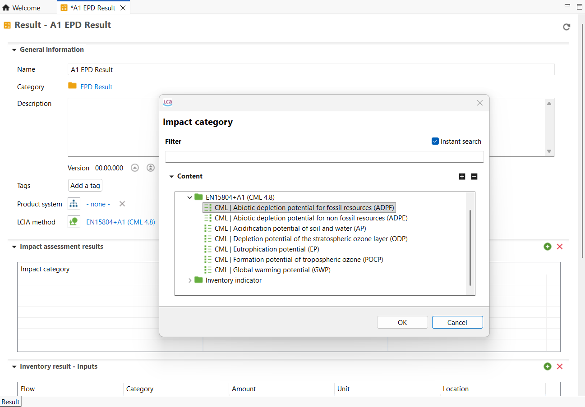

# Importing EPD results from various sources

EPDs are often available as pdf document with unique design, hence they cannot be imported directly into any LCA software. However, a new feature allows you to manually add the results from the publicly available EPDs or to add EPDs using their ILCD file.

## Adding EPDs manually

1.	To do so, you need to create a custom set of results by clicking on the "Results folder" and then "New results". It will create a template that needs to be filled with additional information. 

    
    _Creation of the result example_

2.	Next, the results can be completed by adding an impact category from the respective method. It can be done by clicking on "Impact assessment" field and browsing through the list of available categories 

    
    _Adding results to an impact category_

3.	After all necessary impact categories are added, a full list of associated impacts can be seen. However, it is important to link the burdens to a specific flow that will represent a functional unit. Thus, an existing or a custom flow can be selected by right clicking the "Inventory results – Outputs" field and selecting the right option from the list. Once finished, it is needed to right click on the target flow and set it as a reference. The amounts of the output flow must correspond to the original EPD or converted according to the new functional unit with all of the associated emissions.

    
    _The finished results_

