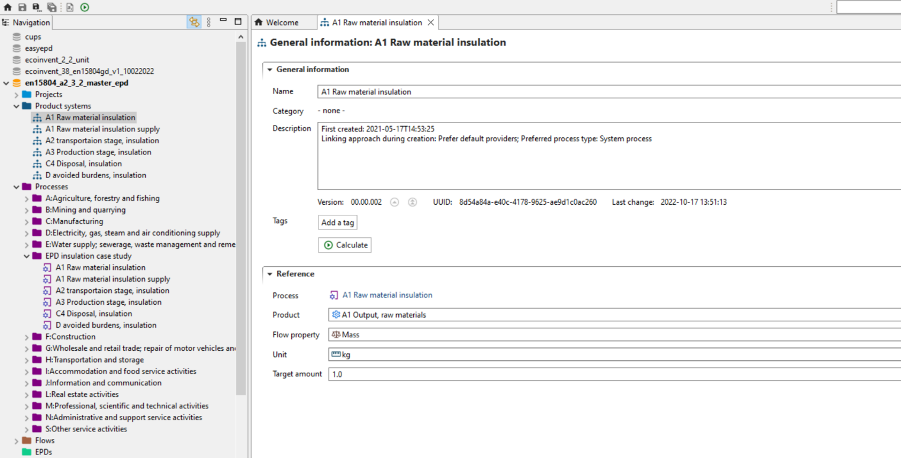
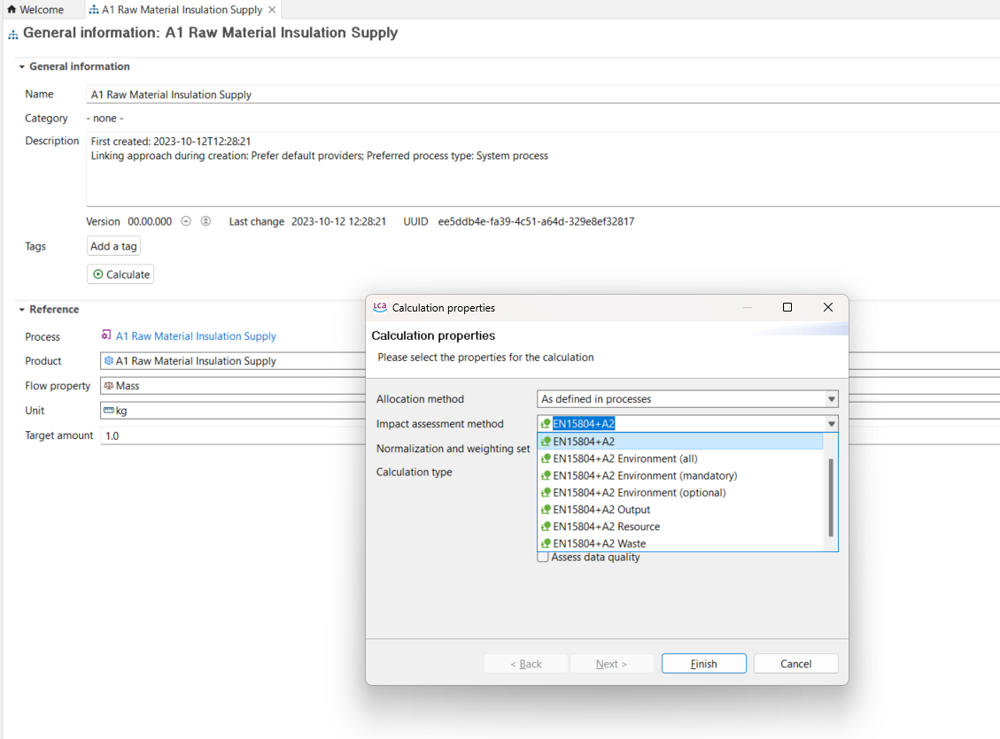
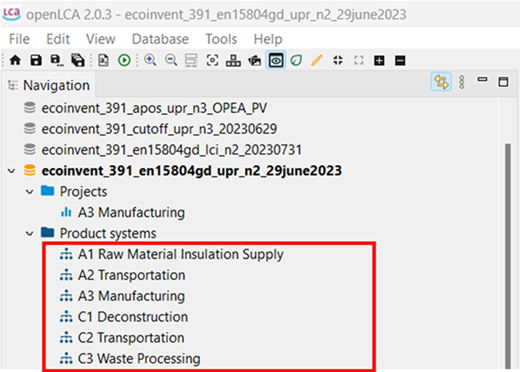
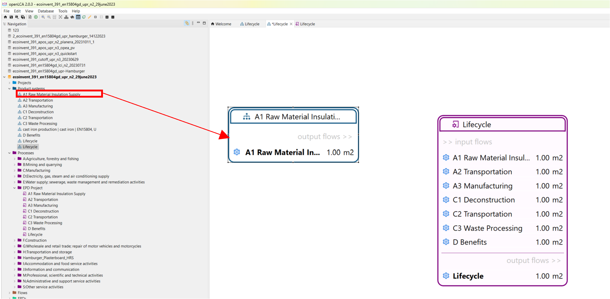
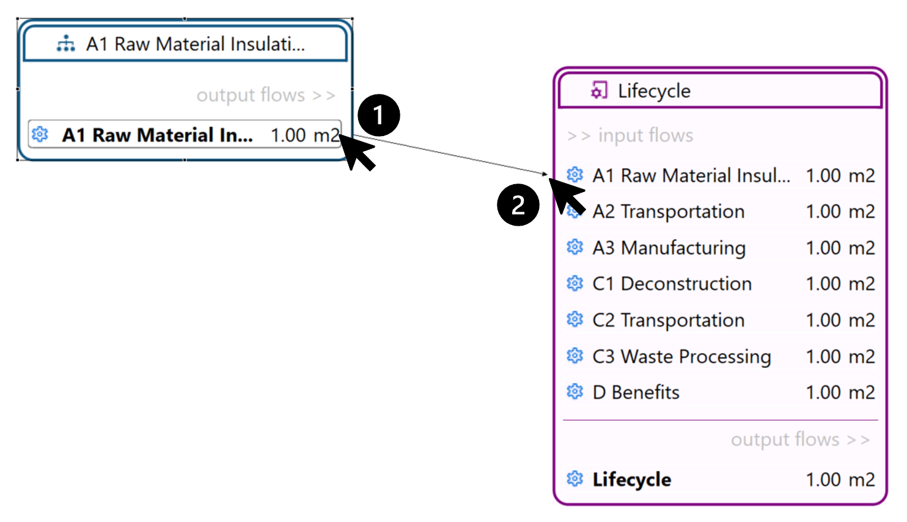
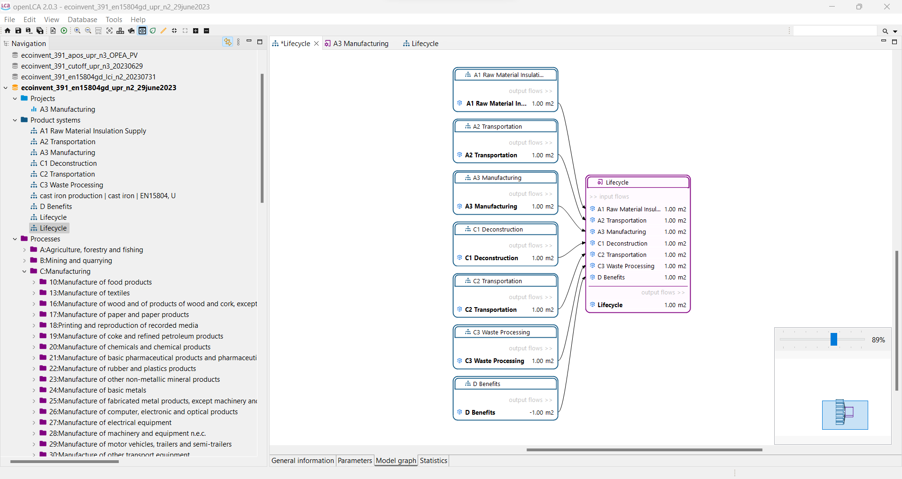
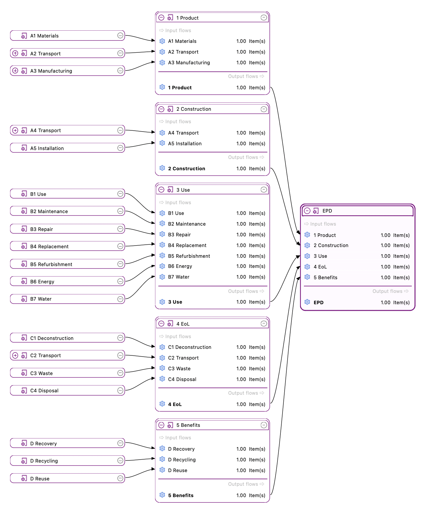
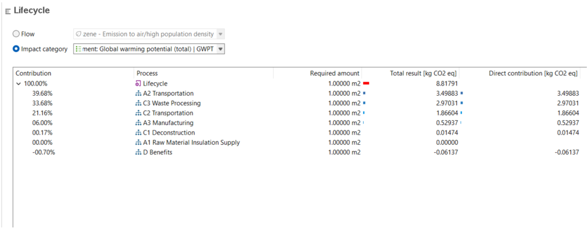
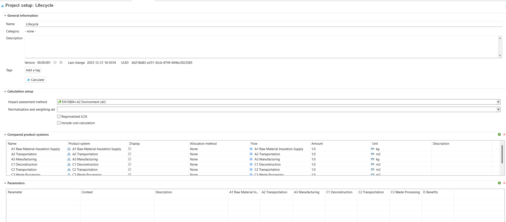
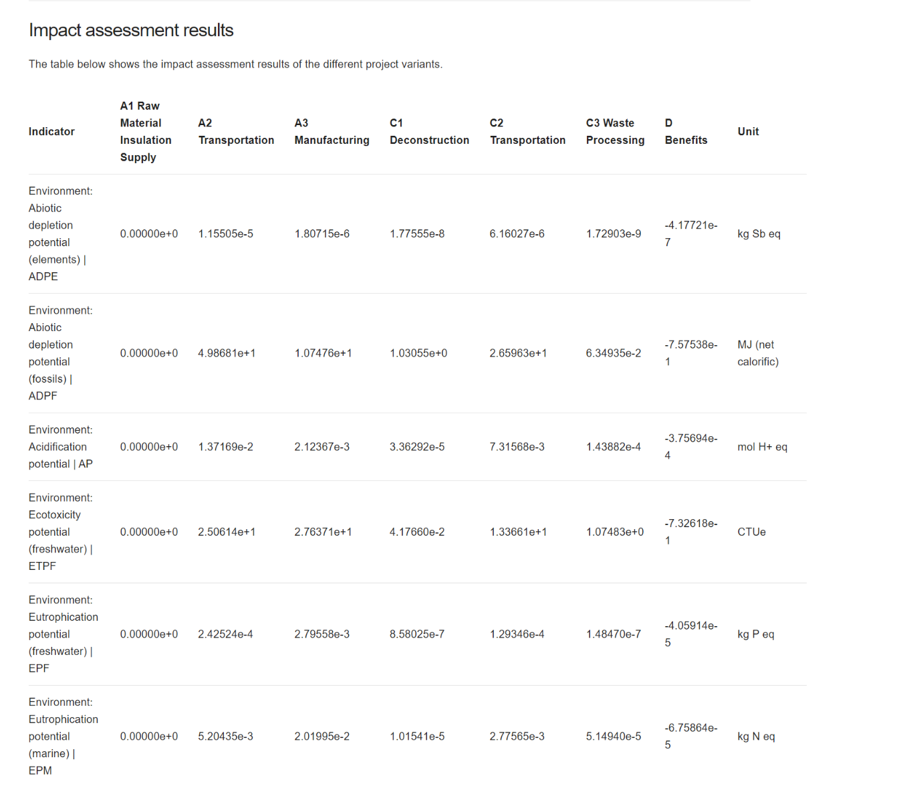

# Calculate the impact assessment

This section summarises different ways to produce impact assessment results using EPD format. There are three different methods:

- Calculate the results of a product system (EPD Module)
- Calculating the results using lifecycle stages as product systems
- Calculating the results using projects

## Calculate results of a single product system

After the product system is created, you can calculate the impact results choosing a LCIA method.

1. To include the results in the EPD, the product systems must be calculated. To do so, go to the "General information" tab of the product systems and right click on "Calculate". This must be performed individually for each product systems that you want to include in your EPD.

    
    _"General information" tab of product system_

2.	After clicking on "Calculate", you will see the interface depicted below. Here, you must now choose the set of indicators you would like to calculate and select the calculation type "Eager/All". After this, the results will appear automatically.

    
    _Selection of Impact Assessment Methods in the calculation of a product system_

## Calculating the results using lifecycle stages as product systems

In order to view the results of the LCA study for the product of interest in an EPD format per lifecycle stages, you can create a product system for each process as seen below. 

Then, create a process system with the flow of each lifecycle stage added. After that, create a product system but make sure that you uncheck the “Auto-link Process”. Then, in the model graph tab of the newly created product system, as seen below, you can drag-and-drop the product system for each stage. 

Then, as demonstrated in the image below, you can move the pointer to the flow of the product system (1) and drag it to the flow of the existing in the “Lifecycle” product system (2).

Eventually, you will be able to set-up the model graph using product system of each lifecycle stage as seen below. 

**_Note_**: The picture above represent a simplification. In a real-life scenario you would most likely model the life cycle with items and product flows, therefore the graph would look more like the picture below:

Results for the calculated product system of “Lifecycle” can then be viewed in the following format:

## Calculating the results using projects

Alternatively, you can create a new project with a report and add all the lifecycle stage product systems as seen below.

With this approach, you can view the results all together for all impact categories for each stage, as you can see below. You can be copy the results that are displayed this way and insert them directly into the EPD report.

