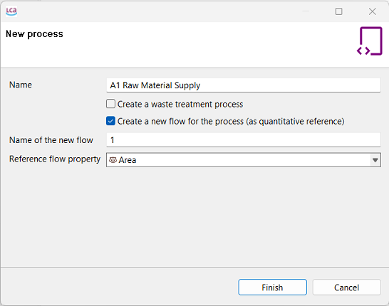
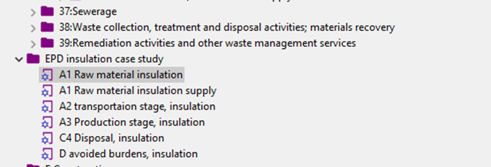

# Creating new processes for target products

To create an EPD, you must create the processes of a target product. In the figure below, various processes are shown, each of which has been generated following the lifecycle stages nomenclature, according to EN15804+A2, and saved in a respective folder. The creation of these processes works in the usual way in open LCA (see [create new process section](../processes/creating_new_process.md)). 

It is recommended that you ensure that reference flow property matches the declared unit and it would be the same for each lifecycle stage.

_Created and saved processes for an EPD_

