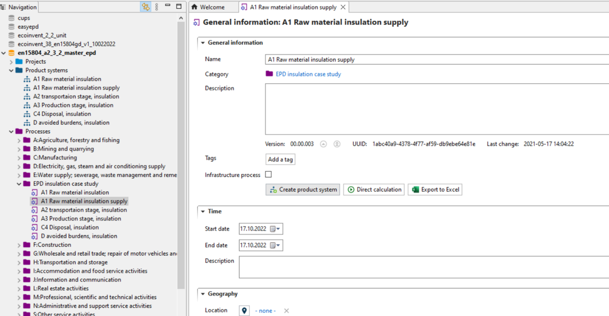

# Create product systems from your processes

In the next step, product systems must be created from the respective processes. 

To do so, go to the "General information" tab in the respective process and click on "Create product system". 
Do this for all processes which should be included in the EPD to include all relevant modules. 

_"General information" tab of a process_

