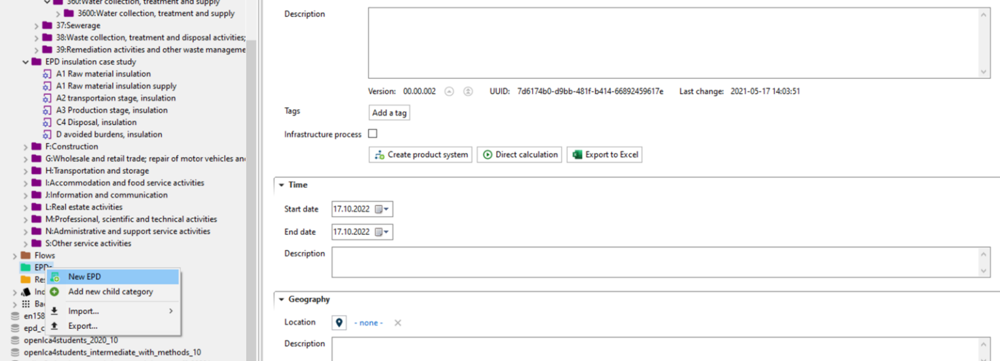
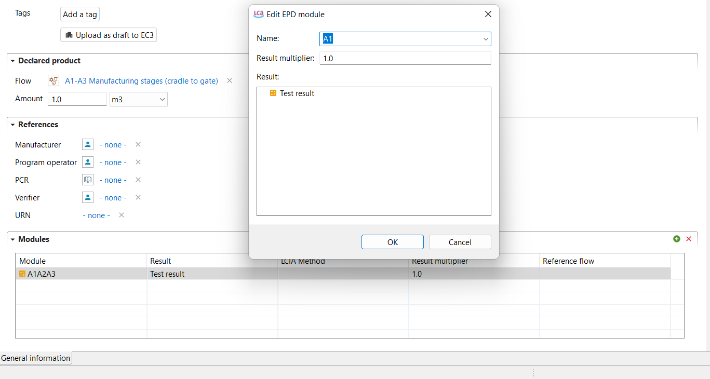
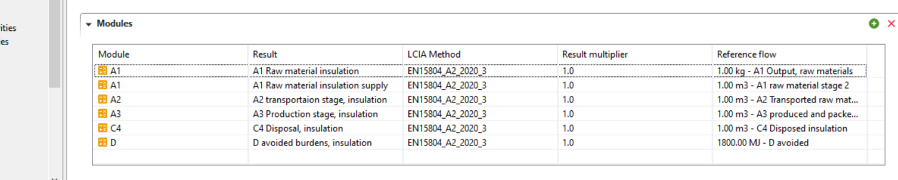

# Creating EPDs in openLCA

An EPD structure can be created in order to store the information using the official nomenclature of the life cycle stages.

1.	To create a new EPD you can now right-click on the folder "EPDs" and select "New EPD". In the window that opens, please name the EPD.

_Creating a new EPD_

2.	Next, you need to navigate to the section "Modules" under "General information" of the EPD. Here, you need to add all modules that should be included. You must select your declared product (flow) in the respective section under "General information".

_"Modules" section in an EPD_

3.	It is now possible to export the completed EPD, by clicking on "File" and selecting "Export". Select "JSON-LD" and click on "Next". Your EPD should be selected. Click on "Finish". Your EPD is now saved in the folder you selected. That allows to exchange with EPDs and send them to responsible parties.

_EPD example_

