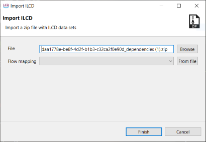
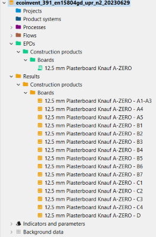

## Importing EPDs files in ILCD format

It is also possible to import EPDs that have an ILCD format (zip file), e.g. [Environdec](<https://data.environdec.com/index.xhtml?stock=Environdata>) by using the [import function](../databases/importing_and_combining_databases.md) whilst a EPD-suitable database is active. 

 _Imported EPD appearing in EPD and Result folder_

After the import, openLCA will display if the import process succeeded with or without any issues. Now, the EPD and the respective results will be found directly in both folders (EPD and Results)!

 _The finished results_

