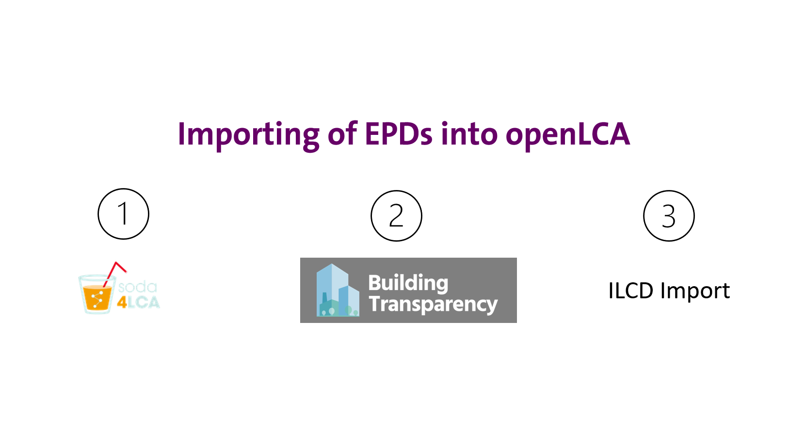

# Importing EPD results from various sources

EPDs are usually stored in a PDF format but now also come with a digital copy that can be imported into openLCA seamlessly through few clicks. In this subsection, we cover “Adding EPDs manually” in case an EPD does not have a digital copy and importing EPDs from online sources. In openLCA, EPDs can be imported via three ways:

1. Using soda4LCA
2. Using Building Transparency
3. Using ILCD import

