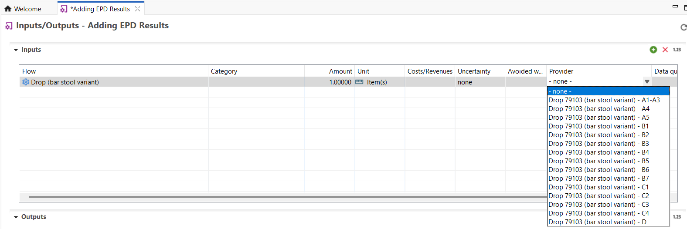
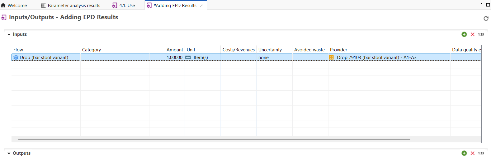
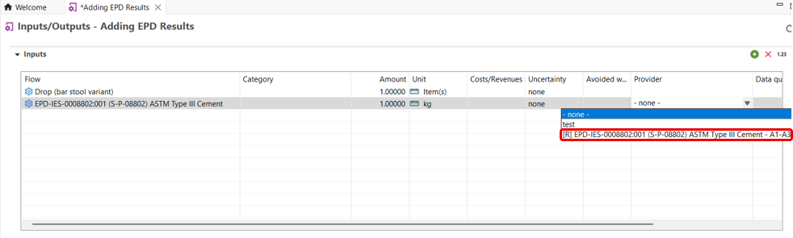
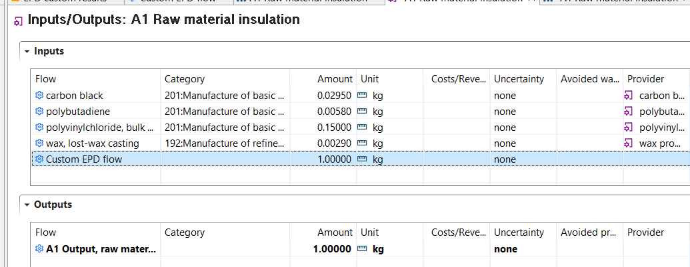
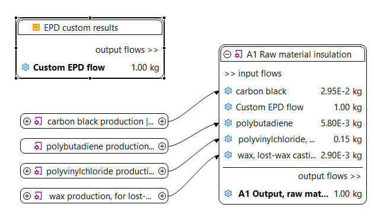
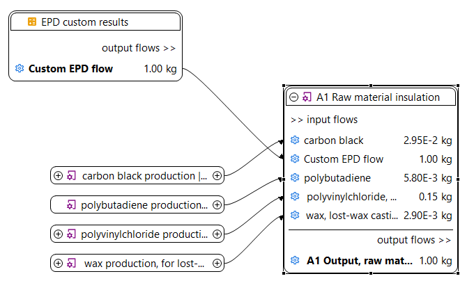

# Using results of EPDs in the product system

To connect EPD results to your product system, this can be done in two ways (1) adding the result output flow into your respective process (2) adding the result output flow through the model graph.

## Method 1: On process level

In openLCA v2.5.0, within the process, add the product flow corresponding to the EPD result as an input.
Then, as usual, use the provider dropdown to select the appropriate module (i.e., the process or result) you want to link to your system.

**Bonus**: if your product flow is connected to normal processes and results, results are indicated by [R] as a prefix. 

## Method 2: via modal graph edit mode

You can also add the EPD result’s output flow directly via the model graph edit mode by drawing the connection between your process and the EPD result. This method offers a visual way to integrate the flow into your product system.

The introduced or saved results can be directly used in a supply chain.

1.	The flow must be added to the inputs of a target inventory that will be connected with a respective result.

    
    _Linking the impacts with an inventory_

2.	Unlike the provider selection, the results can be connected to a respective flow only via the "model graph". 
Thus, a product system needs to be created first. After the supply chain is created, it is needed to open the "model graph" 
under the product system element and drag and drop the result into the editor area. It is important to keep 
track and select the correct reference flow to be able to link to the result. 

    
     _EPD example_

3.	Once the results are in the editor area, they can be connected to the flow manually. That is done by dragging a connection from the 
target flow to the results element.

    
     _EPD example_

4.	After all connections are established and the target amounts are set, it is important to save all changes prior performing the impact assessment. Then, the results can be analyzed as usual.

 _**Notes:**_ 

**For users using the Ecoinvent v3.9 EN15804+A2 add-on database or previous versions:** EPDs imported via ILCD formats cannot be integrated into the results of the EPD when utilized as part of a product system that is created on openLCA. Therefore, you must [manually add the EPD results](./adding_results_3rd_sources.md#adding-epds-manually) OR map the impact categories of the EPD results by creating a new process and adding suitable elementary flows representing each impact category. 

**For users using the Ecoinvent v3.10 EN15804+A2 add-on database with openLCA v2.2:** EPDs imported via the ILCD format can now be directly integrated into the product system. You should use openLCA v2.2 with the v3.10 add-on to import the EPDs and map them to the impact categories. However, we advice you to always verify that the impact categories are mapped correctly, as the online repository from which the EPD is imported does not always link the impact categories to their corresponding unique identifiers accurately.

