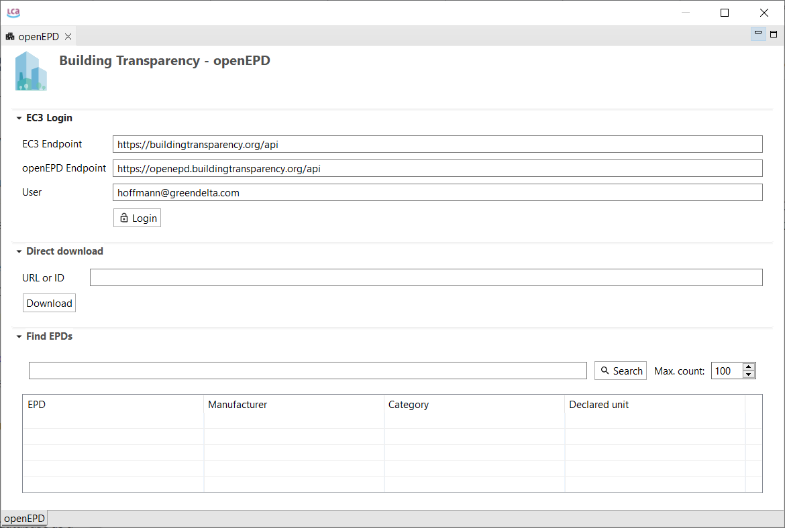
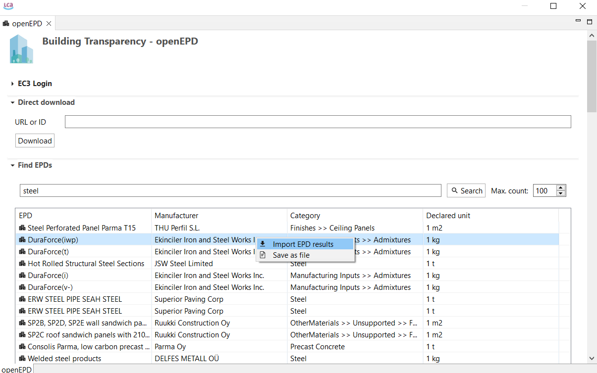
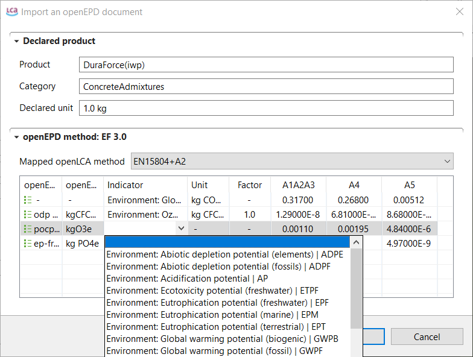
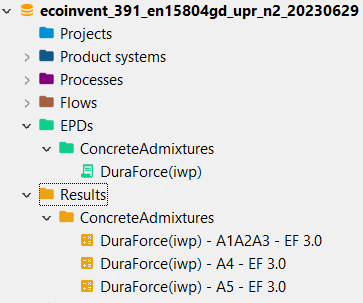
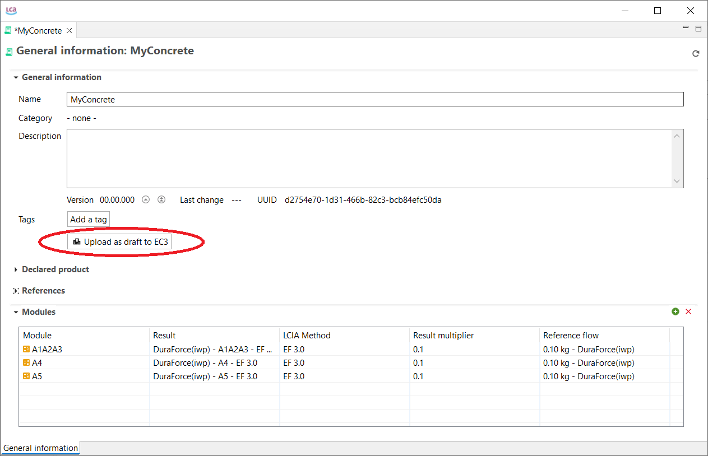
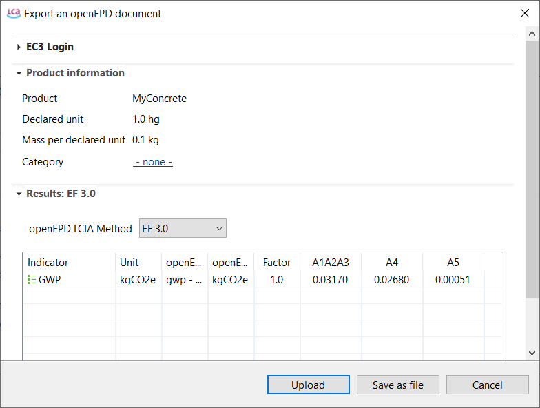

# Import EPDs from openEPD

With openLCA 2 it is now possible to download or upload EPDs to EC3 (Embodied Carbon in Construction Calculator) 
by [Building Transparency](<https://www.buildingtransparency.org/>); requires access (account) to the respective OpenEPD API.

To access the EC3 with openLCA, go to  under Tools → API Clients → Get EPDs from EC3. The following window will appear:

  

After registering on their website: https://buildingtransparency.org/auth/login, insert your user name, click on 'Login' and insert your EC3 account password. Once you are connected you can download via URL/ID, or search and import EPDs through directly in openLCA.

   

openLCA will try to match openEPD LCIA methods with the openLCA indicators in the active database automatically but this can be configured by the user individually.
 
  

The imported EPDs will be displayed in the navigation panel under EPDs. An EPD can contain multiple result modules and hence the results are stand-alone models too and can be flexibly combined in EPDs they have a quantitative reference and can be used in product systems.

 

It is also possible to upload your EPD drafts to the EC3 server. For this open an EPD and select "Upload (Update) EPD on results on EC3". For this, please fill out all the information required in particular the declared product and the URN.

 

Then a new window will appear and you can click on "Upload (Update)".

 

Then you can check your uploaded version under https://buildingtransparany.org/ec3/epds/URN (replace "URN" with your specific URN).

