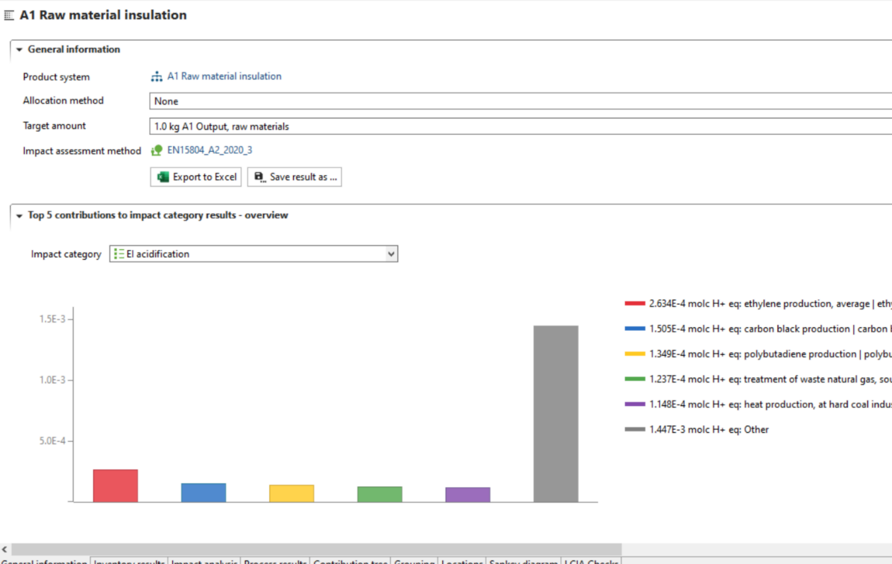
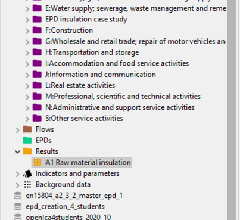

# Save your results

openLCA allows to storing the results in order to use them for an EPD or in further calculations.

1.	In order to save the result of the calculation of a product system, go to the "General information" tab of that specific result. Click on "Save result as". In the window that opens select "As a result".

    
    _"General information" tab of a result_

2.	The results are now saved and available under the folder "Results". The results of the calculations of all product systems that could be included in the EPD must be saved additionally.

    
     _Navigation window showing results_

