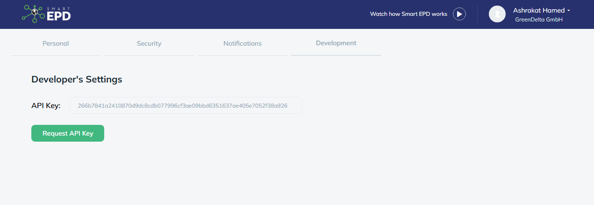
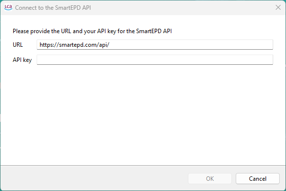
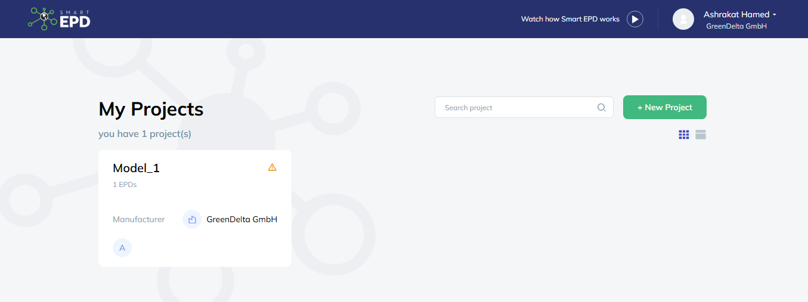
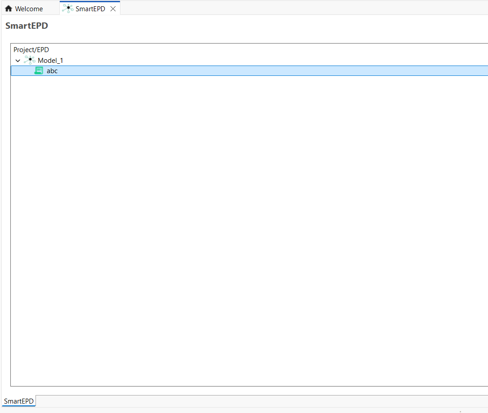
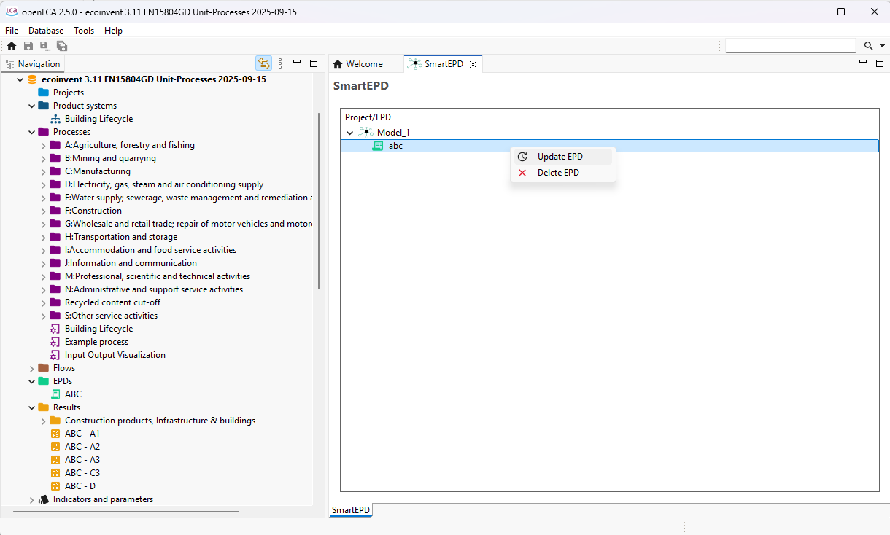
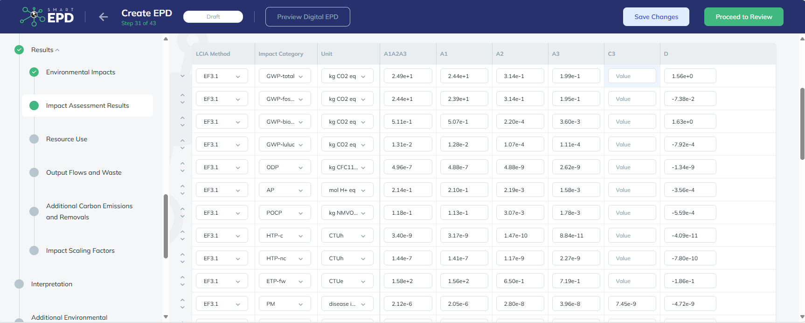

## Uploading EPDs on SmartEPD

In openLCA 2.5.0, you have now access to a new API called ‘SmartEPD’ which can be found under ‘Tools → API Clients → SmartEPD (experimental)’

You are first required to register via: https://www.smartepd.com/request-access where you can then get your own API key via your own profile as seen below.

Back in openLCA, after clicking on ‘SmartEPD (experimental)’, a window shall appear where you shall insert the following URL: https://smartepd.com/api/ and the API key they received. 

Then, the following window appears where you can see the projects you created on SmartEPD website along with the EPDs created in the project.

You are allowed to upload your EPD results created in your database by simply right-clicking on the EPD icon in the SmartEPD  window.

A pop-up window shall appear where your can click on the EPD along with the respective results you wish to upload. After which you can go back to your project on the SmartEPD website and review your results uploaded under “Results”. 

At this stage, you can only upload your results and not import any EPDs from SmartEPDs. 