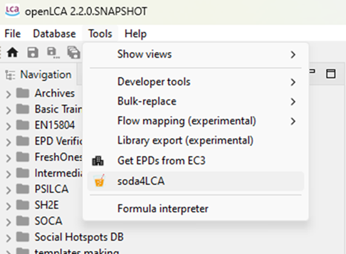
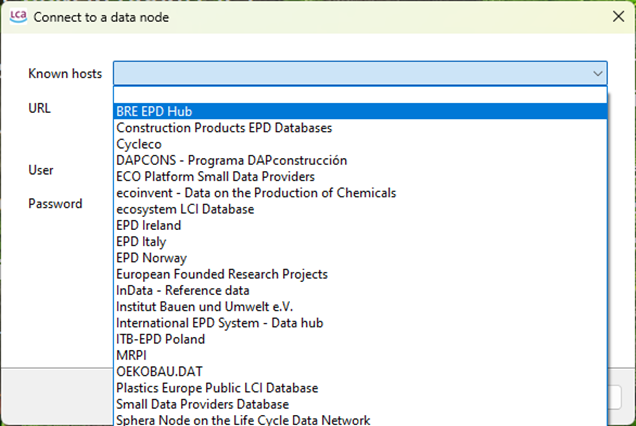
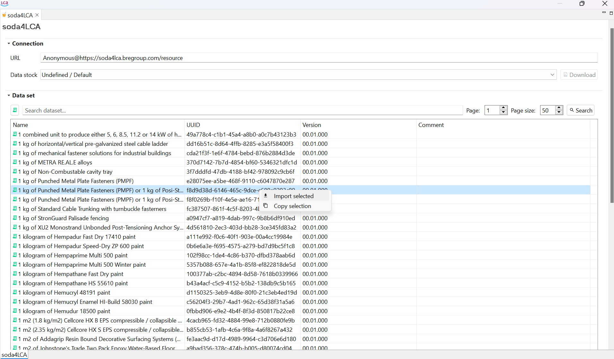

# Using soda4LCA

With openLCA v2.2, you can now access a wider range of EPD libraries through soda4LCA tool. This can be accessed by going to Tools > soda4LCA as seen below:

Then, a pop-up window shall appear where you can select the desired database library as shown below and then click on "ok". 

You can search the library by "EPD", "impact category", and more. With an active database, it's possible, then, to import the results by right-clicking on the desired entry and selecting "import selected". If you have imported an EPD then it shall appear under the "EPD" folder in the working database. If you have imported an impact category, it shall appear under the "impact categories" folder and so on. To integrate results of EPD into the product system, please refer to ["Using results of EPDs in the product systems"](./life_cycle_models.md) section.

