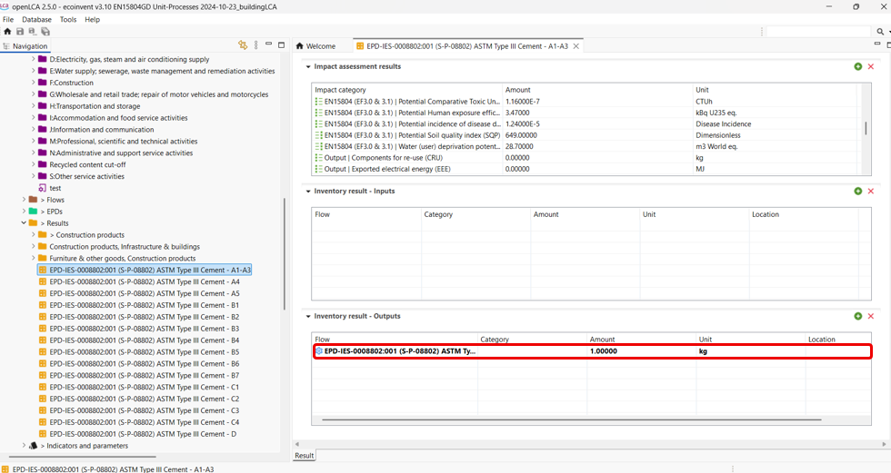

# Using soda4LCA

With openLCA v2.2, you can now access a wide range of ILCD nodes through the soda4LCA tool. This also includes various EPD-focused nodes, e.g. International EPD, ÖKOBAUDAT... The soda4LCA tool can be accessed by going to Tools > soda4LCA as seen below:

Then, a pop-up window shall appear where you can select the desired database node (host) as shown below and then click on "ok". 

You can search the library by "EPD", "impact category", and more. 

With an active database, it's possible, then, to import the results by right-clicking on the desired entry and selecting "import selected". To ensure a smooth integration of the EPD in your database, make sure that you use an EN15804-compatible database like the [EN15804 version of ecoinvent](https://nexus.openlca.org/database/EN15804%20add-on) or the EN15804-compatible method package, which is available for free on the same page. If your active database does not hold the required impact methods, e.g. as in the EN15804 version, openLCA might download them from the respective soda4LCA node, which will take time. Further, this can lead to corrupted EPDs in openLCA, as not all soda4LCA instances contain the referenced indicators and flows.

 
If you have imported an EPD, it shall appear under the "EPD" folder in the working database. If you have imported an impact category, it shall appear under the "impact categories" folder and so on. To integrate results of EPD into the product system, please refer to ["Using results of EPDs in the product systems"](./life_cycle_models.md) section. Make sure that you use the same impact method to calculate impacts as it had been used to generate the EPD. Otherwise the impacts of the EPD will not be taken into account.

**Tip**: When importing an EPD result to include it in your product system in openLCA, make sure there is a product flow set as the quantitative reference under Inventory result → Outputs (as shown below). If no product flow was available, you can simply create a new one, add it to the outputs, and set it as the quantitative reference. This ensures the EPD integrates correctly into your system model.

