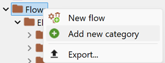

# Creating a new flow

To create a new flow in openLCA, follow these steps:

1. Right-click on the "Flows" folder in your active database.
2. Select "New flow" from the context menu.

  

_Creating a new flow_

The flow creation window will open automatically. Here you can provide a name for the flow, adapt the flow type as a product, elementary or waste flow:

  
_Flow creation window_

And also choose the reference flow property:

  
_Flow creation window_

**It is mandatory to define a reference flow property to proceed. However, you can change it afterwards.**

4. Click "Finish" to complete the flow creation process.

After clicking "Finish," a new flow window will open in the editor interface. Here, you can further specify and define the properties and attributes of the newly created flow according to your requirements.

>_**Note:**_ If you want to organize flows into different categories, first choose to add a category (sub-category). This allows you to create a new category/folder under which you can then add flows to maintain organization.

  
  
_Creating a new category_ 

