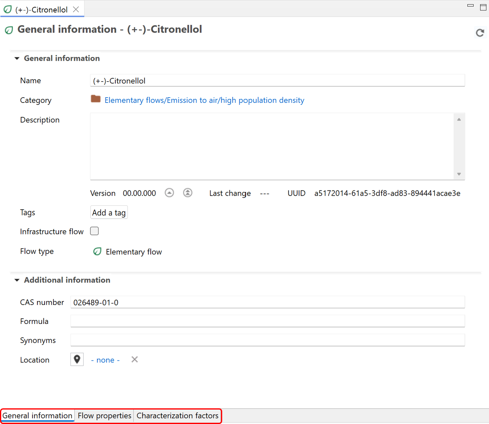

# Flow tab content

After opening a flow in openLCA, you will find tabs at the bottom of the window that provide access to different information and settings relevant to the flow. These tabs differ based on whether the flow is a product, waste, or elementary flow. Let's explore the contents of these tabs:

  

<b>General information</b>

  

- **General information:** Here you can view and modify the flow's name, add a description, additional details or [tags](../cheat/tags.md), and create a process using the flow as reference.

    

  _**Note on "Version":**_ openLCA performs versioning for you. Every time you save the flow, the version will be updated automatically. Additionally, you can also manually higher the version by clicking on either on "Update major version" or "Update minor version". The version can't be reset or modified downwards within openLCA to keep track of changes.
  
  _**Note on "Infrastructure flow":**_ This checkbox serves to store whether a flow is infrastructure flow or not (so, the flow is a product with long lifetime and costly – a building, a machinery, …). This is a mandatory field in the EcoSpold1 format and also used by SimaPro e.g.. In openLCA, it has no practical effect.

- **Used in Processes (for product and waste flows only):** This section shows the processes that consume or produce the flow. Double-clicking on a process will open it in the editor for further exploration.
	
- **Additional Information:** You can use this section to include extra details like CAS number, chemical formula, location, and synonyms to facilitate search and identification of the flow.

<b>Flow Properties</b>

Under the "Flow Properties" section, you can to modify the reference property of the flow. Clicking on the green plus icon, you can also add any other properties relevant to the flow (e.g. economic properties, technical properties etc.). Alternatively, you can add new properties right-clicking on the property table and select "Create new". When you enter an additional flow property, you need also to enter a conversion factor to allows conversion between different properties.

  
  
_Add/edit flow properties_

 
_Conversion factors are given in the "Formula" column_

<b>Characterization Factors (for elementary flows only)</b>

For elementary flows only, you have a third tab called "Characterization Factors". Within this tab, you can view the impact category or categories in which the flow is involved (if any), the impact method associated with the category, the location associated with the flow (if any), the characterization factor for each impact category, and the corresponding unit.

  
_Elementary flow: Characterization factors_

