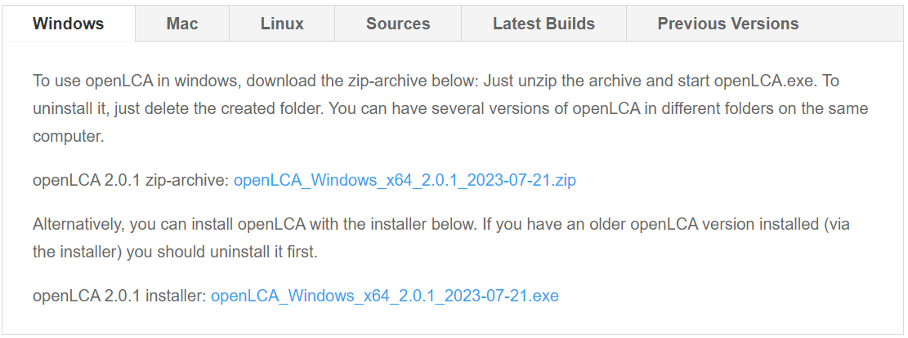
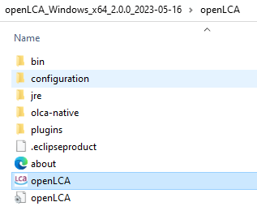
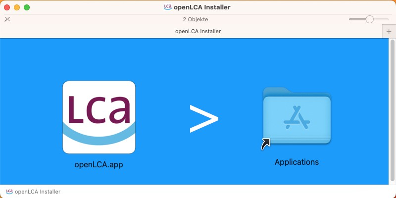
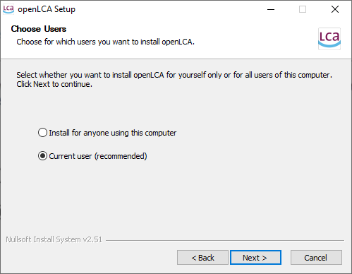

# Download and installation

openLCA natively runs in Linux, Mac, and Windows. For all operation systems, you can [download](<http://www.openlca.org/download>) the respective archive (zip/dmg/tar.gz). For Windows, there is also an installer. Using the zip archive in Windows is typically more convenient than the classic installation in Windows. It is quick and easy and the least "intrusive" method, helping you maintaining a clean system.

To get openLCA running, first step is to download openLCA from the download page (via openLCA.org). The installation process then slightly differs depending on your operating system -Windows, Mac, or Linux. Below, there are instructions for setting up openLCA on your specific platform.

_openLCA download/installation options: Zip-extraction and direct execution or full installation_

Regardless of the installation approach you choose, there will be **no difference** in the program's performance. 

## Launching openLCA from an archive (zip,tar.gz,dmg)

### **Windows** 
Once you have downloaded the zip archive, simply extract the content, launch the openLCA.exe, and the program will start running. 

  

_A decompressed ZIP file_

If you have enabled smart screen on newer Windows system, a warning will pop up that Microsoft does not know the organisation issuing the software. You can safely press "install anyway" and proceed. 

If you are not an admin on your computer, extract the zip file to a folder where you have write access, for example your user directory.

With the zip installation, you can have multiple openLCA installations and versions that coexist without conflicts on your computer. This allows you also to run multiple versions of openLCA simultaneously. However, be mindful of the storage space requirements. Uninstalling, btw., simply means to delete the respective folder and its subfolders that you created from the zip archive.

### **Mac OS** 
To install openLCA 2 on your MacOS system, begin by double-clicking the downloaded DMGImage. This action will open a window where you can conveniently drag-and-drop the openLCA2 application (the .app file located on the left side) into the applications folder of your MacOS system (located on the right side). Once the app is successfully installed, you can launch it either by using the Launchpad or by navigating to the "Applications" folder using the Finder.

  
_Installation for Mac OS_

### **Linux**
Extract the tar.gz into your home folder and double-click on the executable to run openLCA.

## Running openLCA with installation (only Windows)

**Windows:** Download the installer file from the [download page](http://www.openlca.org/download) of the openLCA website and run it. You can choose whether openLCA will be available only for the user who installs it, or for anybody working on the computer. For the installation, you will need admin rights. The folder where openLCA stores its databases will be created for the user who is running the installation. 

It is therefore not a good idea to ask an admin to install openLCA via the installer when you are not the admin yourself, since you will not have access to the database folder afterwards, and also not to the folder where openLCA stores the configuration file, which means you will not be able to change the settings after the installation. 

>**_Note:_** You must first uninstall previous versions of openLCA.

  

_Setup screen for installation in Windows_

Follow the installation steps to the end and you can begin working with openLCA.

>_**Note:**_ If you encounter any issue with Windows Defender preventing you on installing openLCA, please have a look here [https://support.bemopro.com/hc/en-us/articles/11450999280531-Microsoft-Defender-SmartScreen-blocking-program-installation](https://support.bemopro.com/hc/en-us/articles/11450999280531-Microsoft-Defender-SmartScreen-blocking-program-installation).

