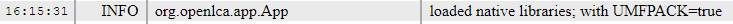

# Download fast libraries

## For openLCA 2.0.2 or earlier

openLCA uses fast numerical libraries (UMFPACK, openBLAS, etc., for the nerds). These, however, are publicly available with an aggressive open source license that prevents us from distributing them together with openLCA. To bring these into openLCA, you will need to install them yourself. To do so, simply click on the "make the calculation in openLCA faster" banner on the welcome page in openLCA.

  
_How to access fast libraries_

This will download and install the libraries, in the openLCA database folder. You need to restart openLCA afterwards, and the banner will disappear.

In the openLCA log file, accessible via help / Open log file in openLCA, you will find an entry such as:

Confirming a successful installation. These libraries make openLCA 5-10 times faster than the default java libraries. 

Having completed these steps, you are good to work with openLCA.

## For openLCA 2.0.3 and later releases

Since **openLCA 2.0.3**, we’re thrilled to announce a significant improvement in the user experience. Through the incorporation of the Intel Math Kernel Library (MKL), we have removed the necessity to download the supplementary UMFPACK library for accelerated calculations. MKL stands as an optimized and efficient library for mathematical and scientific computations. 

Please, note that openLCA 2.0.3 with the previous math libraries can still be downloaded from openLCA.org.

