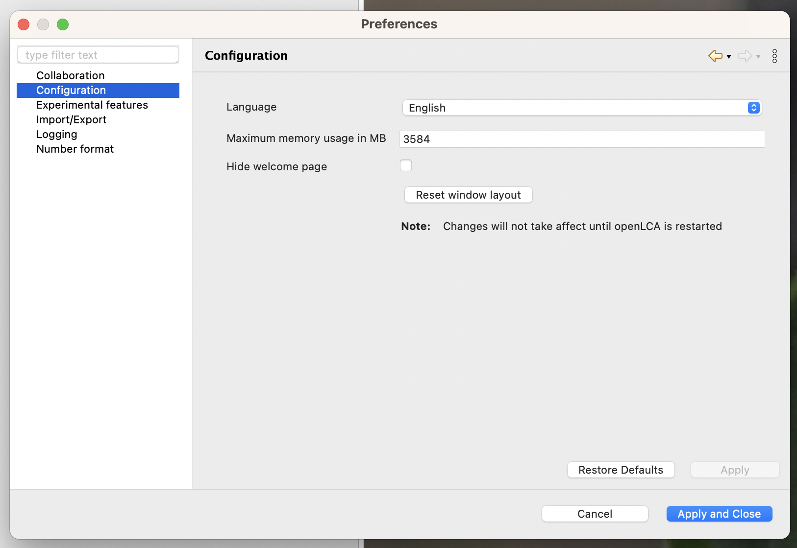
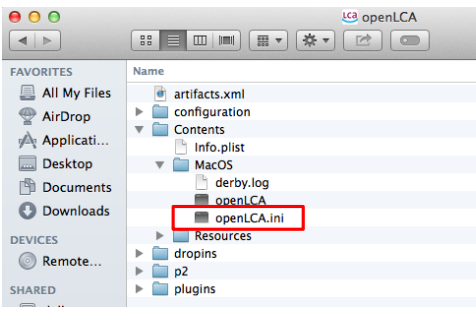
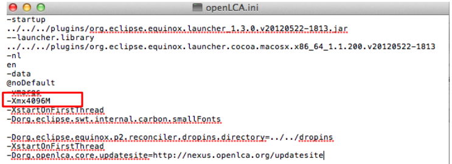

# Adjust memory

After the installation, openLCA can use a quite moderate amount of memory (RAM) from your computer, to allow use and installation on many, also weaker, computers. It is typically useful, however, to expand the memory, especially if you plan to use modern, larger background databases such as ecoinvent 3. The approach for expanding the memory is slightly different in Windows and Apple systems. 
Check please the minimum requirements for allocated memory here (#link); as a general rule, 16GB RAM is sufficient. 

>_**Note:**_ You cannot allocate more memory than what is installed on your computer. You need to leave some memory for the operation system and other software as well. In order to see the available memory, check e.g the task manager in Windows.

## Expanding memory under Windows

To increase memory allocation on Windows, open "File" then "Preferences" and the tab "Configuration". Here you can select the maximum memory usage. It is recommended to increase this value for calculating very complex product systems. In the picture below, we show how to assign 30 GB to openLCA on a system that has 64 GB of accessible memory.
	
  
_Preferences Configuration_

>_**Note**_: Any changes made to the configuration settings will require to restart openLCA in order to apply. 

## Expanding memory under macOS 

>_**Note:**_ This procedure is new with openLCA 2 (old version below)!

To increase the memory allocation on a Mac, start by launching openLCA. Then after clicking on "File" open "Preferences".

  
_How to access the "Preferences" in openLCA under macOS_

>_**Note**_: It is NOT under "openLCA" and "Settings"! And then the tab "Configuration":

  
_Preferences Configuration_

Adjust your memory accordingly!

 macOS (old procedure) 

Start by launching the "Finder" and navigate to the "Applications" folder. Locate openLCA in the Applications folder. Next, right-click on openLCA and choose the option "Show package contents". Once you have accessed the "Show package contents" option, navigate further by opening the "Contents" file. Within the "Contents" file, locate and open the "MacOS" file. You can do this by double-clicking on the file named "openLCA.ini". If the text editor does not open automatically, you can manually select the "Text Edit" program to open it.

Within the text editor, you can manually modify the memory allocation by changing the value. For instance, you can set it to 4096M. After making the desired changes, save the file, close all windows, and proceed to restart openLCA.

  
_Expanding the memory on macOS_

 _Expanding the memory on macOS_

 

