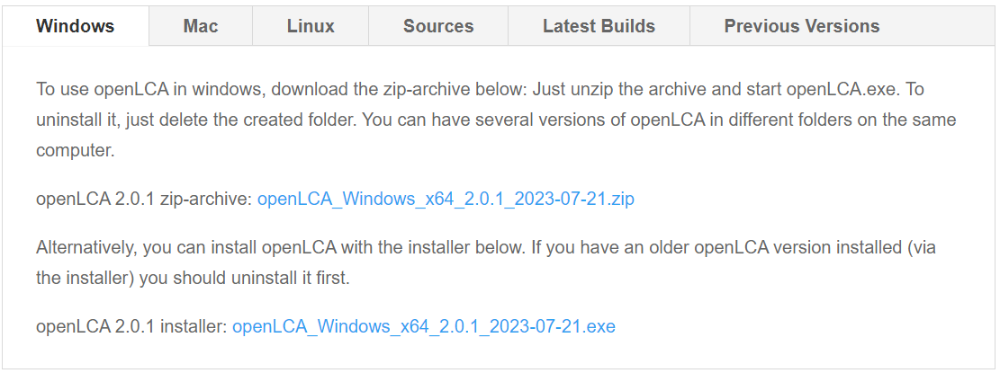

# Update openLCA to the lastest version

To update openLCA, simply download the latest version from the openLCA website. You do **not need to remove older versions** of the software before installing a new one if you are using the Zip archive but you will have to uninstall previous versions of openLCA if you used the installer. openLCA software operates independently from its databases, which means that multiple software versions can coexist on the same system. This makes upgrading straightforward and allows you to keep older versions available if needed.

Depending on the distribution you downloaded (see [Download and installation](../installation/download_installation.md)):

- **Zip archive**: Extract the archive to a folder of your choice and start openLCA directly from that folder. No installation is required.
- **Installer version**: You must first uninstall previous versions of openLCA. Then ,run the installer and follow the installation steps. The installer will create a standard application installation on your system.

After starting the new version, your existing databases will still be visible and can be opened from the database list.

## Installing a new openLCA Version

To update openLCA, download the desired version from the openLCA website and extract the zip archive to a new folder. This installation does not overwrite existing versions, allowing you to keep several openLCA versions available if required.

After installing the new version, start the software normally. All previously used database folders will still be visible in the database list.

## Opening an existing Database in a newer Version

When opening a database created with an older openLCA version, the software checks whether the database structure matches the version requirements. If the structure differs, openLCA will prompt you to [update the database](../databases/database_update.md).

Before performing the update, openLCA may ask whether you want to create a backup of the database. Creating a backup is recommended for important projects but can be skipped if a backup already exists.

During the update, openLCA modifies only the **database structure**, not the actual data. All processes, flows, product systems, and results remain unchanged.

However, after the update is completed, the database **cannot be opened with older versions of openLCA** anymore.

## Compatibility Considerations

The database update process is generally reliable for **incremental updates**, such as moving from one minor version to the next.

For **larger version jumps** (for example from openLCA 1.4 directly to 2.6), the automated update script may fail because the database structure has changed too much between versions. In such cases, the update should be performed in intermediate steps, such as:

- openLCA 1.4 → openLCA 2.0  
- openLCA 2.0 → openLCA 2.4  
- openLCA 2.4 → openLCA 2.6  

Older versions required for these intermediate steps can also be downloaded from the openLCA website.

## Reference Flow Compatibility

Unlike some other LCA software, openLCA does not rely on a hardcoded reference flow system that changes between software versions. As a result, upgrading the software generally does not require any modifications to reference flows or existing model structures.

This design makes upgrading openLCA comparatively straightforward while maintaining compatibility with previously created models.

