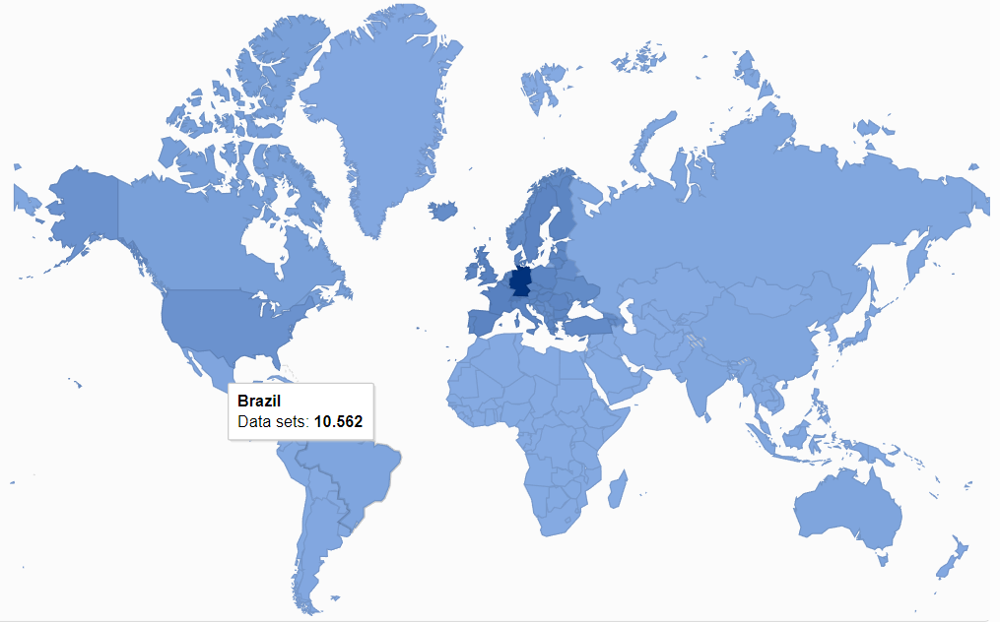
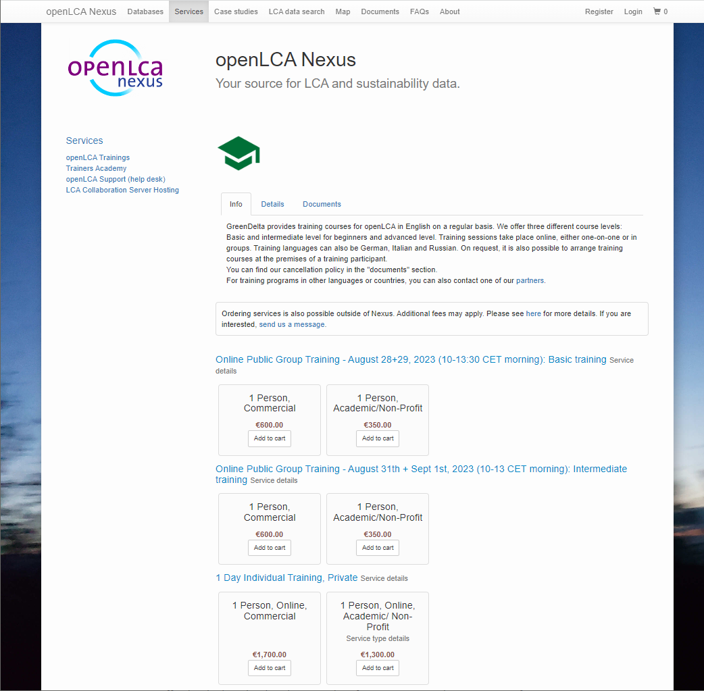

# openLCA Nexus

Expert help needed: Andreas which version do you like better?

new version original version manual 1.11

 
openLCA is a free and open-source software. However, many LCA databases are not for free. 
GreenDelta has created a special website to make LCA data available to users: 
[openLCA Nexus](<https://nexus.openlca.org/>). It contains both freely available and purchasable data offered by world's leading LCA
data providers.

openLCA Nexus (https://nexus.openlca.org) is an online repository for LCA data. 
It combines data offered by world-leading LCA data providers such as the ecoinvent centre (ecoinvent database), 
PE International (GaBi databases), and the Joint Research Centre from the European Commission (ELCD database). Datasets provided in Nexus can be easily imported into the openLCA software. 
openLCA and Nexus databases share a common set of elementary flows and other reference data which have been harmonized in 
coordination with the respective data providers to overcome methodological differences, for example concerning the modelling of waste. 

Nexus contains free and "for purchase" data sets. For ordering and downloading databases from Nexus, you need to sign up using a valid email address. 
The procedure here is very similar to a webshop: simply add the database into a shopping cart and order it. 
To find out more on how to download databases from openLCA Nexus and import them into openLCA. 

openLCA is a free and open-source software. However, many LCA databases are not for free. 
GreenDelta has created [openLCA Nexus](<https://nexus.openlca.org/>), an online repository to make LCA data available to users.
It contains free and "for purchase" data offered by us or world's leading LCA
data providers, including the ecoinvent centre (ecoinvent database), PE International (GaBi databases), 
and the Joint Research Centre from the European Commission (ELCD database). Check out our "[Database section](../databases/database_nexus.md)" on how to effortlessly 
download and import data from Nexus into the openLCA software. 

Moreover, the Nexus website contains a powerful search engine for LCA data that allows you to search for data sets in Nexus. 
It is also possible to filter data sets by the data provider, location, category, price and year of validity. 
We hope this makes it easy to identify the LCA data that you need. 

_openLCA Nexus homepage search function_

## JH: I added the section below on my own choice; Does it suit you? 

### Nexus map

With the LCA data search functionality, users can conduct specific searches based on e.g. database name, country, location, data type, 
category, price, and validity period.  This feature enables users to locate and access relevant data sets tailored to their specific needs.

The openLCA Nexus Map provides an interactive visualization that depicts the distribution of available data sets across different regions. 
The map utilizes varying shades to indicate the abundance of data sets in each region, 
with darker shades indicating a greater availability. 
This visual representation allows users to identify regions with a richer collection of data sets.

  
_openLCA Nexus Map_

### Book your openLCA training with us

You can book your trainings with us directly through [openLCA Nexus](<https://nexus.openlca.org/>).

We are eager to help you finding the right training class adapted to your requirements!

