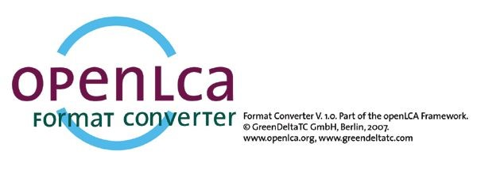
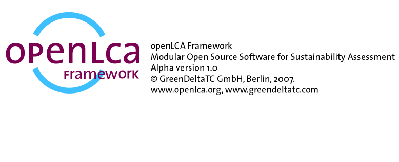

# Why openLCA was started

We started developing openLCA in 2007; a super-long German startup incubation project preparation in the end led to nothing (we needed to specify the number of trainings we will have five years after the project start, per quarter, etc., and were then offered half a million € but only as a loan, to the same conditions as if obtained from a bank, which we declined). But we also had submitted an abstract to the ecobalance conference in Japan, where we presented the idea, and mentioned that we are looking for budget to start. To our surprise, after the presentation, CEOs of PRé and of ecoinvent came and asked how much we need. We did not ask for much, but this funding enabled us to start, initially with a format converter but then also with an LCA software. 

Why we started openLCA is contained in this early presentation, and is still valid today:

  
_Slide 4 of the presentation._

Every sustainability ("sust.") life cycle assessment decision is based on results obtained from a model, which in turn uses data. Software is responsible for taking data, feeding it to a model, and for producing a result from the model. 

So, software is fundamental for decision support. 

Software has influence on:

-	What models can be built;
-	How models can be built;
-	Which methods can be applied (for calculation; impact assessment; data quality assessment; uncertainty assessment; interpretation; …);
-	Which results are easily and not so easily accessible; and on
-	How results are presented

Having written other Life Cycle Assessment (LCA) software before, we thought that writing a new LCA software is something we can do. It should not be a cheap and simplified software, however, but a high performance, flexible software, able to model any LCA, not limited to one sector or product type. And it should be open source, for one to offer something different, but also, to overcome a true bottleneck of LCA: with the specialised software being really expensive, apart from promotional licenses for universities, many could not afford using dedicated LCA software, and many thus could not apply LCA. 

First release of the format converter was 2007, first release of the openLCA LCA software was 2008. Open Source license was Mozilla, so a quite soft, unaggressive license. Andreas Ciroth designed the logo and icons, Michael Srocka led the software development. 

The first format converter logo and splash screen looked like this:

 

the first openlca lca software ("openlca framework") looked like this:

