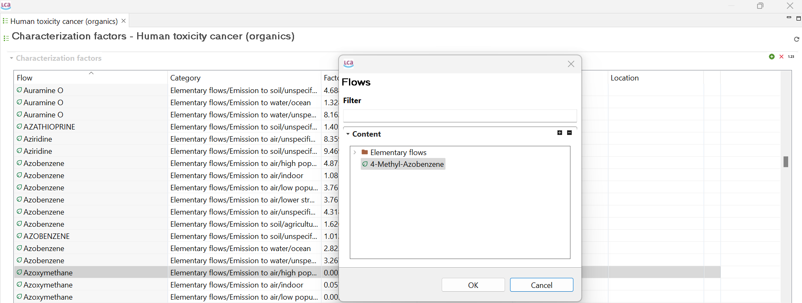
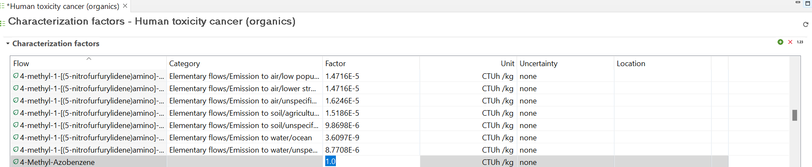
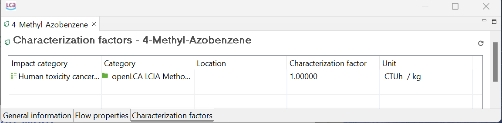

# Creating and addung characterization factors

In some methods maybe the characterization factors of an substance are missing. Hence you can add (or modify existing) characterization factors (CFs) in a LCIA method.

To add a CF to a LCIA method:

1. Open the method and the respective category you want to add your CF to. Change from "General Information" to "Characterization factors"
2. Click on the green plus in the upper right cornern and select the flow you want to add the CF to and confirm with "OK": 

The flow now has the CF of 1. By selecting the field "Factor", you can modify this number. 

Make sure that you saved the impact category. This is also the way to modify  the characterization factor of an elementary flow. However, you can make sure that you added/modified the CF by opening the elementary flow itself and change to 

